# Как процессор выполняет программу

## Введение

Большинство программ, которые мы пишем, в конечном итоге выполняются центральным процессором. Однако зачастую знания о том, как именно CPU исполняет код, остаются довольно поверхностными. Между тем понимание внутренних принципов его работы позволяет лучше объяснить ограничения производительности, причины эффективности тех или иных алгоритмов и осознаннее подходить к оптимизации программ.

В ходе изучения темы я выделил несколько ключевых принципов работы современных процессоров и собрал их в этой статье.

Материал посвящён исключительно десктопным CPU. Специализированные процессоры и GPU намеренно остаются за рамками рассмотрения. Кроме того, все темы рассматриваются на достаточно высоком уровне — этого достаточно, чтобы понять основные принципы работы процессора без погружения в схемотехнику и микроархитектурные детали.

---

# Как процессор выполняет инструкции

На самом высоком уровне процессор можно представить как бесконечный цикл выполнения инструкций. На каждой итерации он получает очередную инструкцию, выполняет её и переходит к следующей. Если выполнять нечего, процессор продолжает работать в режиме ожидания, пока не появится новая задача.

Инструкция представляет собой последовательность байт, кодирующую одну из операций, поддерживаемых данным процессором.

Каждая инструкция проходит несколько последовательных этапов обработки:

1. **Fetch** — получение инструкции по адресу.
2. **Decode** — декодирование инструкции: определение операции (опкода), операндов и других параметров.
3. **Execute** — выполнение инструкции.
4. **Write Back** — запись результата в целевой регистр.

Современные процессоры часто объединяют эти этапы в две крупные части:

* **Front End** — отвечает за получение и подготовку инструкций к выполнению.
* **Back End** — отвечает за загрузку необходимых данных, выполнение инструкции и запись результата.

Такое разделение пригодится позже, когда речь пойдёт о конвейерной обработке инструкций.

## Основные компоненты процессора

Хотя современные процессоры содержат миллиарды транзисторов, их можно представить как совокупность нескольких базовых компонентов.

### Регистры

Регистры — это сверхбыстрые ячейки памяти, предназначенные для хранения данных, необходимых процессору в текущий момент времени.
Исполнительные блоки процессора работают исключительно с регистрами. Если данные находятся в оперативной памяти, их сначала необходимо загрузить в регистр, и только после этого над ними можно выполнять операции.

### Исполнительные блоки

Исполнительные блоки выполняют всю вычислительную работу процессора.

Наиболее распространённые из них:

* **ALU (Arithmetic Logic Unit)** — арифметические и логические операции;
* **FPU (Floating Point Unit)** — операции с числами с плавающей точкой;
* **Branch Unit** — выполнение инструкций переходов.

В современных процессорах подобных блоков значительно больше, однако принцип остаётся тем же: каждый блок специализируется на выполнении определённого класса инструкций.

### Устройство управления

Устройство управления (Control Unit) можно считать своеобразным дирижёром процессора.
Именно оно координирует работу всех остальных компонентов, определяя, какие регистры необходимо считать, какие исполнительные блоки использовать и куда записывать результат выполнения инструкции.

### Процессорные часы

Все элементы процессора должны работать синхронно.
За синхронизацию отвечает генератор тактовых импульсов — процессорные часы. Благодаря им все операции внутри процессора происходят в строго определённой последовательности.


## Упрощённая модель процессора

Чтобы лучше понять принцип работы CPU, удобно рассмотреть максимально упрощённую модель процессора.

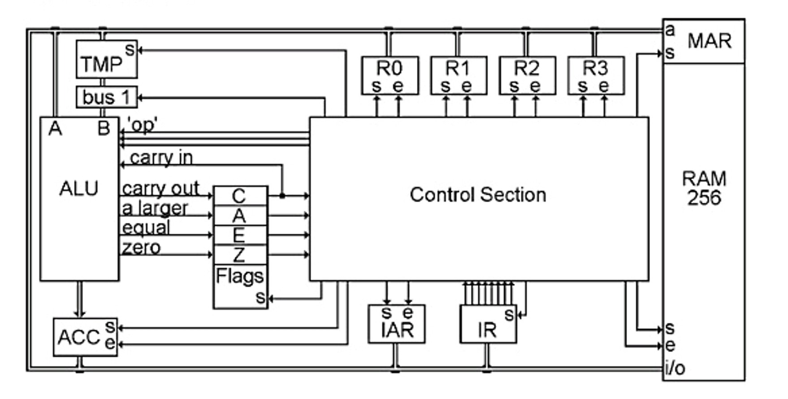

В ней присутствуют следующие элементы:

* регистры **R0**, **R1**, **R2**, **R3**, **IR**, **IAR**, **ACC**, **TMP** и **Flags**;
* арифметико-логическое устройство (**ALU**);
* оперативная память (**RAM**) и регистр адреса памяти (**MAR**);
* устройство управления (**Control Unit**).

На схеме одинарные стрелки обозначают отдельные линии передачи данных, а толстые линии — общие шины данных. В данном примере ширина шины составляет 8 бит.


## Устройство управления

Ниже представлена упрощённая схема устройства управления.

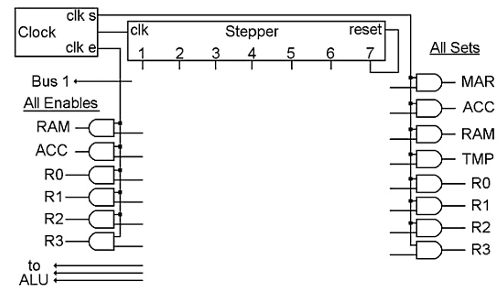

Помимо уже знакомых элементов здесь появляются два важных компонента:

* генератор тактовых импульсов;
* шагатель (Stepper).

Именно шагатель определяет последовательность действий, выполняемых процессором при обработке каждой инструкции.


## Регистры

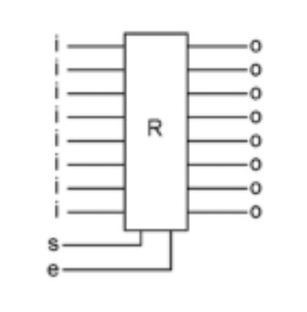

В рассматриваемой модели каждый регистр состоит из восьми ячеек памяти, поэтому имеет восемь входов и восемь выходов.

Работа регистра определяется двумя управляющими сигналами:

* **S (Store)** — разрешает сохранение данных. Пока сигнал активен, содержимое регистра становится равным входным данным. После отключения сигнала значение сохраняется.
* **E (Enable)** — разрешает вывод содержимого регистра на выход. Если сигнал выключен, выход регистра отключён.

У некоторых специализированных регистров один из этих сигналов отсутствует, поскольку соответствующая возможность им не требуется.


## Процессорные часы

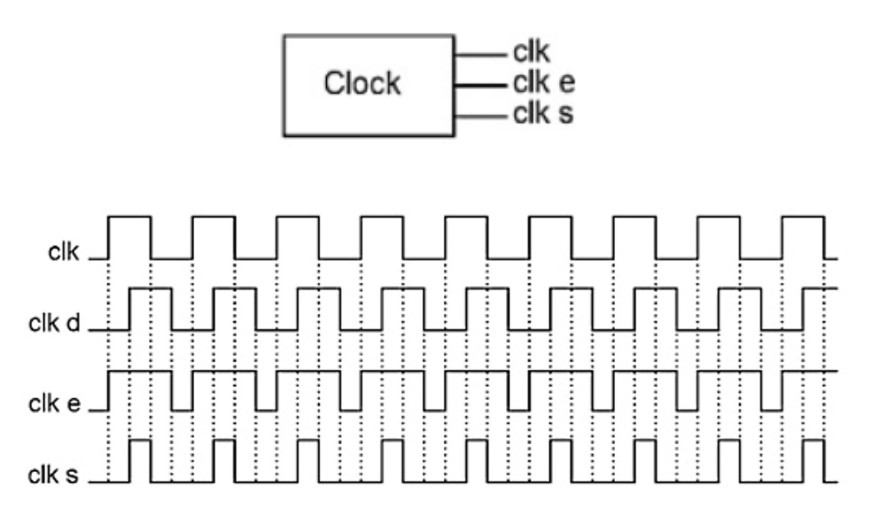

Процессорные часы представляют собой генератор сигнала, который постоянно переключается между состояниями **0** и **1** с заданной частотой.
Например, частота **1 ГГц** означает один миллиард переключений в секунду.

В рассматриваемой схеме часы формируют три сигнала:

* **clk** — основной тактовый сигнал;
* **clk e** — сигнал разрешения чтения регистра;
* **clk s** — сигнал сохранения данных в регистр.

Последовательность этих сигналов подобрана таким образом, чтобы обеспечить корректную передачу данных между регистрами: сигнал **e** включается раньше включения сигнала **Store** и выключается позже выключения
Благодаря этому данные гарантированно успевают перейти из одного регистра в другой без конфликтов и потерь.

## Шагатель

Как уже упоминалось ранее, генератор часов формирует три сигнала: `clk`, `clk e` и `clk s`. Если сигналы `clk e` и `clk s` используются непосредственно регистрами, то основной сигнал `clk` поступает на шагатель (Stepper).

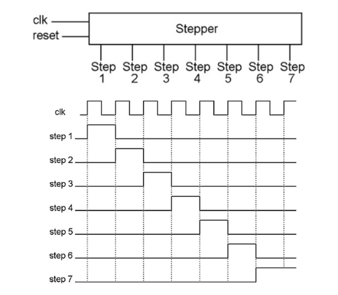

Шагатель представляет собой элемент, который последовательно активирует свои выходы. Каждый выход соответствует одному шагу выполнения инструкции и остаётся активным ровно один такт процессора.
После выполнения последнего шага специальный сигнал `reset` возвращает шагатель в исходное состояние, после чего цикл начинается заново.
Таким образом процессор получает заранее определённую последовательность действий, которую повторяет для каждой инструкции.

---

## Арифметико-логическое устройство и память

Следующим важным элементом процессора является **ALU (Arithmetic Logic Unit)** — арифметико-логическое устройство.

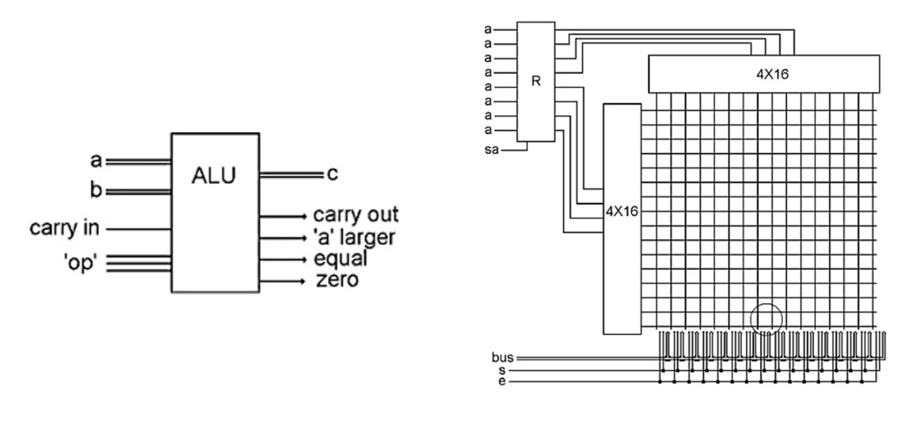

ALU получает на вход:

* два регистра с операндами (`A` и `B`);
* код выполняемой операции (`op`);
* флаг переноса, необходимый, например, для операций сдвига.

Результатом работы ALU является новое значение и набор флагов, характеризующих результат вычислений.
Оперативную память (**RAM**) в данной модели можно представить как множество регистров, доступ к каждому из которых осуществляется за константное время — **O(1)**.
Чтобы выбрать конкретную ячейку памяти, используется специальный регистр **MAR (Memory Address Register)**, в котором хранится адрес требуемой ячейки.

---

## Выполнение инструкции

Теперь рассмотрим, как процессор выполняет отдельную инструкцию.
В нашей модели первые три шага одинаковы абсолютно для любой инструкции и отвечают за её получение из памяти.

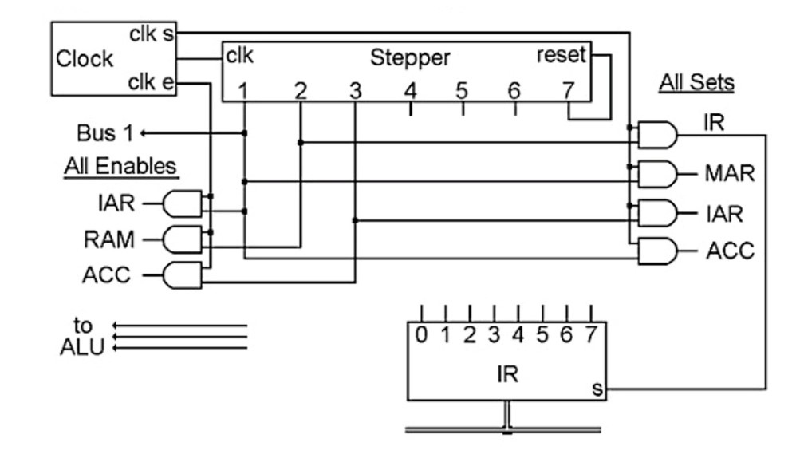

### Шаг 1

В регистр **MAR** загружается значение регистра **IAR**, содержащего адрес текущей инструкции.
Одновременно это же значение поступает в ALU, где к нему прибавляется единица. Таким образом заранее вычисляется адрес следующей инструкции.

### Шаг 2

Используя адрес, находящийся в **MAR**, процессор считывает инструкцию из оперативной памяти и помещает её в регистр **IR (Instruction Register)**.

### Шаг 3

Результат вычисления из ALU, содержащийся в регистре **ACC**, записывается обратно в **IAR**.
В этот момент процессор уже знает адрес следующей инструкции, поэтому после завершения текущей сможет сразу перейти к её выполнению.
После первых трёх шагов дальнейшие действия определяются типом инструкции.

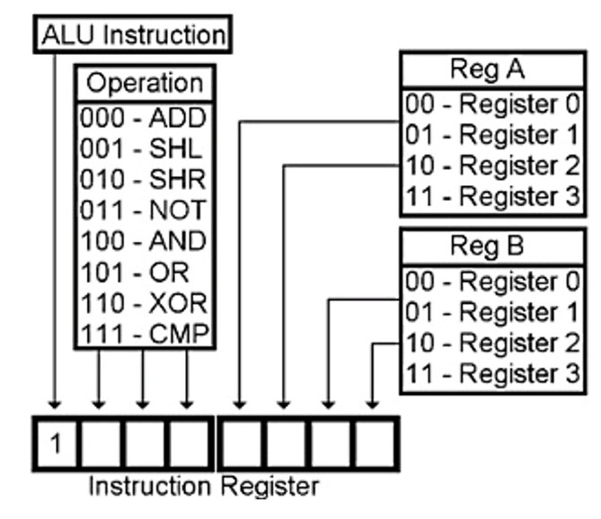

Например, инструкции ALU имеют следующую структуру:

* первый бит определяет, что инструкция относится к арифметико-логическим операциям;
* следующие три бита содержат код операции (opcode);
* последние четыре бита определяют регистры, которые будут участвовать в вычислениях.

Таким образом одна инструкция одновременно сообщает процессору:

* какую операцию необходимо выполнить;
* над какими регистрами её выполнять.

---

### Выполнение ALU-инструкции

Для арифметических инструкций оставшиеся три шага выглядят следующим образом.

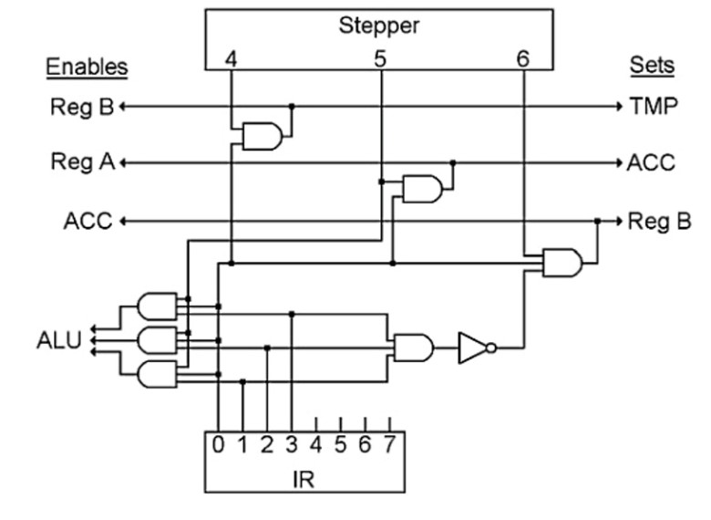

**Шаг 4**

Значение регистра **B** копируется во временный регистр **TMP**.

**Шаг 5**

ALU выполняет требуемую операцию над значениями регистров **A** и **TMP**.

**Шаг 6**

Полученный результат записывается обратно в регистр **B**.
После этого шагатель возвращается к первому шагу, и процессор начинает выполнение следующей инструкции.

## Итоги

Рассмотренная модель процессора намеренно сильно упрощена. Современные CPU содержат значительно больше исполнительных блоков, сложные механизмы планирования инструкций, несколько уровней кэш-памяти и множество других компонентов.

Тем не менее основные идеи остаются неизменными:

* инструкции выполняются последовательно, проходя фиксированные этапы обработки;
* все элементы процессора синхронизируются тактовым генератором;
* вычисления производятся исполнительными блоками над данными, находящимися в регистрах;
* управление последовательностью выполнения осуществляет устройство управления.

---

# Как код превращается в инструкции процессора

Теперь, когда мы разобрались с тем, каким образом процессор исполняет отдельные инструкции, можно перейти к следующему вопросу: откуда вообще берутся эти инструкции?
Любая программа в конечном итоге должна быть преобразована в машинный код — последовательность инструкций, понятных конкретной архитектуре процессора.
В этой главе будут рассматриваться только программы, работающие в средах с операционной системой. Встроенные системы и микроконтроллеры имеют свои особенности и здесь затрагиваться не будут.
В зависимости от способа получения машинного кода языки программирования можно условно разделить на три большие группы.

## Интерпретируемые языки

Первую группу составляют **интерпретируемые языки**, например Python или 1С.

Рассмотрим этот подход на примере стандартного интерпретатора **CPython**.
Исходный код программы сначала преобразуется в **байткод** (файлы `.pyc`). Байткод представляет собой набор инструкций, предназначенных уже не для процессора, а для виртуальной машины Python.
Во время выполнения программы виртуальная машина последовательно читает эти инструкции и вызывает соответствующие функции реализованные на языке C. В результате процессор исполняет не Python-код напрямую, а заранее скомпилированный машинный код интерпретатора.
Если же программа вызывает функцию из библиотеки, написанной на C (например, **NumPy**), управление передаётся этой библиотеке, и процессор начинает исполнять уже её машинный код напрямую.


---

## Условно компилируемые языки

Следующую группу можно назвать **условно компилируемыми**. К ней относятся, например, Java и C#.

Принцип работы здесь во многом похож на Python. Исходный код также сначала преобразуется в байткод, который затем выполняется виртуальной машиной — **JVM** или **CLR**. Однако существуют важные отличия.
Благодаря статической типизации виртуальная машина может выполнять значительно меньше вспомогательной работы при обработке инструкций. Кроме того, многие современные виртуальные машины используют **JIT-компиляцию (Just-In-Time)**.
Во время работы программы виртуальная машина отслеживает наиболее часто исполняемые участки кода — так называемые *горячие* участки (hot paths). После этого они компилируются непосредственно в машинный код и в дальнейшем выполняются процессором уже без участия интерпретатора байткода.
Именно поэтому для достижения максимальной производительности виртуальной машине требуется некоторое время на «прогрев». Чем дольше работает приложение, тем больше часто используемых участков успевает пройти JIT-компиляцию.

---

## Компилируемые языки

Третья группа — полностью **компилируемые языки**, например C, C++ и Go.

В этом случае исходный код ещё до запуска программы преобразуется непосредственно в машинный код.
Благодаря этому разработчик получает более полный контроль над тем, какие инструкции процессора будут сгенерированы, а компилятор может применять значительно более широкий набор оптимизаций, поскольку анализирует всю программу целиком.
Именно поэтому компилируемые языки чаще используются там, где критична максимальная производительность.

---

## Процессы и потоки

После того как программа превратилась в машинный код, возникает следующий вопрос: каким образом операционная система организует её выполнение?

Операционную систему можно рассматривать как интерфейс ко всем ресурсам компьютера, включая процессор.

Для организации выполнения кода она использует две ключевые концепции:

* **поток (thread)**;
* **процесс (process)**.

### Процесс

Процесс представляет собой контейнер, внутри которого выполняется программа.
Он определяет границы доступной памяти и ресурсов, а также объединяет один или несколько потоков исполнения.
Среди ресурсов процесса можно выделить:

* память с машинным кодом программы;
* память с данными;
* файловые дескрипторы;
* сетевые соединения;

Все потоки процесса имеют к этим ресурсам общий доступ.

### Поток

Минимальной единицей исполнения на ядре процессора является **поток**.
Именно поток содержит всю информацию, необходимую для выполнения программы:

* указатель на следующую инструкцию;
* собственный стек;
* локальные переменные;
* регистры процессора и другой контекст выполнения.

Именно потоки назначаются операционной системой на выполнение конкретным ядрам процессора.

Механизм такого назначения мы рассмотрим позже, когда будем говорить о многоядерных процессорах.

---

## Пример выполнения программы на Python

Рассмотрим для примера процесс, выполняющий программу на Python.
Все потоки процесса используют общую память инструкций и данных, общие файловые дескрипторы и остальные ресурсы процесса.
При этом каждый поток имеет собственный стек и собственный контекст выполнения, благодаря чему несколько потоков могут одновременно работать внутри одного процесса, практически не мешая друг другу.

Во время работы поток выполняет цикл интерпретатора Python:

1. получает очередную инструкцию байткода;
2. считывает необходимые данные из памяти;
3. выполняет соответствующую функцию виртуальной машины;
4. записывает результат обратно в память.

Однако у стандартной реализации Python существует важное ограничение — **Global Interpreter Lock (GIL)**.
Из-за GIL одновременно только один поток может выполнять инструкции интерпретатора Python.
При этом ситуация меняется, когда выполнение передаётся в библиотеку, написанную на C. Например, если Python вызывает функцию из библиотеки **NumPy**, интерпретатор освобождает GIL, после чего другой поток может начать выполнять Python-код, пока первый поток находится внутри машинного кода библиотеки.

---

# Архитектуры процессоров

Теперь можно перейти к рассмотрению того, как современные процессоры организуют выполнение инструкций.

Существует множество способов классификации архитектур CPU. В этой статье будут рассмотрены два наиболее полезных подхода:

* классификация по Флинну;
* классификация по уровням параллелизма.

Первая является классической и исторически наиболее известной. Сегодня она используется значительно реже, однако хорошо показывает эволюцию вычислительных систем.
Вторая классификация лучше описывает современные процессоры и именно на ней будет построена дальнейшая часть статьи.

## Классификация Флинна

Классификация Флинна основывается на количестве одновременно обрабатываемых потоков инструкций и потоков данных.

Выделяют четыре основных класса.

### SISD (Single Instruction, Single Data)

Один поток инструкций обрабатывает один поток данных.
Это архитектура классических однопроцессорных систем.

### SIMD (Single Instruction, Multiple Data)

Одна инструкция одновременно применяется к множеству независимых элементов данных.
Именно этот подход лежит в основе современных SIMD-расширений, о которых речь пойдёт позже.

### MIMD (Multiple Instruction, Multiple Data)

Несколько независимых потоков инструкций работают со своими наборами данных.
Практически все современные многоядерные процессоры относятся именно к этому классу.

### MISD (Multiple Instruction, Single Data)

Несколько потоков инструкций выполняют обработку одного и того же набора данных.
Подобная архитектура встречается редко и применяется преимущественно в системах с повышенными требованиями к отказоустойчивости.

---

## Уровни параллелизма

С точки зрения современных процессоров гораздо полезнее рассматривать архитектуру через различные уровни параллелизма.

В рамках статьи нас будут интересовать три основных уровня.

* **ILP (Instruction-Level Parallelism)** — параллельное выполнение нескольких инструкций одним ядром процессора. Сюда относятся конвейеры, суперскалярность и выполнение вне порядка.
* **DLP (Data-Level Parallelism)** — параллельная обработка нескольких элементов данных одной инструкцией. На практике реализуется через SIMD-расширения, такие как SSE, AVX и NEON.
* **TLP (Thread-Level Parallelism)** — параллельное выполнение нескольких потоков за счёт нескольких ядер или технологии SMT.

Именно эти три уровня определяют большую часть производительности современных CPU.

# Instruction-Level Parallelism

До этого момента мы рассматривали процессор как устройство, которое последовательно получает инструкции, выполняет их и переходит к следующим. Такая модель хорошо объясняет базовые принципы работы CPU, однако не отражает того, как устроены современные процессоры.

На практике одно ядро способно выполнять сразу несколько инструкций одновременно. Такой подход называется **Instruction-Level Parallelism (ILP)** — параллелизм на уровне инструкций.

Основная идея ILP заключается в том, чтобы максимально загрузить исполнительные блоки процессора полезной работой. Если разные инструкции не зависят друг от друга, их можно выполнять параллельно, значительно увеличивая производительность без увеличения количества ядер.

Одним из первых и наиболее важных механизмов ILP является **конвейерная обработка инструкций**.

---

## Конвейер

Ранее уже говорилось, что выполнение каждой инструкции можно разделить на четыре последовательных этапа:

1. **Fetch** — получение инструкции.
2. **Decode** — декодирование.
3. **Execute** — выполнение.
4. **Write Back** — запись результата.

Представим простой процессор без конвейера.
Пусть каждая инструкция выполняется за четыре наносекунды, причём каждый этап занимает ровно одну наносекунду.
В таком случае процессор будет выполнять инструкции строго последовательно:

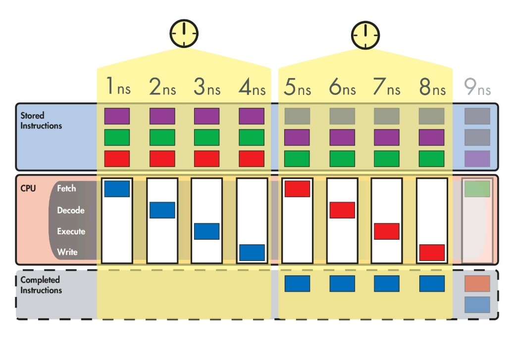

За восемь наносекунд процессор полностью обработает лишь две инструкции.
При этом легко заметить, что на каждом этапе остальные исполнительные блоки простаивают. Пока происходит выполнение инструкции, блок получения новой инструкции ничего не делает. Аналогично простаивают остальные части процессора.

Именно эти простои и стали причиной появления конвейерной обработки.

---

## Конвейерная обработка

В конвейерном процессоре каждый этап начинает работать сразу после освобождения, не дожидаясь полного завершения предыдущей инструкции.
Пока первая инструкция выполняется, следующая уже может декодироваться, а ещё одна — считываться из памяти.
Схематично это выглядит следующим образом:

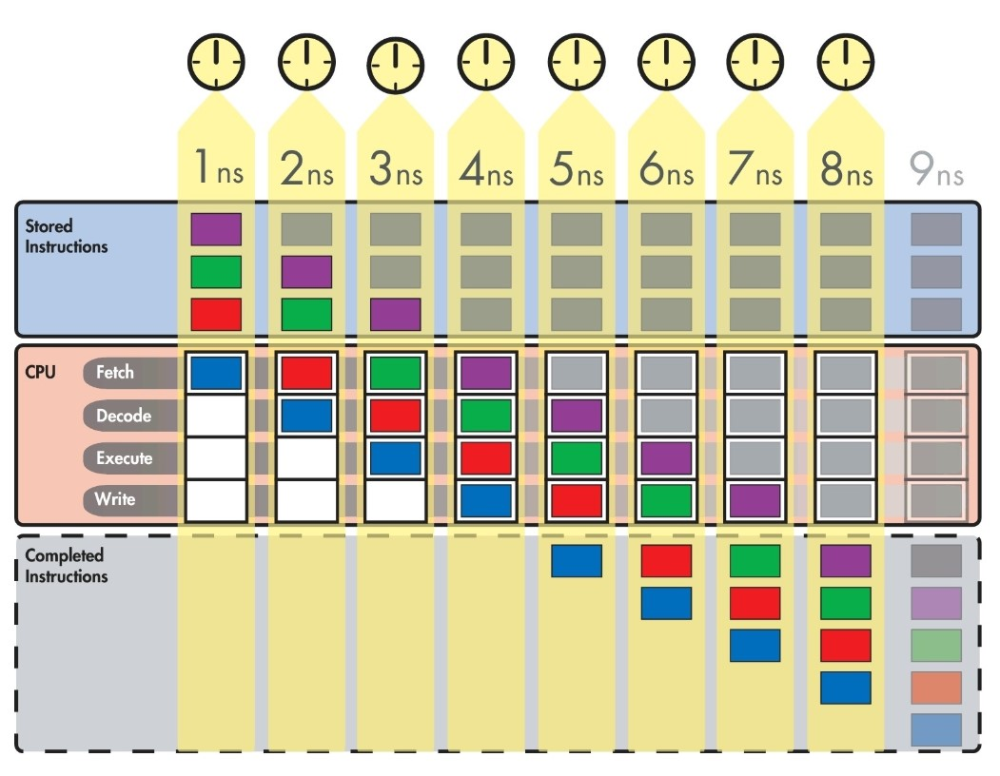

После заполнения конвейера каждый такт завершается одна инструкция.
Если сравнить этот процесс с предыдущим примером, то за те же восемь наносекунд будет выполнено уже четыре инструкции вместо двух.

Важно понимать, что конвейер **не уменьшает время выполнения одной инструкции**. Каждая инструкция по-прежнему проходит все четыре стадии.

Ускорение достигается исключительно за счёт того, что одновременно в работе находятся несколько разных инструкций.

Конвейер начинает работать максимально эффективно только после того, как все его стадии будут заняты.
В начале выполнения программы часть этапов ещё простаивает, поскольку в конвейере пока недостаточно инструкций.

Это состояние называют **прогревом конвейера**.

Аналогичная ситуация возникает после полной очистки конвейера, например при ошибочном предсказании перехода.

Чем глубже конвейер, тем больше времени требуется на его заполнение и тем дороже обходится каждая его остановка.

---

## Пузыри конвейера

К сожалению, в реальных программах конвейер работает далеко не идеально.
Во время выполнения могут возникать простои отдельных стадий, которые обычно называют **пузырями** (*pipeline bubbles*).

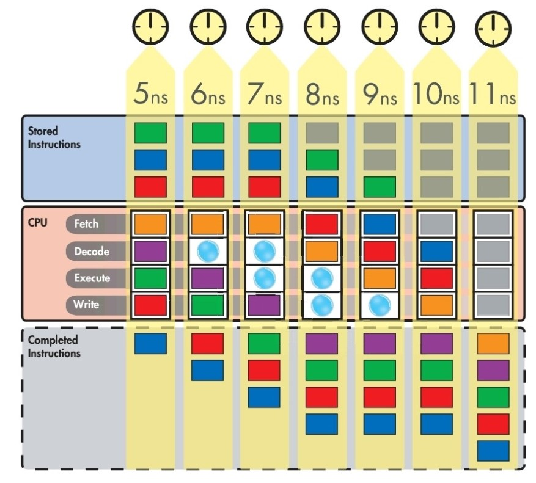

Общая причина появления пузырей всегда одна — ожидание.
Если один из этапов задерживается, следующий этап не может продолжить работу и вынужден простаивать как минимум один такт.

Основные причины появления пузырей можно разделить на несколько категорий:

### Control Hazards

Проблемы переходов возникают при выполнении условных инструкций.
До тех пор пока процессор не узнает результат условия, он не может определить адрес следующей инструкции.
В результате конвейер вынужден ждать.

### Structural Hazards

Конфликты ресурсов возникают, когда нескольким инструкциям одновременно требуется один и тот же исполнительный блок.
Если аппаратных ресурсов недостаточно, часть инструкций вынуждена ждать своей очереди.

### Cache Miss

Если необходимые инструкции или данные отсутствуют в кэше процессора, их приходится загружать из оперативной памяти.
По сравнению с кэшем это занимает значительно больше времени, из-за чего конвейер также начинает простаивать.

---

## Как процессоры уменьшают количество пузырей

Полностью избавиться от пузырей невозможно, однако современные процессоры используют множество механизмов, позволяющих существенно уменьшить их влияние.

### Предсказание переходов

При выполнении условных переходов процессор пытается заранее угадать результат условия.
Если одна и та же инструкция в цикле много раз приводила к переходу, велика вероятность, что так произойдёт и в следующий раз.
Поэтому процессор заранее начинает загружать наиболее вероятные инструкции.
Если предположение оказалось правильным, выполнение продолжается без задержек.
Если же процессор ошибся, конвейер приходится полностью очищать и заново загружать правильные инструкции.
Именно поэтому ошибки предсказания переходов обходятся довольно дорого.

---

### Out-of-Order Execution

Ещё одним важным механизмом является **Out-of-Order Execution (OoO)** — выполнение инструкций вне программного порядка.
Перед попаданием в конвейер инструкции помещаются в специальный буфер.
Если очередная инструкция не может быть выполнена из-за ожидания данных, процессор пытается найти следующую независимую инструкцию, которую можно выполнить уже сейчас.
После завершения вычислений результаты помещаются в другой буфер, где восстанавливается первоначальный порядок выполнения программы.
Таким образом разработчик по-прежнему получает результат, полностью соответствующий исходному коду, хотя внутри процессора отдельные инструкции могли выполняться в совершенно другом порядке.
Именно благодаря этому процессор способен продолжать полезную работу даже тогда, когда часть инструкций временно заблокирована ожиданием данных.

---

## Ограничения конвейера

Может показаться, что достаточно бесконечно увеличивать глубину конвейера, чтобы постоянно получать прирост производительности.

На практике это невозможно.
Во-первых, каждая инструкция состоит из конечного числа этапов, поэтому разделить её можно лишь на ограниченное количество частей.
Во-вторых, увеличение глубины конвейера приводит к дополнительным накладным расходам.

Чем глубже конвейер:

* тем дольше продолжается его прогрев;
* тем больше времени сохраняются пузыри;
* тем дороже обходится каждая ошибка предсказания перехода, поскольку приходится очищать весь конвейер целиком.

Поэтому современные процессоры ищут баланс между глубиной конвейера и эффективностью его работы.

---

## Суперскалярность

До этого момента мы рассматривали увеличение производительности за счёт развития конвейера **в глубину**.
Существует и другой подход — расширение конвейера **в ширину**.
Этот механизм называется **суперскалярностью**.

При суперскалярном исполнении процессор может одновременно обрабатывать сразу несколько инструкций на каждом этапе конвейера.
Для этого каждый этап должен иметь несколько одинаковых исполнительных блоков. В противном случае именно они станут узким местом и ограничат производительность.
Благодаря суперскалярности за один такт одно ядро может завершать сразу несколько инструкций, что позволяет значительно увеличить производительность без увеличения количества ядер.

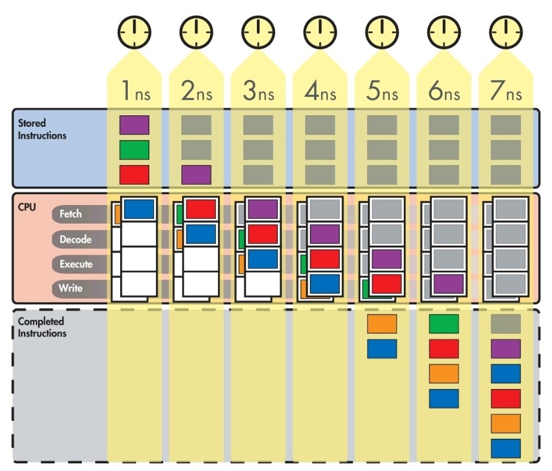

Однако и здесь существуют ограничения.
Чем шире суперскалярное окно, тем сложнее процессору находить независимые инструкции, которые действительно можно выполнять одновременно.
Кроме того, возрастают накладные расходы на управление исполнительными блоками, регистрами и логикой планирования.

# Data-Level Parallelism

Если ILP позволяет выполнять несколько независимых инструкций одновременно, то **Data-Level Parallelism (DLP)** решает другую задачу — обработку нескольких элементов данных одной инструкцией.
Наиболее распространённой реализацией DLP в современных процессорах являются **SIMD-расширения** (*Single Instruction, Multiple Data*).
Основная идея SIMD заключается в том, что одна инструкция одновременно выполняет одну и ту же операцию сразу над несколькими значениями.

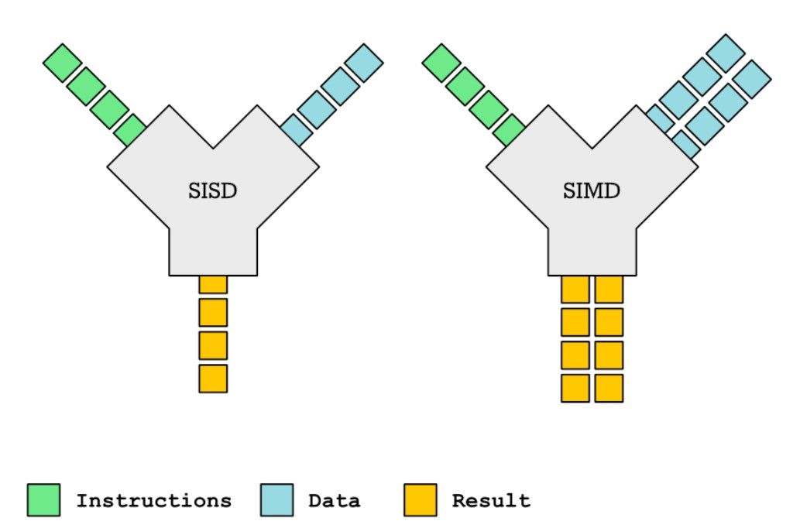


Внутри процессора такие данные помещаются в специальные **векторные регистры**, после чего несколько SIMD-блоков параллельно выполняют одну и ту же операцию над различными частями вектора.
Благодаря этому производительность при обработке массивов данных может увеличиваться в несколько раз.

## Развитие SIMD

За последние десятилетия SIMD прошёл несколько этапов развития:

MMX (1997) – первые SIMD-инструкции от Intel. Использовали регистры блока с плавающей точкой, работали только с целыми числами.
SSE (1999) – собственные 128-битные регистры, поддержка чисел с плавающей точкой, отдельные SIMD-блоки для целочисленных и FP-операций.
AVX / AVX2 (2011–2013) – расширение до 256-битных регистров, ещё более широкая обработка данных за один такт.

Сегодня SIMD широко применяется в задачах обработки изображений, аудио, видео, научных вычислениях и линейной алгебре.
Во многих языках программирования SIMD можно использовать напрямую через специальные инструкции или intrinsic-функции. Такой подход поддерживают, например, C, C++, C# и Rust.
Однако во многих случаях разработчику даже не приходится писать SIMD-код самостоятельно.

Современные компиляторы способны автоматически распознавать подходящие участки программы и заменять обычные инструкции на SIMD-аналоги.

## Почему развитие SIMD замедлилось

На первый взгляд кажется, что достаточно продолжать увеличивать ширину векторных регистров, чтобы постоянно получать прирост производительности.
Однако сегодня развитие DLP внутри CPU практически остановилось.

Причина достаточно проста.

Задачи, требующие массовой обработки больших массивов данных, значительно эффективнее выполняются на GPU, архитектура которых изначально ориентирована на такой тип вычислений.
Поэтому современные процессоры продолжают поддерживать SIMD, однако основной прогресс в этой области уже происходит именно на графических процессорах.

---

# Thread-Level Parallelism

До этого момента речь шла о том, каким образом одно ядро может выполнять больше полезной работы.
Однако существует и другой очевидный способ повышения производительности — выполнять вычисления сразу на нескольких ядрах.

Такой подход называется **Thread-Level Parallelism (TLP)** — параллелизм на уровне потоков.

В современных процессорах TLP достигается двумя основными механизмами:

* **CMP (Chip Multiprocessor)** — использование нескольких физических ядер;
* **SMT (Simultaneous Multithreading)** — выполнение нескольких потоков одним физическим ядром.

---

## CMP — многоядерные процессоры

Сегодня практически все процессоры являются многоядерными.
Каждое ядро представляет собой практически самостоятельный процессор, способный независимо выполнять собственный поток инструкций.
При этом часть ресурсов остаётся общей для всех ядер, а часть принадлежит каждому ядру отдельно.
Например, кэши уровней L1 и L2 обычно являются локальными для каждого ядра, тогда как кэш L3 чаще всего общий.

Распределением потоков по ядрам занимается планировщик операционной системы.
Именно он решает, какое ядро будет выполнять тот или иной поток, учитывая текущую загрузку процессора и историю выполнения.

При первом запуске потока выбранное ядро загружает в свои кэши необходимые данные: часть инструкций, стек и другую информацию, необходимую для начала работы.
По мере выполнения программы остальные данные постепенно подгружаются по мере необходимости.
Если поток снова запускается на том же ядре, часть информации может уже находиться в его кэшах, что ускоряет возобновление выполнения.
Однако если поток переносится на другое ядро, новое ядро вынуждено заново заполнять свои кэши.

Такую ситуацию называют миграцией потока.

Из-за повторного прогрева кэшей миграция обычно сопровождается небольшим снижением производительности, поэтому современные планировщики стараются по возможности сохранять привязку потоков к одним и тем же ядрам.

---

## SMT — Simultaneous Multithreading

Другим способом увеличения производительности является **SMT**.

В этом случае одно физическое ядро одновременно выполняет инструкции нескольких потоков.
Основная идея SMT заключается не в том, чтобы сделать ядро быстрее, а в том, чтобы максимально эффективно использовать уже имеющиеся исполнительные блоки.
Как обсуждалось в предыдущей главе, во время работы конвейера регулярно возникают пузыри — такты, когда часть исполнительных блоков простаивает.
Если в этот момент имеется готовая к выполнению инструкция другого потока, процессор может использовать свободные ресурсы для её выполнения.


Во многих современных процессорах SMT тесно связан с механизмом **Out-of-Order Execution**, который получает возможность выбирать инструкции сразу из нескольких потоков.
Это позволяет значительно уменьшить влияние простоев конвейера.
Однако важно понимать, что потоки в SMT не получают отдельные исполнительные блоки.
Большинство ресурсов ядра остаётся общим.

Если один поток полностью загружает исполнительные блоки вычислениями, второму потоку практически не остаётся свободных ресурсов.
Поэтому SMT может как заметно повысить производительность, так и практически не дать выигрыша.

Если рабочая нагрузка часто порождает пузыри в конвейере — например, из-за ожидания памяти или ветвлений, — SMT обычно оказывается полезен.
Если же один поток уже эффективно использует все ресурсы ядра, второй поток будет лишь конкурировать за них, практически не увеличивая общую производительность.

---

# Кэширование инструкций и данных

В предыдущих главах уже несколько раз упоминалось, что промахи кэша являются одной из основных причин возникновения пузырей в конвейере. Теперь рассмотрим, как устроено кэширование и почему оно настолько важно для производительности современных процессоров.

## Зачем нужен кэш

На протяжении многих лет производительность процессоров росла значительно быстрее, чем скорость оперативной памяти.
Если бы процессору приходилось обращаться к RAM при выполнении практически каждой инструкции, большая часть времени тратилась бы на ожидание данных.
Одним из возможных решений могло бы стать использование исключительно быстрой памяти SRAM. Однако стоимость такой памяти слишком высока, чтобы строить из неё всю оперативную память компьютера.
Поэтому современные процессоры используют многоуровневую систему кэширования, которая позволяет хранить наиболее востребованные данные максимально близко к исполнительным блокам.

## Иерархия кэшей

Кэш процессора обычно состоит из нескольких уровней.

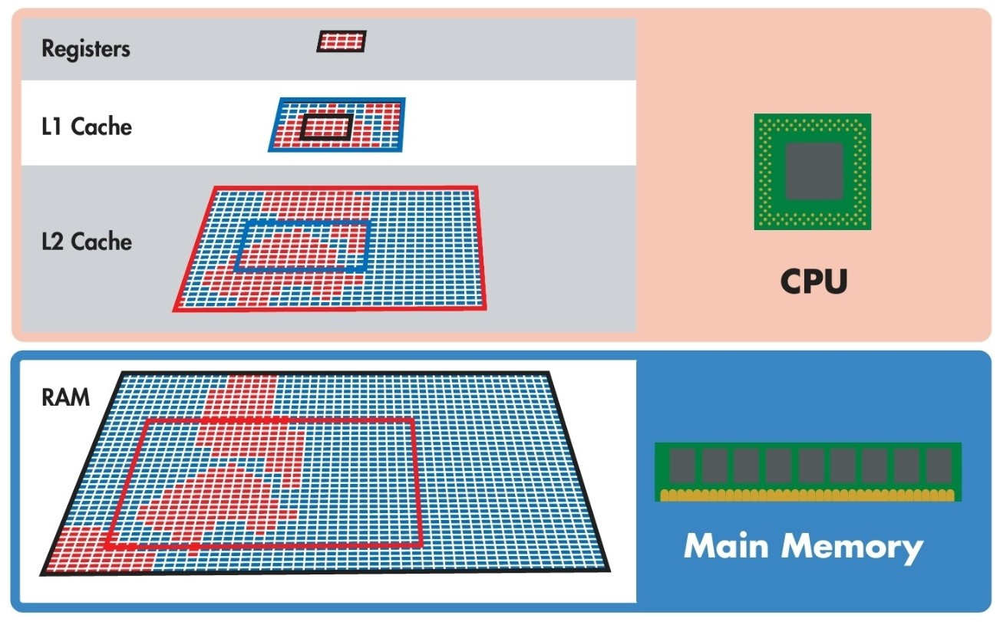

* **L1** — самый маленький и самый быстрый кэш.
* **L2** — больше по объёму, но медленнее.
* **L3** — ещё больше и ещё медленнее.

Каждый уровень хранит копию части данных из следующего уровня памяти.
Когда процессору требуется некоторое значение, поиск происходит последовательно:

1. кэш L1;
2. кэш L2;
3. кэш L3;
4. оперативная память.

Чем раньше будут найдены данные, тем быстрее продолжится выполнение программы.

Большинство программ обладают двумя важными свойствами, благодаря которым кэш оказывается эффективным.

### Пространственная локальность

Данные обычно используются последовательно.
Если процессор обратился к определённому адресу памяти, существует высокая вероятность, что вскоре понадобятся соседние данные.
Именно поэтому кэш загружает данные не по одному байту, а целыми блоками.
Типичный пример — последовательное чтение большого файла или обход массива.

### Временная локальность

Если данные использовались недавно, существует высокая вероятность, что они понадобятся снова.
Например, при выполнении цикла одни и те же инструкции читаются множество раз, а локальные переменные функции используются практически на каждой итерации.
Благодаря этому достаточно один раз загрузить данные в кэш, после чего последующие обращения будут значительно быстрее.

---

## Кэш инструкций и кэш данных

Инструкции программы и её данные имеют разный характер использования.
Если хранить их в одном кэше, они будут вытеснять друг друга.
Например, последовательное чтение большого массива может полностью вытеснить инструкции программы, хотя сами инструкции продолжают постоянно использоваться.

Поэтому в большинстве современных процессоров кэш первого уровня разделён на два независимых кэша:

* **Instruction Cache (I-Cache)** — хранит машинные инструкции.
* **Data Cache (D-Cache)** — хранит данные программы.

Такое разделение уменьшает взаимное влияние инструкций и данных и повышает общую эффективность кэширования.
Иногда аналогичное разделение применяется и для кэша L2, однако значительно реже.

---

## Вытеснение данных из кэша

Размер кэша ограничен, поэтому рано или поздно возникает необходимость освободить место для новых данных.
Для этого процессоры используют различные политики замещения.

Одной из наиболее известных является **LRU (Least Recently Used)**.

Её идея достаточно проста.
Чем дольше некоторый блок данных не использовался, тем выше вероятность того, что именно он будет вытеснен из кэша первым.
На практике современные процессоры используют более сложные алгоритмы, однако большинство из них основаны на той же идее — попытаться сохранить в кэше наиболее востребованные данные.

---

## Кэш в многоядерных процессорах

В многоядерных процессорах кэш организован немного иначе.

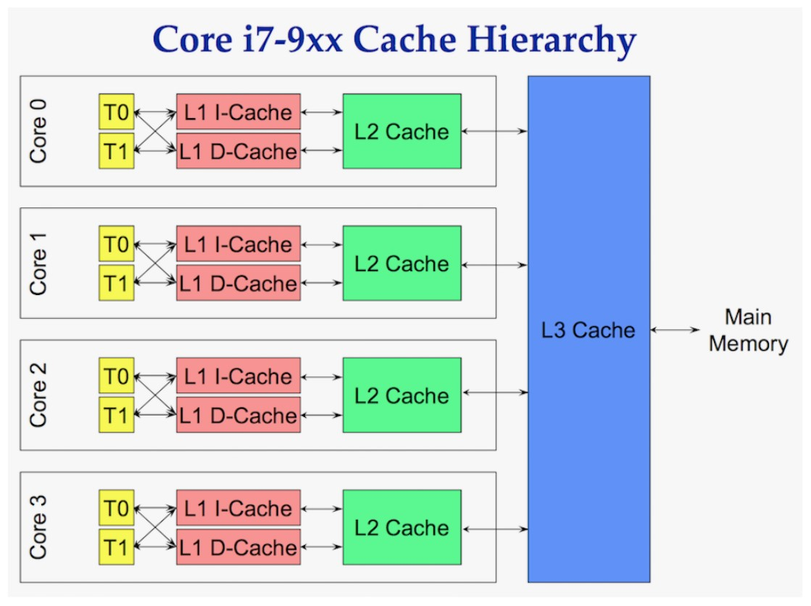

Как правило каждое вычислительное ядро имеет собственные кэши **L1** и **L2**, а кэш **L3** является общим для всех ядер процессора.

Такая организация позволяет сохранить минимальные задержки при работе каждого ядра, одновременно обеспечивая возможность обмена данными через общий последний уровень кэша.

---

## Translation Lookaside Buffer (TLB)

До этого момента предполагалось, что процессор сразу знает адрес нужной ячейки памяти.
На практике всё немного сложнее.

Приложения работают не с физическими, а с **виртуальными адресами**, которые выделяет операционная система. 
Перед обращением к кэшу L2, L3 или оперативной памяти процессор должен преобразовать виртуальный адрес в физический.
Для этого используется специальная структура — **таблица страниц (Page Table)**. Однако постоянный обход таблицы страниц оказался бы слишком дорогой операцией.
Поэтому процессор хранит результаты последних преобразований в специальном кэше — **Translation Lookaside Buffer (TLB)**.

Когда виртуальный адрес уже присутствует в TLB, преобразование выполняется практически мгновенно.
Если же происходит **TLB miss**, процессору приходится заново выполнять обход таблицы страниц.

Сама таблица страниц хранится в оперативной памяти и поддерживается операционной системой.
Чтобы уменьшить стоимость такого обхода, современные архитектуры дополнительно кэшируют её записи.

Например:

* в процессорах Intel используются **Paging Structure Caches (PSC)**;
* в архитектуре ARM — **Page Table Entry (PTE) caches**.

В лучшем случае после промаха TLB необходимые записи находятся в этих специализированных кэшах.
В худшем случае процессору приходится обращаться непосредственно к оперативной памяти, что приводит к заметным задержкам и появлению новых пузырей в конвейере.
Поэтому одним из способов повышения производительности программ является уменьшение количества промахов TLB.
Этого можно добиться за счёт работы с локальными данными и минимизации случайных обращений к памяти.

---

# Мониторинг производительности процессора

После знакомства с внутренним устройством процессора возникает закономерный вопрос: **как увидеть работу всех этих механизмов на практике?**
Современные процессоры предоставляют возможность собирать большое количество внутренних метрик, позволяющих оценить эффективность работы конвейера, кэш-памяти, предсказателя переходов и других компонентов.
В Linux одним из основных инструментов для такой диагностики является утилита **perf**.

## Утилита perf

Утилита позволяет отслеживать события уровня ядра операционной системы, а также получать большое количество аппаратных метрик процессора.

Основой большинства CPU-метрик являются **PMC (Performance Monitoring Counters)** — специальные аппаратные счётчики, встроенные непосредственно в процессор. Они собирают статистику с минимальными накладными расходами и практически не влияют на производительность исследуемой программы.

С помощью `perf` можно собирать статистику:

* для всей системы;
* для отдельных процессов;
* для конкретных потоков;
* для отдельных ядер процессора;
* за выбранный промежуток времени.

Например, следующая команда собирает выбранные метрики по всей системе в течение одной секунды:

```bash
perf stat -a ..... sleep 1
```

---

## Доступные аппаратные события

События в perf разделены по категориям
Полный список можно получить командой:

```bash
perf list
```

Стоит учитывать, что доступный набор событий зависит как от архитектуры процессора, так и от версии ядра Linux.
Кроме того, наличие события в списке ещё не гарантирует, что оно поддерживается конкретным процессором.
Однако существует категория **hardware (`hw`)**, которая поддерживается практически на всех современных архитектурах и обычно служит хорошей отправной точкой для анализа.

Получить список аппаратных событий можно командой:

```bash
perf list hw
```

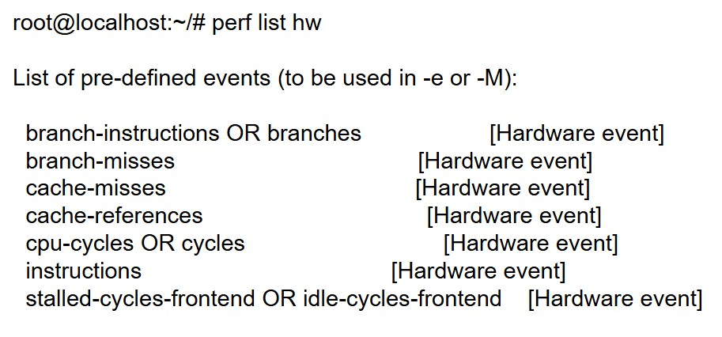


Если возможностей стандартных событий недостаточно, можно обратиться непосредственно к аппаратным счётчикам процессора.
Посмотреть доступные события можно через файловую систему Linux:

```bash
ls /sys/devices/cpu/events
```

Каждый файл соответствует одному аппаратному событию.
Например, для события `cache-misses` на процессоре **AMD Ryzen 9 7950X** можно увидеть запись:

```bash
$ls /sys/devices/cpu/events
branch-instructions  cache-misses      cycles-ct  el-capacity  el-start      mem-stores             topdown-recovery-bubbles        topdown-slots-retired      tx-abort     tx-conflict
branch-misses        cache-references  cycles-t   el-commit    instructions  ref-cycles             topdown-recovery-bubbles.scale  topdown-total-slots        tx-capacity  tx-start
bus-cycles           cpu-cycles        el-abort   el-conflict  mem-loads     topdown-fetch-bubbles  topdown-slots-issued            topdown-total-slots.scale  tx-commit

$cat /sys/devices/cpu/events/cache-misses 
event=0x64,umask=0x09
```

Здесь:

* `event` — номер аппаратного счётчика (PMC);
* `umask` — битовая маска, определяющая, какие именно события необходимо учитывать.

Например, маска `0x09` в двоичном виде соответствует `1001`, то есть используются нулевой и третий биты маски.
Однако сама по себе эта информация ещё не говорит о том, какие именно события будут подсчитываться.

---

## Processor Programming Reference

Чтобы понять назначение конкретного аппаратного счётчика, необходимо обратиться к документации производителя процессора.
Для процессоров AMD таким документом является **Processor Programming Reference (PPR)**.
Сначала необходимо определить семейство и модель процессора.

Это можно сделать с помощью команды:

```bash
lscpu
```

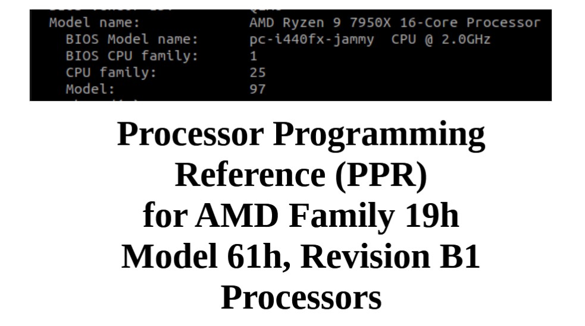

Например, если `lscpu` показывает семейство **25** и модель **97**, необходимо перевести эти значения из десятичной системы счисления в шестнадцатеричную.
В результате получится семейство **19h** и модель **61h**, соответственно нам нужен документ “Processor Programming Reference (PPR) for AMD Family 19h Model 61h, Revision B1 Processors”, который можно найти на сайте AMD (https://www.amd.com/de/search/documentation/hub.html#q=19h%2061h&sortCriteria=%40amd_release_date%20descending)

В разделе **Performance Monitor Counters** описаны все аппаратные счётчики и значения битов `umask`.
Например PMC 0x64 с его битами описан следующим образом:

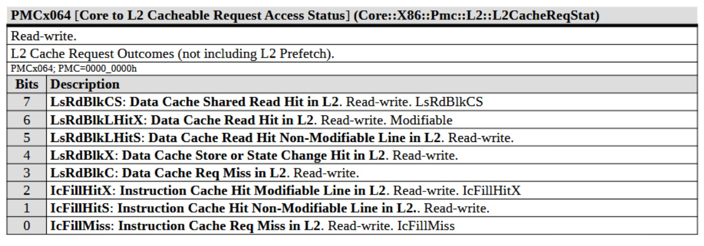

Используя эту информацию, можно точно определить, что именно измеряет интересующая метрика.
Например, становится понятно, что стандартное событие `cache-misses` учитывает промахи как кэша инструкций, так и кэша данных.


При необходимости `perf` позволяет обращаться к аппаратным счётчикам напрямую.

Например:

```bash
perf stat -a -e cpu/event=0x64,umask=0x1/ sleep 1
```

В этом случае вместо готового имени события указываются номер аппаратного счётчика и необходимая битовая маска.
Такой подход позволяет использовать любые возможности конкретной микроархитектуры, даже если готового события в списке `perf` не существует.
