# Архитектура и принципы работы PostgreSQL

# Содержание

- [Архитектура процессов](#архитектура-процессов)
- [MVCC](#mvcc)
- [Архитектура таблиц](#архитектура-таблиц)
- [Autovacuum](#autovacuum)
- [Индексы](#индексы)
- [Буферный кэш](#буферный-кэш)
- [Background Writer](#background-writer)
- [WAL и Checkpointer](#wal-и-checkpointer)
- [Мониторинг эффективности буферного кэша](#мониторинг-эффективности-буферного-кэша)
- [Этапы выполнения запроса](#этапы-выполнения-запроса)
- [Узлы выборки строк](#узлы-выборки-строк)
- [Узлы сортировки таблиц](#узлы-сортировки-таблиц)
- [Узлы агрегации](#узлы-агрегации)
- [Узлы join](#узлы-join)
- [Прочие узлы плана выполнения](#прочие-узлы-плана-выполнения)

# Введение

PostgreSQL — одна из наиболее популярных реляционных систем управления базами данных с открытым исходным кодом. За годы развития система получила множество механизмов, обеспечивающих надежность хранения данных, высокую производительность и возможность одновременной работы большого числа пользователей.

Большинство разработчиков взаимодействуют с PostgreSQL исключительно посредством SQL-запросов, не задумываясь о том, какие процессы происходят внутри сервера после отправки команды. Однако понимание внутреннего устройства СУБД значительно упрощает анализ производительности, интерпретацию планов выполнения запросов и диагностику возникающих проблем.

В статье рассматриваются основные механизмы, участвующие в обработке пользовательских запросов. Она не ставит целью подробно разобрать реализацию каждого компонента PostgreSQL, а концентрируется на фундаментальных принципах работы системы. Понимание этих принципов формирует основу для дальнейшего изучения отдельных подсистем и особенностей их настройки.

# Архитектура процессов

Прежде чем переходить к обработке SQL-запросов, необходимо рассмотреть процессную архитектуру PostgreSQL.

Каждый экземпляр PostgreSQL состоит из набора независимых процессов операционной системы, взаимодействующих между собой через область разделяемой памяти.

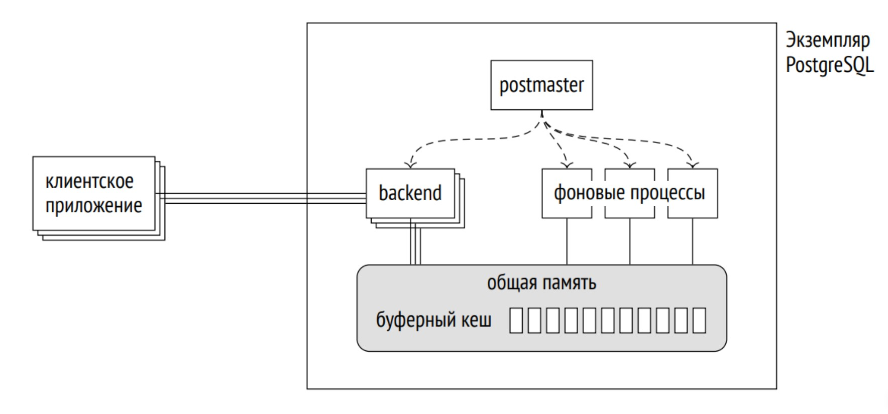

### Postmaster

Postmaster — главный процесс PostgreSQL. Он запускает сервер базы данных, инициализирует разделяемую память, создает фоновые процессы и принимает новые клиентские подключения. Кроме того, Postmaster контролирует состояние дочерних процессов и при необходимости перезапускает их.

К числу основных фоновых процессов относятся **Checkpointer**, **Background Writer**, **WAL Writer**, **Autovacuum Launcher** и другие служебные процессы, отвечающие за обслуживание различных подсистем PostgreSQL.

### Backend-процессы

При поступлении нового подключения Postmaster создает отдельный backend-процесс, который полностью обслуживает соответствующую клиентскую сессию.

Backend выполняет аутентификацию пользователя, принимает SQL-запросы, строит планы их выполнения, взаимодействует с файлами таблиц и индексов, а затем возвращает результаты клиенту. После завершения соединения backend-процесс также завершает свою работу.

Каждое клиентское соединение соответствует отдельному процессу операционной системы. Поэтому большое количество одновременно открытых сессий увеличивает потребление памяти и других системных ресурсов, а частое создание и закрытие соединений создает дополнительную нагрузку на сервер.

По этой причине рекомендуется переиспользовать существующие соединения, используя пулы подключений или сохраняя клиентские соединения открытыми как можно дольше.

### Shared Buffers

Несмотря на то что backend-процессы полностью изолированы друг от друга, все они работают с общим буферным кэшем — **Shared Buffers**.

Shared Buffers представляет собой область разделяемой памяти, в которой хранятся страницы таблиц и индексов, используемые PostgreSQL. Именно через этот буферный кэш backend-процессы и большинство фоновых процессов читают и изменяют данные.

Использование общего буферного кэша позволяет избежать постоянного обращения к дисковой подсистеме, существенно сокращая количество операций ввода-вывода и повышая производительность системы.

# MVCC

Одной из ключевых особенностей PostgreSQL является механизм **MVCC** (*Multiversion Concurrency Control*, многоверсионное управление конкурентным доступом), обеспечивающий изоляцию транзакций без необходимости постоянной блокировки читаемых данных.

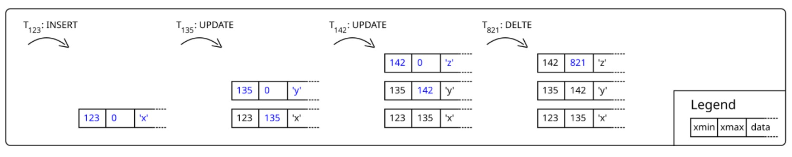

Изоляция в PostgreSQL достигается за счет хранения нескольких версий одной и той же строки. Вместо изменения данных "на месте" при выполнении операций `UPDATE` или `DELETE` создаются новые версии строк, а старые сохраняются до тех пор, пока существуют транзакции, которые потенциально могут их видеть.

Каждая транзакция работает со снимком (*snapshot*) базы данных, сформированным на момент ее начала. Благодаря этому различные транзакции могут одновременно видеть разные версии одной и той же строки, не мешая друг другу.

Продолжительность хранения старых версий напрямую зависит от времени жизни активных транзакций. Чем дольше существует транзакция, тем больше устаревших версий строк приходится сохранять. Это приводит к увеличению размеров таблиц, росту объема работы механизма очистки и, как следствие, может негативно сказаться на производительности системы.

Самая старая активная транзакция определяет так называемый **горизонт событий** — нижнюю границу версий строк, которые еще должны оставаться доступными. Все версии, находящиеся за этим горизонтом и больше не требующиеся ни одной активной транзакции, могут быть удалены механизмом VACUUM.

### Проверка видимости строк

Каждый backend-процесс самостоятельно определяет, какую версию строки необходимо вернуть пользователю.

Независимо от того, выполняется ли последовательное сканирование таблицы или чтение через индекс, PostgreSQL получает доступ ко всем найденным версиям строки и проверяет их видимость на основании служебных полей, содержащих информацию о транзакциях создания и удаления соответствующей версии.

Именно поэтому наличие индекса не избавляет PostgreSQL от необходимости обращаться к данным таблицы — после поиска строки по индексу сервер должен убедиться, что найденная версия действительно видима в рамках текущей транзакции.

### Уровни изоляции

PostgreSQL поддерживает три уровня изоляции транзакций.

**Read Committed** используется по умолчанию. На этом уровне транзакция всегда видит только зафиксированные изменения других транзакций. Однако каждый оператор получает собственный снимок базы данных, поэтому повторное выполнение одного и того же запроса внутри транзакции может вернуть уже другой результат.

Такой уровень изоляции не предотвращает некоторые аномалии чтения, поэтому обеспечение корректности бизнес-логики в отдельных случаях возлагается на приложение.

Уровни **Repeatable Read** и **Serializable** обеспечивают более строгую изоляцию и исключают ряд подобных аномалий. Однако при их использовании PostgreSQL может обнаружить конфликт между параллельно выполняющимися транзакциями и завершить одну из них ошибкой сериализации. В подобных случаях транзакцию необходимо выполнить повторно.

# Архитектура таблиц

Физически каждая таблица PostgreSQL представляет собой набор файлов, каждый из которых выполняет собственную задачу.

Независимо от назначения файла, все они состоят из страниц фиксированного размера. По умолчанию размер страницы составляет **8 КБ**, а любые операции чтения, записи и изменения данных выполняются именно на уровне страниц, поскольку страница является минимальной единицей ввода-вывода в PostgreSQL.

Основным файлом таблицы является **Heap**, в котором непосредственно хранятся строки таблицы.

Помимо Heap, для таблицы могут существовать и дополнительные файлы:

- **Index** — обеспечивает быстрый поиск строк по значениям ключей;
- **FSM (Free Space Map)** — хранит информацию о наличии свободного места на страницах и используется при поиске подходящего места для вставки новых строк;
- **VM (Visibility Map)** — содержит сведения о страницах, все строки которых видимы для всех транзакций, что позволяет оптимизировать выполнение некоторых запросов;
- **TOAST** — вспомогательная таблица, автоматически создаваемая для хранения крупных значений, не помещающихся в обычную страницу Heap.

Каждый из этих файлов играет собственную роль в работе PostgreSQL и будет подробно рассмотрен далее.

### Heap

Heap является основным файлом хранения данных таблицы и представляет собой неупорядоченный набор страниц, содержащих кортежи и служебную информацию о них.

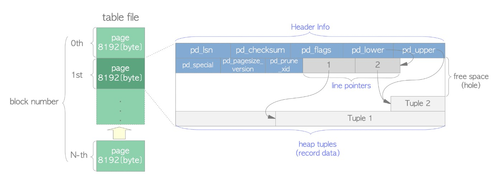

В PostgreSQL кортеж соответствует не логической строке таблицы, а одной конкретной версии этой строки. Именно поэтому операции `UPDATE` и `DELETE` не изменяют данные непосредственно в существующей записи. Вместо этого создается новая версия строки, а предыдущая помечается как устаревшая.

Каждый кортеж должен полностью помещаться в пределах одной страницы Heap. Если размер строки превышает максимально допустимый размер страницы и ее столбцы невозможно вынести в TOAST, попытка вставки завершится ошибкой.

### Free Space Map (FSM)

При вставке новой строки PostgreSQL должен определить, в какую страницу Heap ее следует записать. Последовательный просмотр всех страниц таблицы в поисках свободного места был бы слишком затратным, поэтому для решения этой задачи используется **Free Space Map (FSM)**.

FSM - это карта свободного пространства на страницах таблиц (heap), индексов и TOAST-файлов, при этом каждая структура имеет собственный FSM.

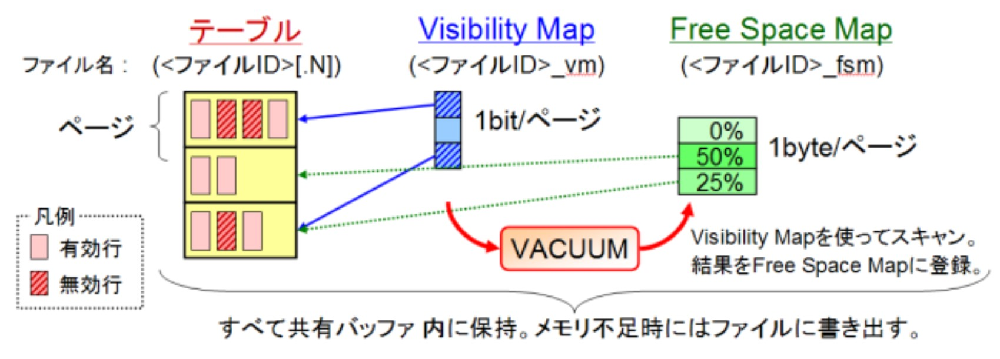

FSM используется для ускорения вставок и обновлений, помогая находить страницы с достаточным количеством свободного места для новых строк. Она хранит не точное значение свободного пространства, а категорию объёма свободного места: например, категория 0 соответствует приблизительно 0–32 байт, категория 2 — 33–64 байта и так далее.

FSM состоит из страниц, которые загружаются в общий буферный кэш при поиске подходящей страницы структуры для вставки. Каждая FSM-страница содержит информацию о множестве страниц структуры, а сами FSM страницы организованы таким образом, чтобы обеспечивать быстрый поиск.

Поскольку FSM хранит приближенные данные, выбранная страница может оказаться слишком заполненной. В таком случае вставка переносится на следующую подходящую страницу, а категория свободного места в FSM обновляется, отражая уменьшение доступного пространства.

Обновления FSM не журналируются в WAL, поэтому после рестарта базы данные FSM могут быть частично утеряны, но это не критично: при последующих операциях VACUUM и вставках карта постепенно восстанавливается и синхронизируется с реальным состоянием heap-страниц.

### Visibility Map (VM)

Проверка видимости строк является одной из основных особенностей PostgreSQL, обусловленной использованием механизма MVCC. Однако во многих случаях серверу необходимо определить видимость не отдельных строк, а целых страниц таблицы.
Для решения этой задачи используется **Visibility Map (VM)** — отдельный файл, содержащий информацию о состоянии страниц Heap.

Для каждой страницы Heap в Visibility Map хранится два бита.

Первый бит (**All Visible**) показывает, что все кортежи, расположенные на странице, видимы для любых транзакций. Если этот бит установлен, PostgreSQL может не выполнять дополнительную проверку видимости каждой строки при использовании некоторых механизмов доступа к данным.
Второй бит (**All Frozen**) указывает, что все кортежи на странице уже были заморожены (*Frozen*) и не требуют повторной обработки при последующих операциях VACUUM.

Visibility Map используется сразу несколькими подсистемами PostgreSQL.

Во-первых, механизм VACUUM может пропускать страницы, помеченные как **All Frozen**, поскольку они гарантированно не требуют дополнительной обработки.
Во-вторых, Visibility Map позволяет выполнять **Index Only Scan**. Если индекс содержит все необходимые для запроса столбцы, а соответствующая страница Heap помечена как **All Visible**, PostgreSQL может вернуть данные непосредственно из индекса, не обращаясь к Heap для проверки видимости строк.

Данные VM хранятся в файле, структура которого синхронизирована со страницами heap-файла. Это позволяет вычислять соответствующую страницу VM на основе номера heap-страницы и загружать ее в буферный кэш при необходимости. Обновление страниц VM выполняется аналогично другим файлам таблицы, а все операции с картой видимости журналируются в WAL.

### TOAST

Как уже было сказано ранее, минимальной единицей хранения данных в PostgreSQL является страница размером **8 КБ**. При этом каждая версия строки должна полностью помещаться в пределах одной страницы Heap.
На практике это ограничение может стать проблемой при работе с типами данных, способными хранить большие объемы информации, например `TEXT`, `VARCHAR`, `BYTEA`, `JSONB` и другими.

Для решения этой проблемы в PostgreSQL используется механизм **TOAST** (*The Oversized-Attribute Storage Technique*).

TOAST позволяет хранить значения большого размера отдельно от основной таблицы, сохраняя в Heap только небольшую служебную запись, содержащую ссылку на вынесенные данные.

### Стратегии хранения

Для столбцов, поддерживающих TOAST, PostgreSQL может использовать несколько стратегий хранения.

* **PLAIN** — значение всегда хранится непосредственно в Heap. Сжатие и перенос в TOAST не выполняются. Единственный вариант для данных, которые нельзя перенести в TOAST.
* **MAIN** — PostgreSQL старается сохранить значение внутри Heap. При необходимости допускается сжатие.
* **EXTERNAL** — значение может быть вынесено в TOAST. Сжатие не применяется.
* **EXTENDED** — стратегия, используемая по умолчанию для объектов, которые можно перенести в TOAST. PostgreSQL сначала пытается сжать значение, а при необходимости переносит его в TOAST.

Выбор стратегии позволяет оптимизировать работу с различными типами данных в зависимости от характера их использования.

### Размещение данных

Если после выполнения всех возможных оптимизаций строка по-прежнему не помещается на страницу Heap, PostgreSQL переносит крупные значения в TOAST.
Данные разбиваются на небольшие части фиксированного размера (чанки), каждая из которых записывается как отдельная строка в TOAST-таблице.
В основной таблице вместо исходного значения остается специальный TOAST-указатель, содержащий информацию, необходимую для восстановления данных.

TOAST-таблица представляет собой обычную таблицу PostgreSQL, предназначенную исключительно для хранения вынесенных значений. Каждая строка такой таблицы соответствует одному фрагменту (чанку) большого значения.
Для хранения чанков используются три основных поля:

* **chunk_id** — идентификатор TOAST-значения. Все чанки, принадлежащие одному исходному значению, имеют одинаковый `chunk_id`.
* **chunk_seq** — порядковый номер чанка внутри значения. Используется для восстановления исходного порядка при чтении данных.
* **chunk_data** — непосредственно содержимое чанка.

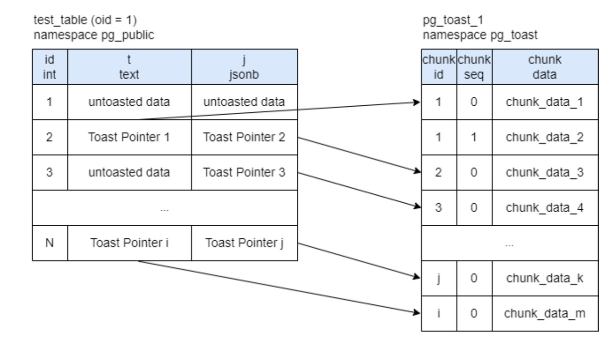

Для ускорения поиска PostgreSQL автоматически создает B-Tree индекс по полям **(chunk_id, chunk_seq)**.

При чтении значения сервер сначала находит все строки с требуемым `chunk_id`, затем считывает их в порядке `chunk_seq`, после чего объединяет содержимое чанков в исходное значение. Если данные были предварительно сжаты, после объединения выполняется их распаковка.


### Работа с TOAST-данными

Чтение данных из TOAST происходит ленивым образом. Фактические чанки загружаются только тогда, когда в результате выполнения запроса требуется вернуть пользователю значение хранящееся в TOAST. Необходимые страницы TOAST-таблицы загружаются в буферный кэш, где backend-процесс собирает из чанков исходное значение.

Удаление данных происходит аналогично обычной таблице: страницы, содержащие удаляемые чанки, помечаются как измененные, а затем записываются на диск в ходе стандартных процессов работы с буферным кэшем.

# Autovacuum

Автоматическую очистку ненужных версий строк и заморозку кортежей в PostgreSQL выполняет механизм **Autovacuum**.

При включённой автоматической очистке в системе постоянно работает процесс **Autovacuum Launcher**, который периодически анализирует базы данных и определяет таблицы, требующие вакуумирования или заморозки.

Для каждой таблицы, удовлетворяющей условиям запуска, создаётся отдельный рабочий процесс (**Autovacuum Worker**), использующий общий буферный кэш PostgreSQL. Он загружает страницы таблицы, помечает мёртвые версии строк как удалённые и выполняет заморозку кортежей.

Заморозка необходима для корректной работы механизма нумерации транзакций. Идентификаторы транзакций являются 32-битными числами, поэтому со временем они могут переполниться.

Чтобы избежать ошибок при сравнении возраста транзакций, старым версиям строк присваивается специальное значение — **Frozen XID**. Такие строки считаются существующими «с очень давних времён» и всегда видимы для всех транзакций, что исключает проблемы, связанные с переполнением счётчика транзакций.

## Запуск процессов Autovacuum

Процесс **Autovacuum Launcher** просыпается через каждый интервал времени, заданный параметром `autovacuum_naptime`.
Во время очередного запуска он анализирует состояние таблиц и определяет, требуется ли для них выполнение очистки.
Если таблица нуждается в вакуумировании, создаётся отдельный рабочий процесс.
Если таких таблиц несколько, за один цикл может быть создано несколько процессов, но их количество не может превышать значение параметра `autovacuum_max_workers`.
Если число таблиц, требующих обработки, превышает количество доступных рабочих процессов, оставшиеся таблицы будут обработаны во время следующего запуска `Autovacuum Launcher`.

## Условия запуска Autovacuum

Автоматическая очистка запускается при выполнении хотя бы одного из нескольких условий.

### Превышение возраста транзакций

Первым условием является достижение максимального возраста транзакций, определяемого параметром `autovacuum_freeze_max_age`.
Если таблица приближается к опасному возрасту, **Autovacuum Launcher** принудительно запускает её очистку и заморозку независимо от ограничения `autovacuum_max_workers`.
Такая очистка также игнорирует ограничения по интенсивности работы, которые будут рассмотрены далее.

### Превышение количества изменённых строк

Вторым условием является превышение количества изменённых кортежей.

Порог вычисляется по формуле:

```text
autovacuum_vacuum_threshold + autovacuum_vacuum_scale_factor * количество строк в таблице
```

Например, при значениях

```text
autovacuum_vacuum_threshold = 50
autovacuum_vacuum_scale_factor = 0.1
```

очистка будет запущена после изменения примерно **10% строк таблицы плюс ещё 50 строк**.

### Превышение количества вставленных строк

Третьим условием является превышение количества вставленных строк.

Порог вычисляется по формуле:

```text
autovacuum_vacuum_insert_threshold + autovacuum_vacuum_insert_scale_factor * количество строк в таблице
```

Даже если в таблицу выполняются только операции вставки, существующие строки со временем также требуют заморозки, поэтому `Autovacuum` запускается и в этом случае.

## Ограничение интенсивности работы

Как автоматическая, так и ручная очистка могут быть ограничены по интенсивности операций ввода-вывода.
Параметры, относящиеся к автоматической очистке, начинаются с префикса `autovacuum` и по смыслу соответствуют параметрам обычного `VACUUM`.

Если значение автоматического параметра равно `-1`, используется соответствующее значение параметра ручного `VACUUM`.

Основными параметрами являются:

* `vacuum_cost_limit`
* `vacuum_cost_delay`

Параметр `vacuum_cost_limit` задаёт максимальную суммарную стоимость операций чтения и записи страниц. После достижения этого значения процесс приостанавливается на время, заданное параметром `vacuum_cost_delay`.

Общий лимит автоматически распределяется между всеми одновременно работающими процессами очистки.
Например, если `vacuum_cost_limit` равен **4000**, а одновременно работают четыре процесса `Autovacuum`, каждый из них сможет использовать только **1000** единиц стоимости.
Поэтому при увеличении количества рабочих процессов имеет смысл увеличивать и значение `vacuum_cost_limit`, иначе каждый процесс будет слишком сильно ограничен.

## VACUUM, VACUUM FULL и CLUSTER

Важно понимать, что обычный `VACUUM` не освобождает дисковое пространство операционной системе.
Он лишь помечает освободившееся место на страницах как доступное для последующих вставок новых строк.
После массовых удалений в таблице может возникнуть значительная фрагментация.

Для полного уплотнения таблицы и возврата свободного пространства операционной системе используется команда `VACUUM FULL`.
Она полностью перестраивает таблицу и все её индексы, освобождая неиспользуемые страницы, однако на время выполнения полностью блокирует таблицу.

В производственных системах для подобных задач часто используется утилита `pg_repack`, позволяющая перестроить таблицу практически без длительной блокировки.

Другим вариантом является команда `CLUSTER`.
Она физически перестраивает таблицу в соответствии с выбранным индексом, благодаря чему связанные строки располагаются рядом друг с другом. Это позволяет повысить эффективность диапазонных запросов и последовательного чтения.

Следует учитывать, что после последующих изменений таблицы такой порядок постепенно нарушается, поэтому `CLUSTER` обычно рассматривается как разовая операция оптимизации.

## Мониторинг работы Autovacuum

Для оценки эффективности работы `Autovacuum` можно использовать системное представление `pg_stat_all_tables`.

Особый интерес представляют следующие поля:

* `n_dead_tup` — количество мёртвых версий строк в таблице;
* `n_ins_since_vacuum` — количество строк, вставленных после последнего выполнения очистки.

Кроме того, можно включить журналирование работы `Autovacuum` с помощью параметра `log_autovacuum_min_duration`.

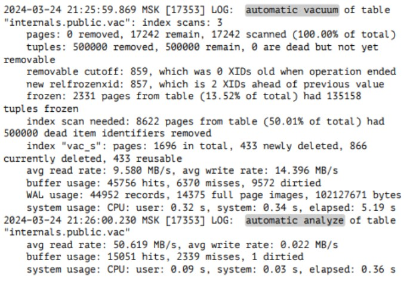

Он задаёт минимальное время выполнения процедуры очистки, после превышения которого информация о её работе будет записана в лог PostgreSQL.

# Индексы

Индекс в PostgreSQL — это отдельный файл, предназначенный для ускорения поиска данных в таблице. Страницы индекса содержат ключи и указатели (**TID**) на соответствующие строки основной таблицы.

Работа со страницами индекса организована так же, как и с табличными. При необходимости они загружаются в **Shared Buffers**, а внесенные изменения записываются на диск стандартным механизмом с использованием **WAL**, **Background Writer** и **Checkpointer**.

Алгоритм поиска зависит от типа индекса (**B-Tree**, **GiST**, **GIN**, **BRIN** и других), однако общий принцип их работы остается одинаковым.

Поиск начинается с чтения корневой страницы индекса. На каждой странице определяется следующая страница, которую необходимо прочитать, пока не будет достигнут листовой узел.

После этого индекс возвращает кортежи, удовлетворяющие условию поиска. Для каждого найденного указателя PostgreSQL загружает соответствующую страницу Heap и проверяет видимость строки в соответствии с правилами MVCC. Только после успешного прохождения этой проверки строка может быть возвращена пользователю.

### Удаление записей из индекса

Удаление строки из таблицы не приводит к немедленному удалению соответствующей записи из индекса. Как и в случае с Heap, очистка устаревших записей выполняется механизмом `VACUUM`.

По этой причине в индексе одновременно могут присутствовать несколько одинаковых ключей, указывающих на различные версии одной и той же строки. Во время выполнения запроса PostgreSQL обращается к Heap и проверяет видимость каждой найденной версии, поэтому пользователю будут возвращены только актуальные данные.

### Добавление записей в индекс

Добавление новой записи начинается с поиска листовой страницы, в которую должна быть выполнена вставка. Для этого PostgreSQL последовательно проходит по страницам индекса, начиная с корневой.

После нахождения целевой страницы выполняется вставка новой записи. Если свободного места оказывается недостаточно, страница разделяется (**split**), в результате чего индекс увеличивается в размере. Для поиска страниц, имеющих свободное место, используется **Free Space Map (FSM)**.

После внесения изменений страница помечается как измененная (*dirty*), а информация обо всех выполненных операциях записывается в журнал предзаписи **WAL**. Физическая запись измененных страниц на диск впоследствии выполняется фоновыми процессами.

### HOT-обновления

Отдельно стоит отметить механизм **HOT (Heap-Only Tuple)**, позволяющий избежать обновления индексов при изменении данных.

Использование HOT возможно только при одновременном выполнении двух условий:

* обновляются исключительно столбцы, не входящие ни в один индекс;
* на странице Heap достаточно свободного места для размещения новой версии строки.

Если хотя бы одно из этих условий не выполняется, PostgreSQL создает новые записи во всех затронутых индексах, поскольку изменившаяся версия строки может потребовать изменения индексных ключей.


# Буферный кэш

Буферный кэш (**Shared Buffers**) — это общее для всех процессов PostgreSQL пространство памяти, в котором хранятся страницы данных, с которыми происходит или происходила работа.

Использование буферного кэша позволяет ускорить доступ к часто используемым данным и уменьшить нагрузку на дисковую подсистему. При чтении страницы сначала загружаются из файловой системы, используя её собственный кэш, а затем помещаются в буферный кэш PostgreSQL.

Каждый буфер соответствует ровно одной странице данных. Поиск нужной страницы в буферном кэше осуществляется с помощью хэш-таблицы.

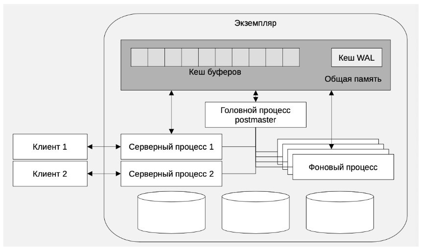

Для каждого буфера PostgreSQL хранит несколько служебных параметров:

* **usage_count** — количество обращений к буферу. Показывает, насколько часто используется страница.
* **pin_count** — количество закреплений буфера. Отражает, сколько процессов в данный момент используют страницу.
* **признак "грязной" страницы** — показывает, содержит ли страница изменения, которые ещё не были записаны на диск.

### Закрепление буферов

При обращении к странице backend-процесс закрепляет соответствующий буфер, увеличивая значение `pin_count`.
Закреплений может быть несколько, если страницу одновременно используют разные процессы. После завершения работы каждый процесс снимает своё закрепление.
Закреплённый буфер остаётся доступным для чтения и записи новых версий строк, однако не может быть использован для хранения другой страницы до тех пор, пока значение `pin_count` не станет равно нулю.


### Алгоритм Clock-Sweep

При каждом обращении к странице, находящейся в буферном кэше, значение `usage_count` увеличивается. Как правило, максимальное значение этого счётчика ограничено числом **5**.
Когда свободных буферов не остаётся и backend-процессу требуется загрузить новую страницу, запускается алгоритм **Clock-Sweep**.

Алгоритм последовательно обходит все буферы, по сути вращаясь по кругу.
Механизм работы выглядит следующим образом:

1. Если буфер закреплён (`pin_count > 0`), он пропускается.
2. Если `usage_count == 0`, буфер выбирается для вытеснения, после чего алгоритм завершает работу.
3. Если `usage_count > 0`, значение уменьшается на единицу, а алгоритм переходит к следующему буферу.

Если выбранная для вытеснения страница является грязной, backend-процесс сначала записывает её на диск, а затем загружает в освободившийся буфер новую страницу.
Если в буферном кэше отсутствуют свободные буферы, процесс чтения или записи ожидает освобождения одного из них после завершения записи грязных страниц.

### Буферные кольца

При последовательном чтении больших таблиц, размер которых превышает примерно четверть буферного кэша, PostgreSQL использует **буферные кольца** (*Buffer Rings*).

Буферное кольцо представляет собой небольшую область памяти, обычно состоящую из **32 страниц**, которая используется вместо основного буферного кэша. Такой подход позволяет избежать массового вытеснения часто используемых страниц при последовательном чтении больших объёмов данных.

Работа кольца организована циклически. После заполнения новые страницы начинают вытеснять наиболее старые страницы кольца.

Однако если буферное кольцо используется не только для чтения, но и для последующего изменения данных, оно быстро вырождается. Это связано с тем, что механизм не ожидает записи грязных страниц на диск, а заменяет их новыми буферами, из-за чего фактически перестаёт работать как кольцевой буфер.

Если при обработке больших таблиц используется индекс вместо последовательного чтения, страницы таблицы и самого индекса загружаются и кэшируются в обычном буферном кэше.


# Background Writer

Как уже говорилось в предыдущем разделе, если при вытеснении буфера backend-процессу попадается грязная страница, ему приходится самостоятельно записывать её на диск. Это крайне неэффективно: процесс, выполняющий пользовательский запрос, вынужден ожидать завершения операции ввода-вывода, что увеличивает задержки и снижает общую пропускную способность системы.

Чтобы избежать такого поведения, в PostgreSQL существует отдельный фоновый процесс — **Background Writer (bgwriter)**. Его задача заключается в том, чтобы заранее, асинхронно и равномерно записывать грязные страницы, которые с наибольшей вероятностью вскоре будут вытеснены из буферного кэша.

Bgwriter периодически просыпается и выполняет проход по буферному кэшу, используя тот же принцип обхода буферов (Clock-Sweep), что и backend-процессы при поиске страницы для вытеснения.

Для каждой страницы последовательно проверяются три условия:

* страница является грязной;
* страница не закреплена (`pin_count = 0`);
* значение `usage_count` равно нулю.

Если все условия выполняются, bgwriter записывает страницу на диск и сбрасывает признак её загрязнения. При этом значение `usage_count` не изменяется, а сам буфер не освобождается — страница продолжает находиться в буферном кэше, но уже в чистом состоянии.

### Настройка Background Writer

Количество страниц, записываемых bgwriter за один цикл, зависит от интенсивности работы backend-процессов и текущего давления на буферный кэш. Чем быстрее backend-процессы запрашивают новые буферы и чем активнее появляются грязные страницы, тем интенсивнее должен работать bgwriter, чтобы опережать их работу.

Поведение процесса определяется несколькими параметрами конфигурации.

Параметр `bgwriter_lru_maxpages` задаёт максимальное количество страниц, которое bgwriter может записать за один цикл.
Параметр `bgwriter_lru_multiplier` определяет, насколько агрессивно процесс увеличивает объём записи в зависимости от скорости, с которой backend-процессы расходуют свободные буферы. Например, значение `1.0` означает, что bgwriter попытается записать примерно столько страниц, сколько backend-процессы потенциально вытеснят до следующего цикла.
Параметр `bgwriter_delay` определяет интервал между последовательными циклами работы процесса.

Если грязных страниц не обнаружено, bgwriter переходит в состояние ожидания и возобновляет работу после истечения заданного интервала или получения сигнала о необходимости очередного прохода.

Работа bgwriter в рамках одного цикла завершается при выполнении одного из следующих условий:

* закончились страницы, подходящие для записи;
* записано требуемое количество страниц;
* достигнут лимит, заданный параметром `bgwriter_lru_maxpages`.

Важно понимать, что bgwriter не пытается очистить весь буферный кэш. Его задача заключается в поддержании достаточного количества чистых буферов, чтобы backend-процессам как можно реже приходилось самостоятельно записывать страницы на диск во время выполнения пользовательских запросов.

# WAL и Checkpointer

**WAL (Write Ahead Log)** — это журнал предзаписи, в котором последовательно фиксируются все изменения данных.

Принцип его работы основан на том, что сначала на диск записывается информация о модификации данных, и только после этого — сами грязные страницы, содержащие изменения. Такой подход одновременно обеспечивает надёжность и высокую производительность.

Записи WAL представляют собой линейный поток данных, который записывается последовательно и эффективно использует возможности дисковой подсистемы. В отличие от него, грязные страницы располагаются в различных участках файлов таблиц и требуют случайного доступа к диску. Благодаря этому последовательная запись WAL значительно быстрее и дешевле записи самих страниц данных.

Транзакция считается зафиксированной после того, как все относящиеся к ней записи WAL были гарантированно записаны на диск, даже если изменённые страницы в этот момент всё ещё находятся только в буферном кэше.

### Контрольные точки

Для восстановления после сбоя PostgreSQL использует WAL не с самого начала журнала, а начиная с последней контрольной точки (**Checkpoint**).
Контрольная точка — это момент времени, после которого все изменения данных гарантированно записаны на диск, а восстановление может быть продолжено, начиная именно с этой позиции журнала WAL.
Фактически checkpoint представляет собой специальную запись в WAL, обозначающую, что все изменения, предшествующие ей, уже были физически применены к страницам данных.

### Процесс Checkpointer

Созданием контрольных точек занимается отдельный фоновый процесс **Checkpointer**.

При запуске checkpoint процесс сначала определяет границу контрольной точки, после чего начинает записывать на диск все грязные страницы, изменения которых относятся к диапазону до этой границы. После завершения записи в WAL создаётся отметка о новой контрольной точке.

В отличие от **Background Writer**, который лишь постепенно очищает буферный кэш, **Checkpointer** обязан записать на диск все грязные страницы, относящиеся к текущей контрольной точке.

### Настройка Checkpointer

Параметр `checkpoint_timeout` определяет максимальный интервал между двумя соседними контрольными точками. Если за это время checkpoint не был инициирован другим механизмом, PostgreSQL запускает его автоматически.
Параметр `checkpoint_completion_target` задаёт долю времени от `checkpoint_timeout`, в течение которой PostgreSQL старается равномерно распределить запись грязных страниц на диск.

Например, если `checkpoint_timeout` равен **10 минутам**, а `checkpoint_completion_target` имеет значение **0.5**, то PostgreSQL будет стремиться завершить запись страниц в течение первых **5 минут**, распределяя нагрузку на дисковую подсистему максимально равномерно.

Если запись страниц не успевает завершиться за время, определяемое параметром `checkpoint_completion_target`, PostgreSQL прекращает искусственно растягивать процесс и продолжает запись на максимально возможной скорости.
Если же checkpoint не успевает завершиться даже за время `checkpoint_timeout`, он всё равно продолжается до полного завершения. После этого новый checkpoint может начаться практически сразу, поскольку время ожидания уже истекло.
Помимо автоматического запуска, контрольная точка может быть создана вручную с помощью команды `CHECKPOINT`, а также автоматически при достижении предельного размера WAL, задаваемого параметром `max_wal_size`.

После создания новой контрольной точки WAL-сегменты, находящиеся до неё и больше не требующиеся для репликации или архивирования, могут быть удалены.


# Мониторинг эффективности буферного кэша

Оценить эффективность работы буферного кэша можно с помощью системного представления `pg_stat_bgwriter`, содержащего статистику работы процессов **Background Writer** и **Checkpointer**.

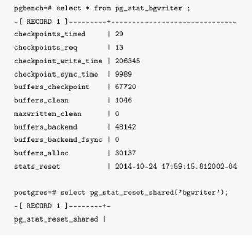

### Статистика контрольных точек

Поле `checkpoints_timed` содержит количество контрольных точек, выполненных автоматически по расписанию.
Поле `checkpoints_req` показывает количество внеплановых контрольных точек, инициированных вручную командой `CHECKPOINT` или автоматически при превышении ограничения, заданного параметром `max_wal_size`.

Частое выполнение внеплановых checkpoint создаёт дополнительную нагрузку на подсистему ввода-вывода и обычно свидетельствует о неоптимальной конфигурации PostgreSQL.

Поле `checkpoint_write_time` содержит суммарное время записи буферов на диск во время выполнения контрольных точек (в миллисекундах). Для получения среднего времени выполнения checkpoint необходимо разделить это значение на сумму `checkpoints_timed + checkpoints_req`.
Поле `checkpoint_sync_time` показывает суммарное время, затраченное на выполнение операций `fsync()` при завершении контрольных точек, то есть на фактическую запись данных из файлового кэша операционной системы на диск.
Значения `checkpoint_sync_time`, значительно превышающие норму, могут свидетельствовать о проблемах с дисковой подсистемой или некорректной настройке файлового кэша операционной системы.

### Статистика записи страниц

Поле `buffers_checkpoint` содержит количество страниц, записанных процессом **Checkpointer**.
Поле `buffers_clean` показывает количество страниц, записанных процессом **Background Writer**.
Поле `maxwritten_clean` содержит количество случаев, когда **Background Writer** был вынужден завершить очередной цикл записи из-за достижения ограничения, заданного параметром `bgwriter_lru_maxpages`.
Если значение `maxwritten_clean` постоянно увеличивается, это может означать, что Background Writer не успевает очищать необходимое количество страниц при текущих настройках.
Поле `buffers_backend` показывает количество страниц, записанных непосредственно backend-процессами пользовательских сессий.

Чем меньше значение `buffers_backend`, тем эффективнее работают фоновые процессы. Большие значения указывают на то, что **Background Writer** и **Checkpointer** не успевают своевременно очищать буферный кэш, вследствие чего backend-процессам приходится самостоятельно записывать страницы на диск.

Поле `buffers_backend_fsync` содержит количество случаев, когда backend-процессам приходилось самостоятельно выполнять операцию `fsync()`.

В штатном режиме операции `fsync()` выполняются процессом **Checkpointer** через специальную очередь. Ненулевое значение `buffers_backend_fsync` может свидетельствовать о переполнении этой очереди, недостаточной производительности дисковой подсистемы или некорректной настройке параметров PostgreSQL.

Все перечисленные показатели являются накопительными и отражают суммарную активность системы с момента последнего запуска PostgreSQL.

При необходимости накопленная статистика может быть сброшена вручную с помощью функции:

```sql
SELECT pg_stat_reset_shared('bgwriter');
```

### Оценка эффективности кэширования

Эффективность использования буферного кэша можно оценить как для отдельного запроса, анализируя его план выполнения, так и в целом для базы данных с помощью расчёта коэффициента **hit ratio**.

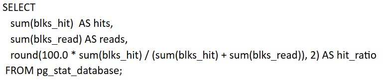

Показатель `hit_ratio` отражает процент обращений к данным, которые были обслужены из буферного кэша без обращения к дисковой подсистеме.

Значение, близкое к **100%**, свидетельствует об эффективной работе кэша. Если `hit_ratio` заметно ниже (например, менее **90%**), стоит обратить внимание на параметры `shared_buffers`, `work_mem`, а также на характер выполняемых запросов.


# Этапы выполнения запроса

Теперь можно перейти к главному, как происходит выполнение запроса пользователя.
Выполнение любого SQL-запроса в PostgreSQL можно разделить на несколько последовательных этапов.


### Установка соединения

Первым этапом является установка соединения между клиентом и сервером базы данных.
Клиент и PostgreSQL взаимодействуют по собственному протоколу PostgreSQL, работающему поверх TCP. Для каждого входящего соединения PostgreSQL создаёт отдельный процесс — **Backend**, который полностью обслуживает данное соединение.
Backend-процесс выполняет аутентификацию клиента (проверку SSL-соединения, пароля и других механизмов аутентификации), после чего обрабатывает все поступающие от него SQL-запросы.

### Лексический анализ (Parsing)

После получения SQL-запроса начинается этап лексического анализа (**Parsing**).
На этом этапе текст запроса разбивается на отдельные токены, из которых затем строится синтаксическое дерево (**Parse Tree**).

### Семантический анализ (Analyzer / Binder)

Следующим этапом является семантический анализ (**Analyzer / Binder**).

На этом этапе элементы синтаксического дерева связываются с реальными объектами базы данных. PostgreSQL:

* разрешает имена таблиц;
* разрешает имена столбцов;
* определяет типы данных;
* проверяет права доступа.

В результате формируется дерево запроса (**Query Tree**).

### Переписывание запроса (Rewriter)

После семантического анализа запрос при необходимости проходит этап переписывания (**Rewriter**).
На этом этапе PostgreSQL раскрывает конструкции, требующие дополнительного преобразования. Например, если запрос обращается к представлению (**View**), то его определение подставляется непосредственно в дерево запроса.
В результате получается модифицированное дерево запроса, которое затем передаётся оптимизатору.

### Построение плана выполнения (Planner / Optimizer)

Последним этапом является построение плана выполнения запроса (**Planner / Optimizer**).
Именно на этом этапе PostgreSQL выбирает наиболее эффективный способ выполнения запроса: определяет методы получения данных из таблиц, порядок соединения таблиц, используемые индексы, способы сортировки и другие операции, необходимые для выполнения запроса.
Именно работа **Planner / Optimizer** оказывает наибольшее влияние на производительность SQL-запросов, поэтому далее подробно рассмотрим принципы построения плана выполнения.

## Планировщик запросов

Работу планировщика можно рассматривать как преобразование декларативного SQL-запроса в императивный план выполнения. Для этого backend-процесс строит множество возможных вариантов выполнения запроса, оценивает стоимость каждого из них и выбирает план с наименьшей оценочной стоимостью.

### Статистика планировщика

Для построения эффективного плана выполнения PostgreSQL использует статистику таблиц.

Статистика представляет собой набор метрик, описывающих структуру таблиц и распределение данных внутри них. Именно от её актуальности зависит, сможет ли планировщик корректно выбрать способы чтения данных, фильтрации, соединения таблиц и использования индексов.

Статистика подразделяется на два типа:

* **каталожная статистика**;
* **детализированная статистика**.

#### Каталожная статистика

Каталожная статистика описывает структуру таблицы и хранится в системных каталогах (`pg_class`, `pg_attribute`, `pg_index` и других).

Она включает:

* список столбцов и их типы;
* сведения об индексах и их ключах;
* количество строк в таблице (`reltuples`);
* количество страниц таблицы и индексов;
* сведения о размере объектов;
* метаданные об ограничениях (constraints).

Каталожная статистика обновляется при выполнении DDL-операций (`CREATE INDEX`, `ALTER TABLE`, `DROP INDEX` и других), а также во время выполнения `VACUUM` и `Autovacuum`, которые пересчитывают количество строк и страниц таблиц. Часть каталожной статистики обновляется и при выполнении команды `ANALYZE`.

#### Детализированная статистика

Детализированная статистика хранится в системных каталогах `pg_statistic` и `pg_statistic_ext` и содержит информацию о распределении данных внутри столбцов.

Она включает:

* наиболее часто встречающиеся значения;
* гистограммы распределения остальных значений;
* долю `NULL`;
* среднюю ширину значения;
* другие характеристики распределения данных.

Детализированная статистика обновляется командой `ANALYZE`, которая может запускаться как вручную, так и автоматически процессом **Autovacuum**.

Автоматический запуск выполняется при выполнении условия:

```text
изменённые_строки > autovacuum_analyze_scale_factor × reltuples + autovacuum_analyze_threshold
```

По умолчанию используются следующие значения:

```text
autovacuum_analyze_threshold = 50
autovacuum_analyze_scale_factor = 0.1
```

Полученная статистика используется планировщиком для оценки селективности условий поиска, стоимости операций `JOIN`, выбора индексов и построения наиболее эффективного плана выполнения запроса.

## Дерево плана выполнения

Результатом работы этапа оптимизации является **дерево плана выполнения**.

Дерево представляет собой иерархию операторов, в которой:

* листья дерева соответствуют операциям чтения данных (например, `Seq Scan` или `Index Scan`);
* внутренние узлы выполняют операции над потоками данных, такие как фильтрация, сортировка, соединение таблиц и другие;
* корневой узел формирует итоговый результат выполнения запроса.

Исполнение запроса в PostgreSQL построено на итеративной модели.

Когда требуется получить очередную строку результата, корневой узел плана запрашивает её у своих дочерних узлов. Каждый дочерний узел, в свою очередь, при необходимости обращается к своим потомкам. Таким образом, запрос на получение строки рекурсивно проходит вниз по дереву, после чего сформированная строка последовательно возвращается обратно к корневому узлу и отправляется клиенту.

Если используется **server-side cursor**, получение строк выполняется только по мере их запроса клиентом. После выдачи очередной порции данных выполнение плана приостанавливается до следующего обращения клиента.

При обычном выполнении запроса (**client cursor**) получение строк продолжается до тех пор, пока корневой узел не перестанет возвращать новые строки.

Каждый узел плана имеет ограничение на объём оперативной памяти, который он может использовать для хранения промежуточных данных. После превышения этого объёма узел начинает использовать временные файлы на диске.
Максимальный объём памяти, доступный одному узлу плана, определяется параметром `work_mem`.

## Анализ плана выполнения

Просмотреть построенный план выполнения можно с помощью команды `EXPLAIN` или настроив журналирование планов выполнения запросов.
Каждый узел плана содержит набор характеристик, позволяющих оценить эффективность его работы.

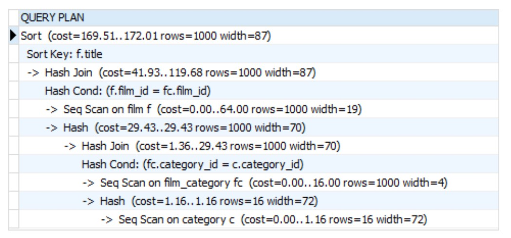

Наиболее полезными являются следующие параметры:

* **cost** — оценочная стоимость выполнения узла. Первое число показывает стоимость получения первой строки, второе — стоимость получения всех строк.
* **rows** — ожидаемое количество строк, которое обработает узел.
* **width** — средний размер строки в байтах.
* **actual time** — фактическое время выполнения узла.
* **loops** — количество запусков узла.
* **buffers** — статистика работы с буферным кэшем. Например, `shared hit` показывает количество страниц, найденных в буферном кэше, а `shared read` — количество страниц, считанных с диска в буферный кэш.

Далее подробно рассмотрим наиболее часто встречающиеся узлы плана выполнения и особенности их работы.

# Узлы выборки строк

### Sequential Scan

**Sequential Scan** — это последовательное чтение всех страниц таблицы с проверкой каждой строки на соответствие условиям запроса.

Для каждой страницы PostgreSQL либо использует уже загруженную страницу из **Shared Buffers**, либо считывает её с диска. После этого все кортежи страницы последовательно проверяются на соответствие правилам MVCC и условиям фильтрации.

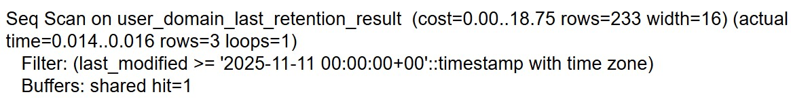

Узел не использует параметр `work_mem`, поскольку ему нет необходимости накапливать промежуточные результаты. Строки, удовлетворяющие условиям запроса, сразу передаются следующему узлу плана выполнения.

Обычно `Sequential Scan` используется в следующих случаях:

* запрос имеет низкую селективность, поэтому всё равно потребуется прочитать большую часть страниц таблицы;
* таблица полностью помещается в буферном кэше, и использование индекса не даёт существенного выигрыша;
* отсутствует индекс, позволяющий эффективно выполнить фильтрацию.

При необходимости `Sequential Scan` может быть преобразован в **Parallel Seq Scan**, при котором чтение таблицы распределяется между несколькими worker-процессами.

### Index Scan

**Index Scan** выполняет выборку строк с использованием индекса.

Сначала PostgreSQL считывает страницы индекса и находит указатели на строки, удовлетворяющие условиям поиска. Затем по найденным указателям загружаются соответствующие страницы таблицы, после чего выполняется проверка видимости строк в соответствии с правилами MVCC.

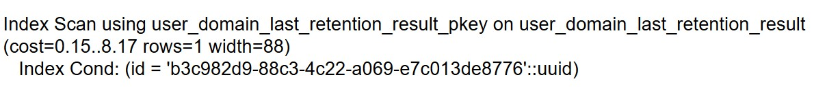

Как и `Sequential Scan`, данный узел не использует `work_mem`, поскольку найденные строки сразу передаются следующему узлу плана выполнения.

Существует несколько разновидностей `Index Scan`.

**Index Scan Backward** выполняет обход индекса в обратном направлении. Например, такой вариант может использоваться при выполнении сортировки по убыванию.
**Index Only Scan** позволяет получить данные непосредственно из индекса, не обращаясь к страницам основной таблицы.

Использование `Index Only Scan` возможно только при выполнении двух условий:

* все запрашиваемые столбцы присутствуют в индексе;
* страница таблицы отмечена в **Visibility Map** как полностью видимая.

Если хотя бы одно из этих условий не выполняется, PostgreSQL обращается к странице основной таблицы для проверки видимости строк по правилам MVCC. В этом случае `Index Only Scan` фактически деградирует до обычного `Index Scan`.

### Bitmap Index Scan + Bitmap Heap Scan

**Bitmap Scan** представляет собой промежуточный вариант между `Sequential Scan` и `Index Scan`.

Он используется в случаях, когда выборка по индексу возвращает слишком большое количество строк для эффективного `Index Scan`, но при этом выполнять полное последовательное сканирование таблицы ещё нецелесообразно.

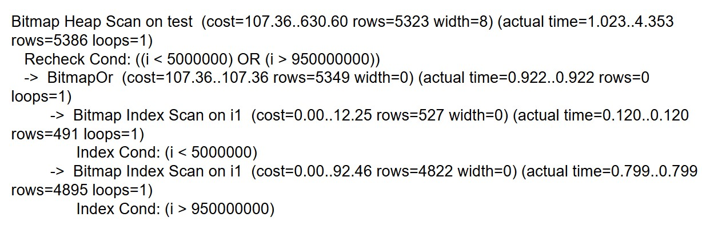

Сначала для каждого условия поиска строится битовая карта страниц, содержащих подходящие строки. Если условий несколько, полученные битовые карты объединяются.
После этого итоговая карта сортируется по номерам страниц, что позволяет минимизировать количество случайных обращений к дисковой подсистеме.
Затем PostgreSQL последовательно считывает найденные страницы, проверяет видимость строк и применяет дополнительные условия фильтрации, которые не использовались при построении битовой карты.

Битовая карта хранится в памяти, выделяемой параметром `work_mem`. Если её размер превышает доступный объём памяти, промежуточные данные выгружаются во временные файлы на диск, что может существенно снизить производительность выполнения запроса.

# Узлы сортировки таблиц

### Sort

**Sort** — это узел плана выполнения, который получает на вход неотсортированный набор строк и возвращает тот же набор, отсортированный по одному или нескольким ключам.

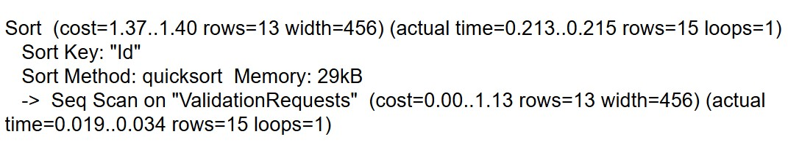

Перед началом сортировки узел полностью считывает входной поток строк и сохраняет его в памяти, выделяемой параметром `work_mem`.
Если объём данных превышает доступный размер `work_mem`, PostgreSQL использует временные файлы на диске, что может значительно увеличить время выполнения запроса.

Только после завершения обработки всего входного набора данных узел начинает возвращать отсортированные строки следующему узлу плана выполнения.

### Incremental Sort

**Incremental Sort** — это оптимизация обычного `Sort`, позволяющая избежать сортировки всего набора данных целиком.

Если входной поток уже отсортирован по части ключей, PostgreSQL сортирует только небольшие группы строк, имеющие одинаковые значения уже отсортированных полей.

Например, для запроса

```sql
ORDER BY a, b
```

если входной поток уже гарантированно отсортирован по столбцу `a` (например, благодаря использованию индекса), PostgreSQL остаётся отсортировать только строки внутри каждой группы с одинаковым значением `a` по столбцу `b`.

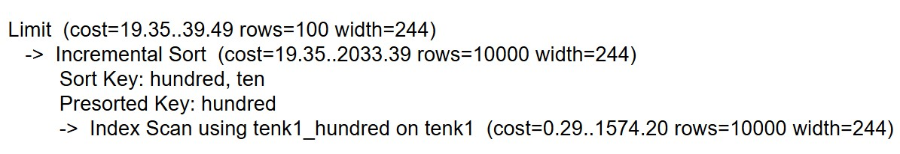

Обработка выполняется последовательно по группам. Каждая группа считывается, сортируется в пределах `work_mem` по оставшимся ключам и сразу передаётся следующему узлу плана выполнения.

Если сортировка выполняется по нескольким столбцам, PostgreSQL использует наиболее длинный префикс сортировки, уже обеспечиваемый входным потоком (например, существующим индексом), а затем сортирует строки внутри каждой группы по оставшимся ключам.

# Узлы агрегации

### Plain Aggregate

**Plain Aggregate** используется, когда запрос содержит агрегатные функции, но не содержит группировки (`GROUP BY`).

Например:

```sql
SELECT COUNT(*) FROM table_name;
```

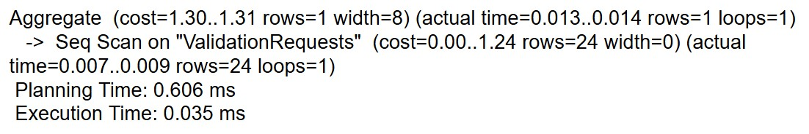

Входной поток строк обрабатывается последовательно. Для каждой агрегатной функции в памяти, выделенной параметром `work_mem`, хранится промежуточная структура состояния агрегатора.

По мере поступления каждой новой строки состояние агрегатора обновляется. После обработки всего входного потока агрегаты финализируются, и полученный результат передаётся следующему узлу плана выполнения.

### Group Aggregate

**Group Aggregate** используется, когда запрос содержит оператор `GROUP BY`, а входной поток уже отсортирован по ключам группировки.
Если входные данные не отсортированы, планировщик предварительно добавляет в план узел `Sort`.

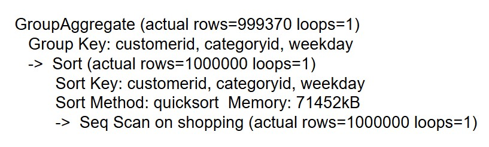

Во входном потоке последовательно выделяются группы строк с одинаковыми значениями ключей группировки. Для текущей группы в `work_mem` хранятся промежуточные структуры агрегаторов.
После обработки всех строк группы агрегаты финализируются, результат передаётся следующему узлу плана, а затем начинается обработка следующей группы.

Если запрос содержит предложение `HAVING`, сформированные группы дополнительно фильтруются перед передачей следующему узлу плана выполнения.

### Hash Aggregate

**Hash Aggregate** применяется в случаях, когда входной поток не отсортирован либо предварительная сортировка оценивается планировщиком как слишком дорогостоящая, а ожидаемое количество групп сравнительно невелико.

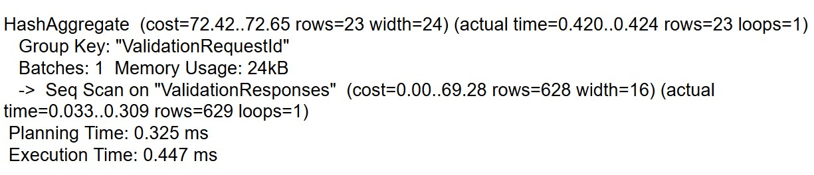

Перед началом обработки в памяти, выделенной параметром `work_mem`, создаётся хеш-таблица, содержащая структуры агрегаторов для каждой группы.
Для каждой входной строки вычисляется хеш по ключам группировки, после чего обновляется состояние соответствующего агрегатора.
Если размер хеш-таблицы превышает доступный объём `work_mem`, PostgreSQL начинает использовать временные файлы на диске.
После обработки всего входного потока агрегаты финализируются, а полученный результат передаётся следующему узлу плана выполнения.

### Устранение дубликатов

Помимо выполнения агрегатных функций, узлы `Group Aggregate` и `Hash Aggregate` могут использоваться для устранения дубликатов.

Например, выражение

```sql
SELECT DISTINCT x, y
FROM table_name;
```

может быть преобразовано планировщиком в эквивалентную группировку:

```sql
SELECT x, y
FROM table_name
GROUP BY x, y;
```

В результате для каждой уникальной комбинации значений остаётся одна строка. Какая именно строка будет выбрана, зависит от порядка обработки данных.

Если же используется конструкция `DISTINCT ON`, которая по синтаксису SQL требует сохранения порядка строк, PostgreSQL использует только `Group Aggregate`.

# Узлы join

### Nested Loop

**Nested Loop** соединяет строки из двух источников данных с помощью вложенного цикла.

Один из дочерних узлов выбирается как внешний (**Outer**), второй — как внутренний (**Inner**).

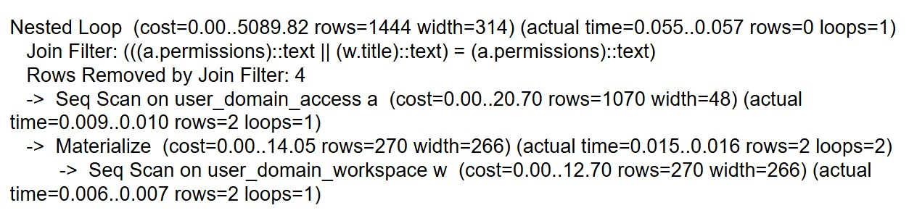

Внешний узел последовательно возвращает строки одну за другой. Для каждой полученной строки выполняется внутренний узел с подстановкой соответствующих параметров (например, значения ключа соединения из текущей строки внешнего узла).
Как только найдена подходящая пара строк, она сразу передаётся следующему узлу плана выполнения.
Таким образом, внутренний узел выполняется столько раз, сколько строк возвращает внешний узел. Поэтому эффективность `Nested Loop` во многом определяется способом доступа к данным во внутреннем узле.

Если внутренний узел не зависит от значений внешнего узла (например, при `CROSS JOIN` или фильтрации без параметров), PostgreSQL может добавить в план узел `Materialize`.
`Materialize` сохраняет весь результат дочернего узла в буфере, расположенном в памяти `work_mem`, после чего все последующие обращения выполняются уже к этому буферу, без повторного выполнения дочернего узла.

Если же внутренний узел зависит от параметров внешнего, но значения этих параметров часто повторяются, PostgreSQL может использовать узел `Memoize`.
`Memoize` представляет собой хеш-таблицу, размещённую в `work_mem`, где ключом являются параметры выполнения внутреннего узла, а значением — набор строк, возвращённых для этих параметров.
Кэш `Memoize` заполняется постепенно по мере выполнения запроса. При достижении ограничения `work_mem` из него вытесняются наименее используемые записи.
Если результат, соответствующий одному ключу, сам по себе не помещается в `work_mem`, кэширование для такого ключа не используется.

### Hash Join

**Hash Join** выполняет соединение двух наборов строк с использованием хеш-таблицы.

Работа алгоритма состоит из двух этапов.

На этапе **построения (Build Phase)** по данным внутреннего источника (**Inner**) создаётся хеш-таблица. Хеш вычисляется по значениям столбцов, участвующих в условии соединения.
На этапе **поиска (Probe Phase)** PostgreSQL последовательно считывает строки внешнего источника (**Outer**) и ищет соответствующие записи в построенной хеш-таблице.

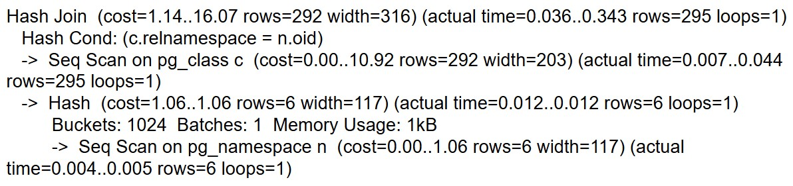

`Hash Join` может использоваться только для соединений по условию равенства (`=`). При использовании условий `<`, `>`, `<=`, `>=`, `BETWEEN` и других неравенств данный алгоритм неприменим.
Кроме того, условие соединения должно позволять независимо вычислить ключ хеширования для каждой из соединяемых таблиц. 
Если получение строк одной стороны соединения требует значений из другой стороны, Hash Join использовать невозможно.

Хеш-таблица хранится в памяти, выделяемой параметром `work_mem`. Если её размер превышает доступный объём памяти, PostgreSQL использует временные файлы на диске.

После нахождения совпадения соединённые строки сразу передаются следующему узлу плана выполнения и не накапливаются в памяти.

### Merge Join

**Merge Join** соединяет два уже упорядоченных потока данных.

Для использования данного алгоритма как внешний (**Outer**), так и внутренний (**Inner**) поток должны быть отсортированы по ключу соединения.

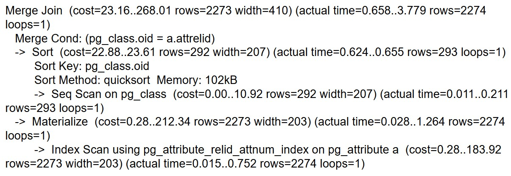

В отличие от `Hash Join`, который поддерживает только соединения по равенству, `Merge Join` может эффективно выполнять соединения как по равенству (`=`), так и по диапазонам (`<`, `<=`, `>`, `>=`).
Для использования `Merge Join` условие соединения должно допускать независимую сортировку данных каждой из соединяемых таблиц.

Сам узел `Merge Join` не использует `work_mem` для хранения промежуточных данных. Соединение выполняется путём последовательного продвижения по обоим отсортированным потокам.

Результирующие строки передаются следующему узлу плана выполнения потоково, по мере обработки групп строк с совпадающими ключами соединения.

### Особенности выполнения JOIN

Различные типы соединений (`INNER JOIN`, `LEFT JOIN`, `RIGHT JOIN`, `FULL JOIN`) практически не влияют на выбор алгоритма соединения. В большинстве случаев изменяется только логика передачи строк следующему узлу плана выполнения.

Исключением является `CROSS JOIN`. Поскольку он не содержит условия соединения, PostgreSQL всегда выполняет его с помощью алгоритма `Nested Loop`. Использование `Hash Join` или `Merge Join` в данном случае невозможно, так как для их работы необходимы ключи соединения.

Если запрос соединяет три и более таблиц, PostgreSQL выполняет соединение последовательно.
Сначала строится результат соединения двух таблиц, затем этот промежуточный результат соединяется с третьей таблицей, после чего — с четвёртой и так далее.
При этом одной из основных задач планировщика является выбор наиболее эффективного порядка соединения таблиц, поскольку именно он во многом определяет итоговую стоимость выполнения запроса.


# Прочие узлы плана выполнения

### Limit

**Limit** ограничивает количество строк, возвращаемых дочерним узлом плана выполнения.

В отличие от большинства других узлов, `Limit` не преобразует входной поток данных. Его задача заключается только в управлении чтением дочернего узла.

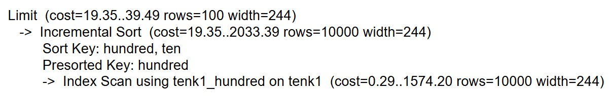

Узел хранит два параметра:

* `count` — количество строк, которое необходимо вернуть;
* `offset` — количество строк, которое необходимо пропустить.

Во время выполнения `Limit` последовательно получает строки от дочернего узла, пропускает первые `offset` строк, после чего передаёт вверх по плану не более `count` строк. Если дочерний узел завершает работу раньше, выполнение также завершается.

Важно понимать, что использование большого значения `OFFSET` не избавляет PostgreSQL от необходимости читать пропускаемые строки. Поэтому запросы с большими значениями `OFFSET` могут значительно снижать производительность.

### Unique

**Unique** удаляет повторяющиеся строки из уже отсортированного входного потока.

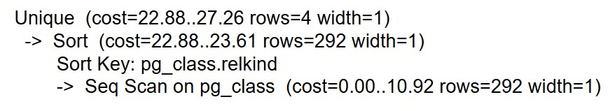

Узел предполагает, что входные данные уже упорядочены по ключам сравнения.

Во время выполнения `Unique` запоминает последнюю переданную вверх строку и сравнивает с ней каждую следующую. Если строки совпадают, новая строка отбрасывается. При обнаружении нового значения строка передаётся следующему узлу плана выполнения, после чего процесс повторяется.

Поскольку `Unique` работает только с соседними строками, он не использует `work_mem` для хранения всего набора данных.

### Gather и Gather Merge

Узлы **Gather** и **Gather Merge** используются при выполнении параллельных запросов.
Их задача заключается в объединении результатов, полученных несколькими параллельно работающими worker-процессами.

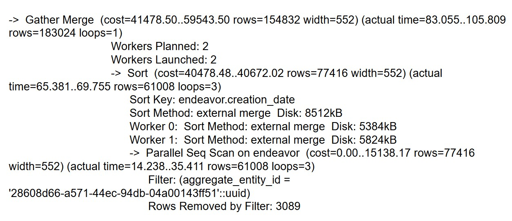

**Gather** передаёт строки следующему узлу плана по мере их готовности, не сохраняя порядок строк.
**Gather Merge** объединяет уже отсортированные потоки данных от worker-процессов и сохраняет общий порядок сортировки, выбирая очередную строку в соответствии с ключом сортировки.


