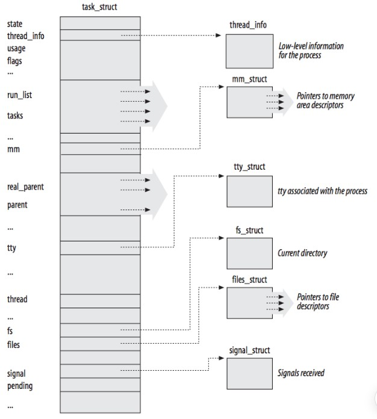
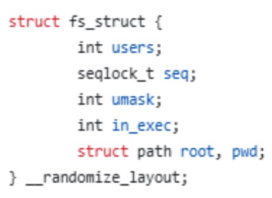
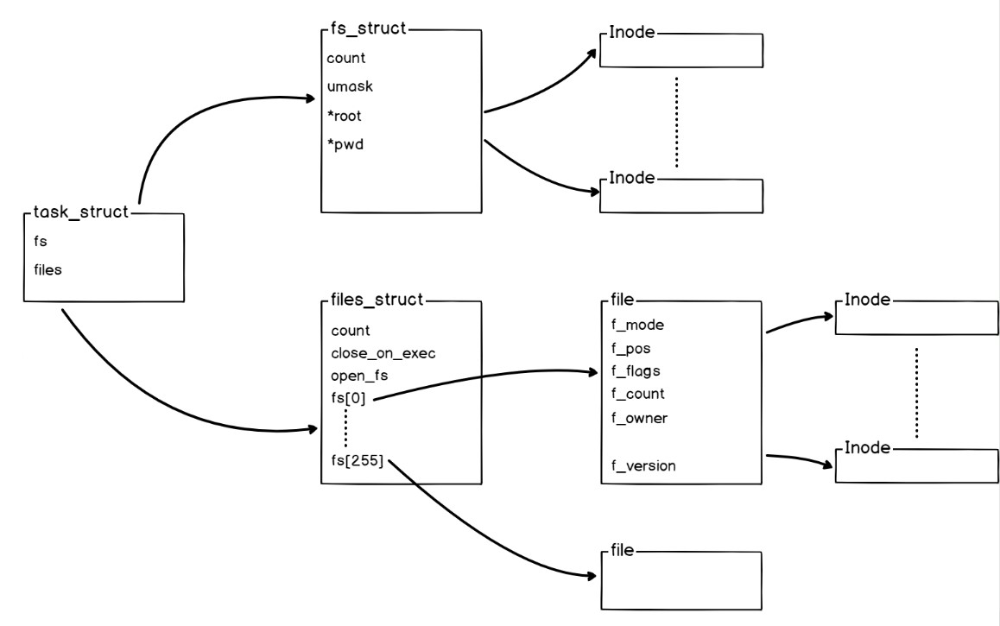
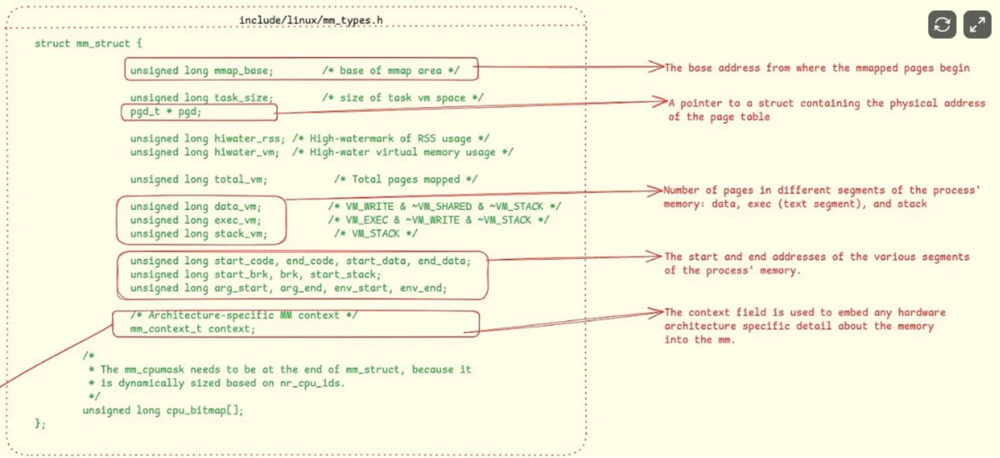
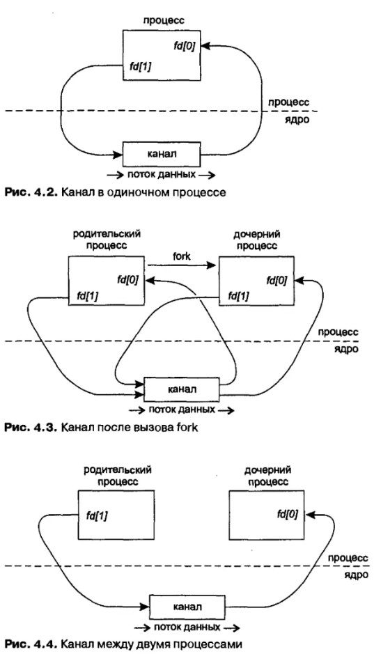
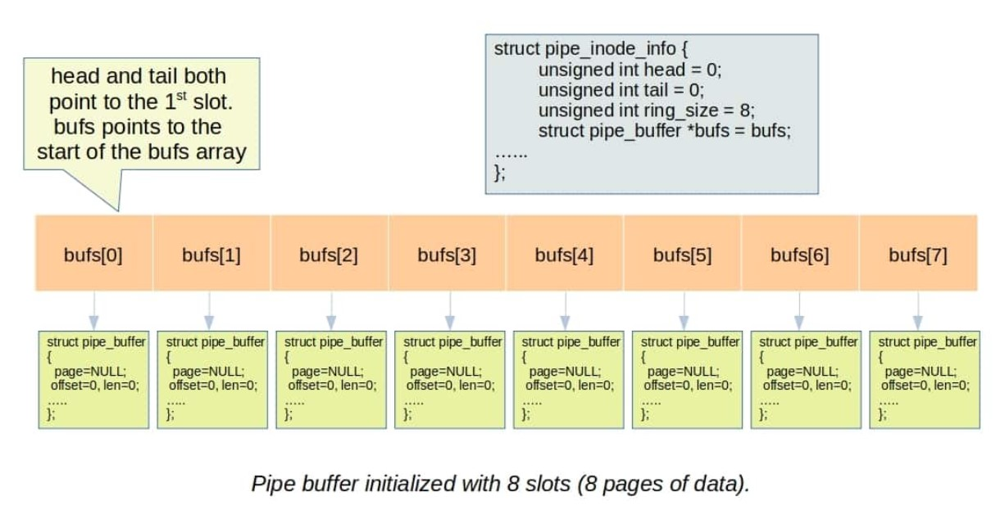
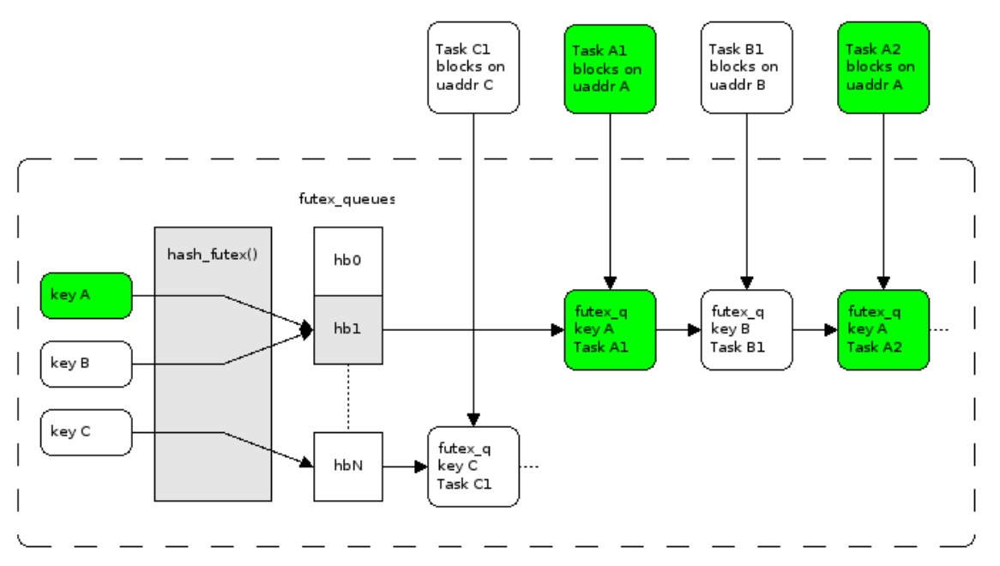

# Межпроцессное взаимодействие в Python на POSIX-системах

# Содержание

- [POSIX, Linux и libc](#posix-linux-и-libc)
- [Процессы и потоки в Linux](#процессы-и-потоки-в-linux)
- [Межпроцессное взаимодействие в Linux](#межпроцессное-взаимодействие-в-linux)
- [Примитивы синхронизации в Linux](#примитивы-синхронизации-в-linux)
- [IPC в Docker](#ipc-в-docker)
- [Создание процессов в python](#создание-процессов-в-python)
- [IPC в Python](#ipc-в-python)
- [Примитивы синхронизации в python](#примитивы-синхронизации-в-python)

# Введение

В этой статье рассмотрим, как в Python реализовано межпроцессное взаимодействие на POSIX-системах.
Начнём с механизмов, которые предоставляет сама операционная система, а затем постепенно перейдём к тому, как Python использует POSIX API в своих высокоуровневых обёртках.

# POSIX, Linux и libc

Для понимания дальнейшего материала полезно сначала рассмотреть общую архитектуру UNIX-подобных операционных систем и место стандарта POSIX в этой экосистеме.

Одной из ключевых особенностей UNIX-подобных систем является наличие стандартизированного интерфейса взаимодействия приложений с операционной системой. Эту роль выполняет семейство стандартов **POSIX** (*Portable Operating System Interface*), определяющее набор API, типы данных, поведение функций, правила работы процессов, потоков и многие другие аспекты работы системы.

Благодаря этому приложение, написанное в соответствии со стандартом POSIX, может быть перенесено между различными UNIX-подобными операционными системами с минимальными изменениями. При этом важно понимать, что POSIX стандартизирует именно внешний интерфейс и ожидаемое поведение, а не внутреннюю реализацию этих механизмов.

Linux является одной из наиболее распространённых UNIX-подобных операционных систем. Само ядро Linux предоставляет низкоуровневый интерфейс в виде системных вызовов (*system calls*), через который пользовательские программы взаимодействуют с ядром.

Набор и семантика системных вызовов Linux являются частью интерфейса самого ядра и не обязаны полностью соответствовать стандарту POSIX. Более того, многие возможности Linux вообще не описаны POSIX и представляют собой расширения, специфичные именно для этой операционной системы.

Для предоставления приложению стандартизированного POSIX-интерфейса поверх системных вызовов используется стандартная библиотека языка C (**libc**). Именно она реализует большинство функций, описанных в POSIX, скрывая детали работы конкретного ядра и при необходимости преобразуя один вызов POSIX в один или несколько системных вызовов Linux.

Существует несколько реализаций libc, наиболее известными из которых являются **GNU C Library (glibc)**, **musl libc**, **uClibc** и другие. Несмотря на совместимость базового интерфейса, они могут существенно различаться внутренней реализацией. Поэтому некоторые особенности поведения программ могут зависеть не только от версии ядра Linux, но и от используемой реализации libc.

В дальнейшем весь материал будет рассматриваться применительно к операционной системе Linux и наиболее распространённой реализации стандартной библиотеки C — **GNU C Library (glibc)**.

# Процессы и потоки в Linux

Прежде чем переходить к межпроцессному взаимодействию, необходимо разобраться, как операционная система представляет процессы и потоки.

Вспомним, что процесс - это единица выполнения программы.
Каждый процесс обладает собственным виртуальным адресным пространством, что обеспечивает безопасное и изолированное выполнение программ.

Концептуально существует два способа создания нового процесса:

* **spawn** — создание нового процесса «с нуля»;
* **fork** — клонирование уже существующего процесса.

В Linux семантика `spawn` реализуется неявно.
Во время загрузки системы ядро создаёт первый пользовательский процесс с PID 1 (`init` или `systemd`). Все остальные процессы появляются путём клонирования уже существующих процессов с помощью системных вызовов `fork()` (или `clone()`), после чего обычно выполняется вызов `execve()`, заменяющий адресное пространство процесса новой программой.
Таким образом, создание процесса путём `fork()` от процесса с PID 1 по своей сути эквивалентно созданию процесса через `spawn`.

Отдельно стоит отметить, что в Linux отсутствует самостоятельное понятие потока на уровне ядра.
Вместо этого используются **Light Weight Process (LWP)** — сущности, создаваемые библиотекой `pthread`, но представленные в ядре теми же структурами `task_struct`, что и процессы.

С точки зрения ядра Linux процесс представляет собой группу потоков, разделяющих общие ресурсы и объединённых общим идентификатором процесса.


## Структура `task_struct`



В Linux практически вся информация, необходимая для выполнения процесса или потока, хранится в структуре `task_struct`.

Она содержит указатели на адресное пространство процесса, таблицу открытых файлов, состояние обработки сигналов, информацию, необходимую планировщику, и многие другие ресурсы.

При создании нового процесса создаётся новая структура `task_struct` с собственной копией адресного пространства.
При создании нового потока также создаётся новая `task_struct`, однако в этом случае она:

* разделяет адресное пространство и другие ресурсы с потоками той же группы;
* имеет собственный идентификатор потока (TID), но общий для всей группы идентификатор процесса (TGID);
* представляет собой самостоятельную единицу планирования.

Таким образом, при создании процесса появляется структура, которая одновременно является и процессом, и его первым потоком. После создания дополнительных потоков эта структура становится лидером группы потоков (*Thread Group Leader*).

В дальнейшем нас будут интересовать следующие поля структуры `task_struct`:

* `fs_struct` — файловый контекст процесса;
* `files_struct` — таблица открытых файловых дескрипторов;
* `mm_struct` — адресное пространство процесса;
* `signal_struct` — состояние сигналов процесса;
* `sighand_struct` — таблица обработчиков сигналов.

### `fs_struct`

Структура `fs_struct` описывает файловый контекст процесса, то есть то, **как процесс видит файловую систему**, а не то, какие файлы у него открыты.

Она содержит:

* текущий рабочий каталог процесса (`cwd`);
* корневой каталог процесса (`root`);
* маску прав доступа (`umask`);
* служебные и синхронизационные поля.

Именно `fs_struct` используется ядром при разрешении относительных и абсолютных путей, а также при выполнении операций, работающих с путями файловой системы, например `open()`, `stat()` или `chdir()`.



### `files_struct`

Структура `files_struct` описывает контекст открытых файлов процесса.

Она является управляющим объектом для файловых дескрипторов и содержит:

* ссылку на таблицу файловых дескрипторов;
* счётчики ссылок и механизмы синхронизации, необходимые для корректной работы в многопоточном процессе;
* служебную информацию.

Основным элементом этой структуры является `fdtable` — динамически расширяемая таблица файловых дескрипторов, реализованная как массив указателей на структуры `file`.
Файловый дескриптор представляет собой индекс в этом массиве, указывающий на соответствующий объект `struct file`.

В свою очередь, `struct file` описывает состояние открытого файла и содержит:

* текущую позицию в файле;
* флаги открытия;
* ссылку на объект файловой системы (`struct inode`).

При открытии нового файла создаётся объект `struct file`, после чего в `fdtable` добавляется новая запись, тем самым формируя новый файловый дескриптор.

Содержимое таблицы файловых дескрипторов можно наблюдать через каталог:

```text
 /proc/<pid>/fd/
```

Этот каталог представляет собой динамическое отображение таблицы файловых дескрипторов процесса, где каждый элемент соответствует одному открытому файловому дескриптору.



### `mm_struct`

Структура `mm_struct` описывает адресное пространство процесса.

Нас прежде всего интересует то, что она хранит указатель на **PGD (Page Global Directory)** — корневой каталог таблиц страниц, через который ядро получает информацию о сопоставлении виртуальных и физических адресов памяти.

Помимо этого, `mm_struct` содержит сведения об отображениях виртуальной памяти и другую служебную информацию, необходимую подсистеме управления памятью.



### Обработка сигналов

В Linux обработкой сигналов занимаются сами потоки.

Сигнал может быть отправлен как конкретному потоку, так и процессу в целом (то есть группе потоков).
Во втором случае ядро выбирает один из потоков группы, который находится в подходящем состоянии и не блокирует данный сигнал своей маской. Именно этот поток выполнит обработку сигнала.

Для хранения информации, связанной с сигналами, используются две структуры:

* `signal_struct` — хранит состояние сигналов и связанные с ними данные на уровне процесса (группы потоков);
* `sighand_struct` — хранит таблицу обработчиков сигналов.

Каждая структура `task_struct` содержит указатели на соответствующие `signal_struct` и `sighand_struct`.

Как правило, эти структуры разделяются всеми потоками одного процесса и существуют в единственном экземпляре для всей группы потоков.
Когда сигнал отправляется процессу, информация о нём помещается в `signal_struct`, где формируется общая очередь ожидающих сигналов процесса.

После этого ядро выбирает подходящий поток, переносит информацию о сигнале в очередь ожидающих сигналов этого потока, расположенную в его `task_struct`, и впоследствии именно этот поток выполняет обработку.

Если же сигнал адресован конкретному потоку, он сразу помещается в очередь сигналов соответствующей `task_struct`, минуя уровень `signal_struct`.

## Создание процессов

Теперь, когда мы познакомились с тем, как ядро представляет процессы и потоки, можно перейти к механизмам их создания и рассмотреть наиболее распространённые функции стандарта POSIX.

### `fork()`

Вызов `fork()` создаёт новый процесс путём клонирования контекста процесса, из которого он был вызван.
Исходный процесс называется **родительским**, а созданный — **дочерним**.
Если `fork()` вызывается из многопоточного процесса, в дочернем процессе будет существовать только один поток — тот, из которого был выполнен вызов `fork()`.

В обобщённом виде реализацию `fork()` в библиотеке `libc` можно представить следующим образом.

Во время выполнения `fork()` создаётся новая структура `task_struct`, формируется новый PID, устанавливаются связи между родительским и дочерним процессами.

Для дочернего процесса создаётся новая структура `mm_struct`, логически копирующая адресное пространство родителя.
Физические страницы памяти при этом не копируются. Вместо этого используется механизм **Copy-On-Write (COW)**.
Первоначально оба процесса используют одни и те же физические страницы памяти, которые помечаются как доступные только для чтения. При первой попытке записи одним из процессов ядро создаёт отдельную копию изменяемой страницы.

Структура `fs_struct` копируется, поэтому дочерний процесс наследует текущий рабочий каталог, наследует корневой каталог процесса, при этом последующие вызовы `chdir()` или `chroot()` в одном процессе не влияют на другой.

Структура `sighand_struct` также копируется.
Поэтому сразу после создания дочерний процесс имеет тот же набор обработчиков сигналов, что и родитель, однако их дальнейшее изменение происходит независимо.

Для `signal_struct`, наоборот, создаётся новый экземпляр.
Очередь ожидающих сигналов родителя не наследуется, поэтому дочерний процесс начинает работу с собственным состоянием сигналов.

Структура `files_struct` также копируется.
Это означает, что таблицы файловых дескрипторов у родителя и потомка становятся независимыми: открытие или закрытие файлов в одном процессе не влияет на другой.
Однако сами записи таблицы указывают на одни и те же объекты `struct file`.
Поэтому такие характеристики, как текущая позиция чтения (`f_pos`), остаются общими. Например, чтение файла родительским процессом изменяет позицию чтения и для дочернего процесса.

### `vfork()`

`vfork()` представляет собой оптимизацию `fork()`, предназначенную для случая, когда дочерний процесс создаётся исключительно для немедленного вызова `exec()`.

При использовании `vfork()` дочерний процесс полностью разделяет адресное пространство родителя (`mm_struct` не копируется), а выполнение родительского процесса приостанавливается.
Родитель продолжает работу только после вызова дочерним процессом `execve()` или `_exit()`.
Дочерний процесс не должен изменять разделяемую память, использовать стек, обращаться к глобальным данным или выполнять действия, способные изменить адресное пространство процесса. Нарушение этих требований приводит к неопределённому поведению.

Исторически появление `vfork()` связано с тем, что ранние реализации `fork()` полностью копировали память процесса. Если сразу после этого выполнялся `exec()`, вся проделанная работа оказывалась бесполезной.

Позже в Linux появился механизм **Copy-On-Write**, значительно снизивший стоимость обычного `fork()`, а затем стандарт POSIX получил функцию `posix_spawn()`, обеспечивающую безопасное создание нового процесса без промежуточного состояния.

По этой причине `vfork()` считается устаревшим и был исключён из стандарта POSIX начиная с редакции 2004 года.

Современные реализации `libc` сохраняют поддержку функции в целях совместимости, однако её реализация может использовать более безопасные внутренние механизмы вместо непосредственного системного вызова `vfork()`.

### `posix_spawn()`

`posix_spawn()` является современным способом создания нового процесса для последующего запуска программы.
Эта функция была предложена стандартом POSIX как безопасная альтернатива связке `fork() + exec()` и устаревшему `vfork()`.

В отличие от `vfork()`, пользовательский код никогда не выполняется в разделяемом адресном пространстве родительского процесса.
Новый процесс сразу создаётся для запуска другой программы, а его адресное пространство не копируется и не разделяется с родительским процессом.
Благодаря этому `posix_spawn()` безопасно использовать в многопоточных приложениях, а также удаётся избежать накладных расходов, связанных с созданием Copy-On-Write-копии памяти родительского процесса.

### Создание потоков

Для создания нового потока стандарт POSIX предоставляет функцию `pthread_create()`.
Как уже отмечалось ранее, в Linux поток не является отдельной сущностью на уровне ядра. Каждый поток представлен собственной структурой `task_struct` и планируется ядром так же, как и обычный процесс.

Отличие потока от процесса заключается не в типе сущности, а в наборе разделяемых ресурсов.
При создании потока через `pthread_create()` библиотека `libc`, как правило, использует системный вызов `clone()` с набором флагов, обеспечивающих совместное использование:

* адресного пространства (`mm_struct`);
* таблицы файловых дескрипторов (`files_struct`);
* файлового контекста (`fs_struct`);
* таблицы обработчиков сигналов (`sighand_struct`);
* состояния сигналов процесса (`signal_struct`).

Благодаря этому все потоки одного процесса работают в общем виртуальном адресном пространстве, используют одну таблицу открытых файлов, имеют общий файловый контекст и единый набор обработчиков сигналов.

# Межпроцессное взаимодействие в Linux

Теперь, когда мы познакомились с тем, как в Linux создаются процессы и потоки, можно перейти непосредственно к механизмам **Inter Process Communication (IPC)** и рассмотреть, каким образом они реализованы в POSIX-системах.

## Pipe

В UNIX-подобных системах **каналы (pipe)** являются одним из базовых механизмов межпроцессного взаимодействия (**IPC**) и предназначены для потоковой передачи байтов между процессами.

Существует два типа каналов:

* **неименованные каналы (Anonymous Pipe)**, создаваемые системными вызовами `pipe()` или `pipe2()`;
* **именованные каналы (FIFO)**, представленные в файловой системе как специальный тип файла и создаваемые с помощью `mkfifo()`.

Несмотря на различия во внешнем интерфейсе, в Linux оба варианта используют один и тот же внутренний механизм ядра.
Неименованный канал представляет собой анонимный объект ядра, существующий до тех пор, пока на него ссылается хотя бы один открытый файловый дескриптор.

Обычно такие файловые дескрипторы наследуются после вызова `fork()`, поэтому именно этот сценарий является наиболее распространённым способом использования `pipe`.

Следует отметить, что в Linux каналы являются **строго полудуплексными**, то есть данные могут передаваться только в одном направлении. Для организации двустороннего обмена обычно создаются два независимых канала.



С точки зрения пользовательского API дескрипторы pipe это обычные файловые дескрипторы, поэтому для них доступны стандартные операции `read()`, `write()`, `poll()`, `select()`, `epoll()` и другие механизмы работы с файловыми дескрипторами.


### Внутреннее устройство

Внутри ядра Linux `pipe` реализован как кольцевая очередь буферов.
Основным объектом является структура `pipe_inode_info`, содержащая:

* индекс начала очереди (`tail`);
* индекс конца очереди (`head`);
* массив структур `pipe_buffer`.

Каждая структура `pipe_buffer` описывает один фрагмент данных, расположенный в отдельной странице памяти, и хранит:

* указатель на страницу памяти;
* смещение начала данных;
* длину полезных данных;
* служебную информацию.

Таким образом, физически `pipe` представляет собой не непрерывный массив байтов, а кольцевую очередь страниц памяти.



### Запись данных

Передача данных осуществляется потоково.
При выполнении `write()` ядро сначала пытается дописать данные в последнюю страницу буфера, если в ней осталось свободное место.
Если страница заполнена, выделяется новая страница памяти размером `PIPE_BUF`, создаётся новый объект `pipe_buffer`, после чего указатель `head` перемещается к следующему элементу кольца.
Если объём записываемых данных превышает размер одной страницы, процесс повторяется до тех пор, пока все данные не будут записаны либо буфер `pipe` полностью не заполнится.
После достижения конца массива `pipe_buffer` указатель `head` возвращается в начало кольца при условии, что соответствующие элементы уже освобождены после чтения.

### Атомарность записи

Стандарт POSIX гарантирует атомарность записи только для сообщений размером не более `PIPE_BUF`.
Это означает, что запись размером до `PIPE_BUF` байт не может быть перемешана с данными, одновременно записываемыми другими процессами.
Причина этого заключается в реализации ядра Linux.
Под одной блокировкой процесс может дописать данные в текущую страницу и при необходимости полностью заполнить следующую страницу.
Если после этого требуется выделение ещё одной страницы памяти, блокировка снимается, и другой процесс может выполнить собственную запись между двумя частями предыдущей.

### Чтение данных

Чтение также выполняется потоково и не сохраняет границы отдельных операций `write()`.
Поэтому один вызов `read()` может вернуть меньше данных, чем было передано одним вызовом `write()`. Результат зависит от размера пользовательского буфера и текущего состояния канала.
После полного считывания содержимого очередного `pipe_buffer` указатель `tail` перемещается вперёд, а соответствующая страница памяти освобождается либо повторно используется ядром.
При одновременном чтении и записи ядро гарантирует согласованность внутренней структуры канала: невозможно прочитать ещё не записанные данные или перезаписать информацию, которая ещё не была прочитана.

### Размер буфера

По умолчанию новый `pipe` рассчитанн на **16 страниц памяти**.
При этом страницы выделяются **лениво** — сразу после создания канала память практически не используется. Страницы начинают выделяться только при первой записи данных.

Если пользователь достигает значения `pipe-user-pages-soft`, размер новых каналов автоматически уменьшается до двух страниц.
При достижении значения `pipe-user-pages-hard` выделение новых страниц становится невозможным.

Следует обратить внимание, что это не приводит к ошибкам выделения памяти.
Если канал работает в блокирующем режиме, операция записи будет ожидать освобождения памяти. При использовании режима `O_NONBLOCK` вызов `write()` завершится ошибкой `EAGAIN`.

Лимиты использования памяти задаются параметрами:

```text
`/proc/sys/fs/pipe-user-pages-soft`;
`/proc/sys/fs/pipe-user-pages-hard`.
```

Кроме того, максимальный размер одного канала ограничивается параметром:

```text
/proc/sys/fs/pipe-max-size
```

Размер конкретного `pipe` можно изменить вызовом

```c
fcntl(fd, F_SETPIPE_SZ, size);
```


### Режимы работы

Поведение канала можно изменить с помощью дополнительных флагов.
Флаг `O_NONBLOCK` переводит операции чтения и записи в неблокирующий режим.
Без него запись в заполненный канал или чтение из пустого приводят к блокировке вызывающего потока.
При использовании `O_NONBLOCK` такие операции завершаются ошибкой `EAGAIN`.

Linux также поддерживает флаг `O_DIRECT` для каналов.
В этом режиме ядро перестаёт объединять последовательные записи в одну страницу, а каждая запись начинает рассматриваться как отдельный пакет.
Чтение выполняется пакетами размером не более `PIPE_BUF`.
Если пользовательский буфер меньше размера пакета, оставшаяся часть сообщения отбрасывается.
Если буфер больше, возвращается только один пакет размером не более `PIPE_BUF`.
Следует учитывать, что данный режим является расширением Linux и не входит в стандарт POSIX.

## FIFO

**FIFO** отличается от обычного `pipe` тем, что имеет собственный объект файловой системы.
Это позволяет обмениваться данными процессам, которые не связаны отношением родитель–потомок и не наследовали файловые дескрипторы через `fork()`.
FIFO создаётся функцией `mkfifo()`.
Сам inode FIFO существует в файловой системе до тех пор, пока не будет удалён с помощью `unlink()`.
Буфер же существует только до тех пор, пока хотя бы один процесс удерживает открытый файловый дескриптор, связанный с данным FIFO.


## POSIX Message Queues

**POSIX Message Queues** — это механизм межпроцессного взаимодействия, предназначенный для обмена дискретными сообщениями между процессами.

В отличие от `pipe` или сокетов, где данные рассматриваются как непрерывный поток байтов, очередь сообщений оперирует отдельными сообщениями ограниченного размера. Каждое сообщение сопровождается числовым приоритетом, поэтому порядок получения определяется не только временем отправки, но и значением этого приоритета.

Очередь сообщений является именованным объектом ядра. Её жизненный цикл семантически аналогичен обычному файлу: объект существует до тех пор, пока его имя не будет удалено вызовом `mq_unlink()` и пока остаётся хотя бы один открытый дескриптор, ссылающийся на очередь.

Создание или открытие очереди выполняется функцией `mq_open()`.

В Linux очереди сообщений реализованы поверх специальной виртуальной файловой системы **mqueue**, которая обычно смонтирована в каталоге:

```text
/dev/mqueue
```

Поэтому каждая созданная очередь отображается как отдельный объект в этом каталоге.

При успешном открытии `mq_open()` возвращает дескриптор очереди. В отличие от обычных файловых дескрипторов, работа с ним осуществляется не через `read()` и `write()`, а через специализированные функции POSIX Message Queue API.

### Внутреннее устройство

В Linux сообщения внутри очереди хранятся в **красно-чёрном дереве**, отсортированном по приоритету.
Сообщения с меньшим приоритетом располагаются в левой части дерева, а с большим — в правой. При получении сообщения ядро извлекает самый правый узел дерева, то есть сообщение с максимальным приоритетом.
Если несколько сообщений имеют одинаковый приоритет, внутри соответствующего узла они располагаются в порядке **FIFO**.

При создании очереди задаются её основные параметры:

* `mq_maxmsg` — максимальное количество сообщений;
* `mq_msgsize` — максимальный размер одного сообщения.

После создания очереди изменить эти значения невозможно.

### Отправка и получение сообщений

Передача сообщений выполняется функцией `mq_send()`.
Размер сообщения может находиться в диапазоне от нуля до `mq_msgsize`, при этом каждому сообщению назначается приоритет.

Если очередь пуста, ядро сначала проверяет, ожидает ли какой-либо процесс получение сообщения через блокирующий вызов `mq_receive()`.
Если такой процесс существует, сообщение передаётся ему напрямую, минуя внутреннюю структуру хранения очереди.
Если ожидающих процессов нет, сообщение помещается в очередь в соответствии со своим приоритетом.
Получение сообщений выполняется функцией `mq_receive()`.

### Асинхронные уведомления

Очереди сообщений поддерживают механизм асинхронного уведомления через функцию `mq_notify()`.
Процесс может зарегистрироваться для получения уведомления при появлении первого сообщения в пустой очереди.
Важно понимать, что уведомление генерируется только при переходе очереди из состояния **«пусто»** в состояние **«не пусто»**.
В каждый момент времени зарегистрировать уведомление может только один процесс. Попытка повторной регистрации приводит к ошибке.
После доставки уведомления регистрация автоматически снимается, поэтому для получения следующего уведомления необходимо повторно вызвать `mq_notify()`.

Если же в момент отправки сообщения уже существует процесс, ожидающий данные в блокирующем вызове `mq_receive()`, сообщение передаётся ему напрямую. В этом случае очередь не переходит в состояние «не пусто», поэтому уведомление не формируется. Т.е. если один и тот же процесс одновременно зарегистрировал уведомление через `mq_notify()` и ожидает сообщение в блокирующем `mq_receive()`, сообщение будет получено обычным способом через `mq_receive()`, а регистрация уведомления сохранится до следующего реального перехода очереди из пустого состояния в непустое без ожидающих получателей.

### Ограничения

Параметры, ограничивающие использование POSIX Message Queues, располагаются в каталоге:

```text
/proc/sys/fs/mqueue/
```

Они позволяют ограничить:

* максимальное количество сообщений в новой очереди;
* максимальный размер одного сообщения;
* максимальное количество очередей в системе (по умолчанию — **256**).

Дополнительно действует ограничение `RLIMIT_MSGQUEUE`, которое определяет максимальный суммарный объём памяти, используемой очередями сообщений одним пользователем.


## UNIX Domain Sockets

**UNIX Domain Socket (AF_UNIX)** — это механизм межпроцессного взаимодействия, предоставляющий унифицированный интерфейс сокетов для локального обмена данными между процессами.

В отличие от сетевых сокетов, передача данных происходит полностью внутри ядра и не использует сетевой стек. По своей природе UNIX Domain Socket ближе к `pipe` или очередям сообщений, однако предоставляет значительно более гибкий интерфейс.

В основе реализации лежат очереди сообщений, содержащие структуры **`skb` (socket buffer)**, инкапсулирующие передаваемые данные и сопутствующие метаданные. Независимо от типа сокета очередь `skb` реализована как двусвязный список.

Работа с сокетом начинается с его создания, при котором определяется модель взаимодействия. Основными типами являются:

* `SOCK_STREAM`;
* `SOCK_DGRAM`;
* `SOCK_SEQPACKET`.

Именно выбранный тип определяет способ передачи данных и семантику большинства операций API.

### SOCK_STREAM

`SOCK_STREAM` устанавливает постоянное двустороннее соединение между двумя процессами.
После установления соединения оба сокета связываются друг с другом внутренними указателями ядра, поэтому дальнейшая передача данных происходит напрямую без повторного поиска адресата.
Передача осуществляется как непрерывный поток байтов. Границы отдельных вызовов `send()` не сохраняются, поэтому один вызов `recv()` может вернуть как часть одного сообщения, так и данные сразу из нескольких операций отправки.
После установления соединения связанный сокет нельзя подвязать другому без разрыва соединения и пересоздания сокета.

### SOCK_DGRAM

`SOCK_DGRAM` реализует передачу отдельных сообщений без установления соединения.
Каждый вызов `sendto()` формирует самостоятельную датаграмму, которая помещается в очередь получателя как отдельное сообщение.
Сокет может либо явно указывать адрес получателя при каждой отправке через `sendto()`, либо вызвать `connect()`, сохранив адрес получателя внутри собственной структуры.
Следует обратить внимание, что для `SOCK_DGRAM` вызов `connect()` **не создаёт соединения**. Он лишь избавляет от необходимости повторно передавать адрес при каждой отправке.
При необходимости сокет может быть перепривязан к другому получателю без пересоздания.

### SOCK_SEQPACKET

`SOCK_SEQPACKET` сочетает свойства двух предыдущих моделей.
Как и `SOCK_STREAM`, он требует предварительного установления соединения.
Как и `SOCK_DGRAM`, он сохраняет границы сообщений.

Каждое сообщение доставляется атомарно и считывается целиком одним вызовом `recv()`, если пользовательский буфер имеет достаточный размер.

### Ограничения буферов

Для всех типов UNIX Domain Socket существуют ограничения на объём данных, которые могут одновременно находиться в очередях сокета.
При достижении установленного лимита операция отправки либо блокируется до освобождения памяти, либо немедленно завершается ошибкой `EAGAIN`, если используется неблокирующий режим.
Для сокетов типов `SOCK_STREAM` и `SOCK_SEQPACKET` ограничение определяется объёмом **данных "в полёте"**.
При выполнении `send()` ядро создаёт новый объект `skb` и учитывает его объём в буфере отправителя. Пока получатель не прочитал переданные данные, они продолжают считаться принадлежащими отправителю.
Если суммарный объём таких данных превышает допустимый размер буфера, дальнейшая отправка блокируется либо завершается ошибкой `EAGAIN`.
Буфер получателя в AF_UNIX непосредственно не участвует в этом ограничении.

Максимальные размеры буферов ограничиваются системными параметрами:

```
net.core.wmem_max;
net.core.rmem_max;
```

Для `SOCK_DGRAM` используется другая модель.
Каждая датаграмма выделяется как отдельный объект памяти. Перед размещением сообщения ядро проверяет, помещается ли оно по размеру в очередь отправителя.
Если размер одной датаграммы превышает установленный лимит, отправка завершается ошибкой `EMSGSIZE`.
Если же превышен суммарный объём выделенной памяти у отправителя, возникает блокировка либо ошибка `EAGAIN`.
Если сокеты не связаны напрямую отношением peer-to-peer, дополнительно используется ограничение длины очереди получателя, которое фактически ограничивает количество одновременно ожидающих сообщений.

Интересной особенностью является то, что достаточно выполнить `connect()` только на стороне получателя. В этом случае получатель будет принимать сообщения исключительно от указанного сокета, тогда как отправитель может продолжать использовать `sendto()` без каких-либо ограничений на количество адресатов.

При изменении размеров буферов необходимо учитывать параметры `net.core.wmem_max` и `net.core.rmem_max`. Значение определяется минимальным из этих ограничений независимо от того, изменяется размер буфера отправителя или получателя.

## API UNIX Domain Socket

API сокетов существенно богаче, чем у ранее рассмотренных IPC-механизмов, поэтому рассмотрим его отдельно.

### bind()

Функция `bind()` связывает сокет с адресом и определяет способ его обнаружения другими процессами.

В UNIX Domain Socket существуют три варианта адресации:
**Анонимный сокет** не имеет имени и может использоваться только через уже существующее соединение либо посредством передачи файлового дескриптора.
**Именованный сокет** создаёт inode в файловой системе и использует стандартную модель прав доступа UNIX.
**Абстрактный сокет** существует только в памяти ядра. Он имеет имя, но не создаёт объекта файловой системы, поэтому автоматически удаляется после завершения работы процессов. Такой механизм удобнее в использовании, однако лишён файловой модели контроля доступа.

После создания любой сокет является анонимным. Именно вызов `bind()` делает его именованным или абстрактным.

### listen()

Функция `listen()` переводит сокеты типов `SOCK_STREAM` и `SOCK_SEQPACKET` в пассивный режим ожидания входящих подключений.
После этого слушающий сокет обслуживает только запросы на установление соединения.
Для каждого нового подключения ядро создаёт отдельный серверный сокет и помещает информацию о нём во внутреннюю очередь ожидающих соединений.
Сам слушающий сокет в передаче пользовательских данных участия не принимает.
Размер очереди ожидающих подключений ограничивается параметром `backlog`.

### connect()

Семантика `connect()` зависит от типа сокета.

Для `SOCK_DGRAM` вызов лишь сохраняет указатель на сокет-получатель внутри структуры отправителя и избавляет от необходимости использовать `sendto()`.
Эта операция является односторонней: принимающая сторона о подключении не уведомляется.
Двусторонняя связь возникает только в том случае, если обе стороны самостоятельно вызовут `connect()`.
После подключения сокет перестаёт принимать сообщения от других отправителей. Попытка передачи данных с постороннего сокета завершится ошибкой. Сообщения, уже находящиеся в очереди до выполнения `connect()`, при этом остаются доступными для чтения.

Для `SOCK_STREAM` и `SOCK_SEQPACKET` вызов `connect()` всегда выполняется относительно слушающего сокета.
Ядро создаёт новый серверный сокет, связывает его с клиентским и помещает запись о новом соединении в очередь слушающего сокета.
Именно эта запись впоследствии извлекается функцией `accept()`.

### accept()

Функция `accept()` завершает процедуру установления соединения на стороне сервера.
Она извлекает подготовленный серверный сокет из очереди ожидающих подключений и связывает его с новым файловым дескриптором.
Если очередь подключений пуста, блокирующий сокет будет ожидать появления нового соединения.

### Отправка и получение данных

Для передачи данных используются функции:

* `send()`.
* `sendto()`.
* `sendmsg()`.

Базовым механизмом является `sendmsg()`, позволяющий передавать не только данные, но и дополнительные метаданные и управляющие флаги. `send()` и `sendto()` являются его упрощёнными вариантами.

В UNIX domain сокетах для этих методов реализован только флаг MSG_OOB. Он реализует внеполосные данные для SOCK_STREAM, но использует ту же очередь с пометкой, а не отдельный канал. Однако он очень спецефичен и подробно его рассматривать мы не будем.

Получение данных выполняется функциями:

* `recv()`.
* `recvfrom()`.
* `recvmsg()`.

Для сокетов, сохраняющих границы сообщений, один вызов чтения всегда соответствует одному сообщению. Если пользовательский буфер недостаточен, оставшаяся часть сообщения теряется.
Для потоковых сокетов данные могут считываться сразу из нескольких объектов `skb`, а непрочитанный остаток остаётся в очереди.

`recvfrom()` дополнительно возвращает адрес отправителя.
`recvmsg()` предоставляет доступ к вспомогательным данным, включая переданные файловые дескрипторы и информацию об отправителе, но не влияет на выбор сообщения, а лишь извлекает уже прикреплённые метаданные.

Дополнительно методы поддерживают флаги для получения данных. Из наиболее полезных флагов можно выделить:

* `MSG_TRUNC` — позволяет узнать полный размер сообщения, даже если было запрошено меньше данных.
* `MSG_WAITALL` — имеет смысл только для потоковых сокетов и заставляет ядро ждать накопления запрошенного объёма, если это возможно.
* `MSG_PEEK` — позволяет читать данные без удаления из очереди, а в сочетании с глобальным флагом сокета `SO_PEEK_OFF` даёт возможность последовательно просматривать очередь.

### Аутентификация процессов

Одной из важных особенностей UNIX Domain Socket является встроенная поддержка передачи информации об отправителе.
Ядро может автоматически прикреплять к сообщению идентификатор процесса (`PID`), пользователя (`UID`) и группы (`GID`).
Для соединений (`SOCK_STREAM`, `SOCK_SEQPACKET`) аналогичную информацию можно получить непосредственно о подключённом процессе.


## Shared Memory

**POSIX Shared Memory** предоставляет механизм совместного использования памяти несколькими процессами.

В POSIX разделяемая память оформлена в виде именованных объектов, которые по своей семантике ближе к обычным файлам, чем к «сырой» памяти.
Основной точкой входа является функция `shm_open()`, которая создаёт или открывает объект разделяемой памяти в специальном пространстве имён. В Linux оно обычно реализовано поверх виртуальной файловой системы:

```text
/dev/shm
```

После успешного вызова `shm_open()` процесс получает файловый дескриптор, поэтому на начальном этапе работа с объектом практически не отличается от работы с обычным файлом. Используются привычные флаги открытия, модель прав доступа UNIX и файловые дескрипторы.
При этом содержимое такого объекта, в отличие от обычного файла, как правило, располагается в оперативной памяти благодаря файловой системе `tmpfs`, а не хранится на постоянном носителе. Благодаря этому разделяемая память хорошо подходит для высокопроизводительного межпроцессного взаимодействия.

Удаление объекта выполняется функцией `shm_unlink()`, которая по своей семантике полностью аналогична обычному `unlink()`.
Имя объекта немедленно удаляется из пространства имён, однако сами данные продолжают существовать до тех пор, пока хотя бы один процесс удерживает открытый файловый дескриптор либо активное отображение памяти через `mmap()`.

Функция `shm_open()` принимает параметры `oflag` и `mode`.

Параметр `oflag` определяет способ открытия объекта и полностью соответствует файловому API.
Параметр `mode` задаёт права доступа при создании объекта, подчиняется стандартной UNIX-модели с учётом `umask` и определяет, какие процессы смогут открыть данный объект. После отображения памяти права доступа уже не влияют непосредственно на операции чтения и записи.

### Отображение памяти

Работа с Shared Memory выполняется посредством отображения объекта в адресное пространство процесса с помощью функции `mmap()`.
Именно `mmap()` превращает файловый дескриптор в указатель на непрерывный диапазон виртуальной памяти.

В отличие от `read()`, который копирует данные из внутреннего представления ядра в пользовательский буфер, `mmap()` создаёт отображение одних и тех же физических страниц памяти сразу в адресных пространствах нескольких процессов.

Поэтому все процессы работают непосредственно с общей областью памяти.
Если используется соответствующий режим отображения, запись через полученный указатель сразу становится доступна другим процессам без дополнительных операций копирования.

Как и многие другие механизмы виртуальной памяти, отображение работает лениво.
При первом обращении к странице возникает исключение **Page Fault**, после чего ядро либо выделяет новую физическую страницу памяти, либо подключает уже существующую страницу объекта Shared Memory.

### Режимы отображения

Функция `mmap()` поддерживает несколько режимов отображения памяти.

При использовании `MAP_SHARED` все изменения записываются в общий объект и становятся видимыми всем процессам, использующим данное отображение.
При использовании `MAP_PRIVATE` создаётся отображение с механизмом **Copy-On-Write (COW)**. После первой попытки записи ядро создаёт приватную копию страницы, поэтому дальнейшие изменения становятся видимыми только текущему процессу и не затрагивают исходный объект Shared Memory.

Завершение работы с отображением выполняется функцией `munmap()`, которая удаляет соответствующий диапазон виртуальных адресов из адресного пространства процесса, не уничтожая при этом сам объект разделяемой памяти.

## I\O Эвенты

Практически все рассмотренные ранее механизмы IPC в Linux могут быть представлены файловыми дескрипторами, благодаря чему с ними можно работать через единый интерфейс ввода-вывода. Однако наиболее важной возможностью такого подхода является поддержка механизма событий ввода-вывода (I/O events), который позволяет приложению эффективно ожидать наступления различных событий без постоянного опроса состояния объектов.

Для работы с такими событиями используются системные интерфейсы `select()`, `poll()` и `epoll()`. Вместо непрерывной проверки, появились ли данные в сокете, канале или другом IPC-механизме, процесс передаёт управление ядру и блокируется. Как только происходит интересующее событие — например, в сокет поступают данные или становится возможной запись в pipe, — ядро пробуждает процесс, и тот может сразу приступить к обработке.

При этом важно помнить, что разные механизмы IPC поддерживают различные типы событий. Поэтому перед использованием необходимо убедиться, что конкретный IPC совместим с выбранным механизмом ожидания и предоставляет необходимые I/O-события.

# Примитивы синхронизации в Linux

## Кольца защиты

Перед тем как перейти к примитивам синхронизации, необходимо разобраться с концепцией колец защиты.

Архитектура x86 реализует аппаратную модель защиты на основе четырёх уровней привилегий (колец защиты), пронумерованных от 0 до 3. Наиболее привилегированным является ring 0, а наименее привилегированным — ring 3. Текущий уровень привилегий процессора называется CPL (Current Privilege Level). Хотя архитектура предусматривает четыре кольца, современные операционные системы, включая Linux, фактически используют только два: ring 0 для ядра (Kernel Space) и ring 3 для пользовательских приложений (User Space). Кольца 1 и 2 в типичной конфигурации не используются.

Аппаратная модель защиты распространяется на три категории ресурсов: память, порты ввода-вывода и выполнение привилегированных инструкций.

Программа, работающая в пользовательском режиме, может свободно обращаться только к собственному адресному пространству. Она не может самостоятельно открыть файл, отправить сетевой пакет, выделить память или выполнить другую операцию, требующую доступа к ресурсам системы.

Для выполнения таких операций используются системные вызовы. При их выполнении процессор временно переключается в режим ядра, ядро выполняет необходимую работу и затем возвращает управление приложению. Пользовательский код взаимодействует только с интерфейсом ядра и не имеет прямого доступа к его внутренним структурам.

Практически все рассмотренные ранее механизмы IPC (за исключением Shared Memory) требуют перехода в режим ядра, поскольку обмен данными между процессами осуществляется через объекты, расположенные в пространстве ядра. Примитивы синхронизации позволяют существенно сократить количество таких переходов, что уменьшает накладные расходы на переключение контекста и повышает производительность.


## Spinlock

Стандарт POSIX определяет семейство функций `pthread_spin_*`, реализующих спин-блокировки. Они полностью работают в пользовательском пространстве, не используют системные вызовы и реализованы средствами libc.

Необходимо отметить, что в Linux существуют и ядерные spinlock. Несмотря на одинаковое название, это совершенно другой механизм, предназначенный для синхронизации внутри ядра.

Идея `pthread_spin` заключается в активном ожидании освобождения блокировки. Если критическая секция занята, поток не переводится в состояние сна, а продолжает циклически проверять состояние блокировки. Такой подход избавляет от накладных расходов на взаимодействие с планировщиком, но при этом поток расходует процессорное время, не выполняя полезной работы.

Эффективность spinlock напрямую зависит от политики планирования и характера нагрузки. В системах с предсказуемым или real-time планированием, где можно контролировать вытеснение и гарантировать, что владелец блокировки продолжит выполнение до выхода из критической секции, активное ожидание может быть оправдано при очень коротких участках защищённого кода. Однако при стандартной политике планирования Linux - Completely Fair Scheduler (SCHED_OTHER) - поток, удерживающий блокировку, и потоки, ожидающие её освобождения, находятся в одинаковом состоянии runnable. Планировщик распределяет процессорное время между ними согласно принципу справедливости, не учитывая факт владения блокировкой. В результате владелец блокировки может быть вытеснен ради выполнения потоков, которые лишь активно ожидают освобождения ресурса. Это приводит одновременно к бесполезному расходованию процессорных тактов и к увеличению фактического времени ожидания блокировки, поскольку поток, способный её освободить, не получает приоритетного доступа к CPU. Именно поэтому использование spinlock в пользовательском пространстве оправдано только в строго контролируемых сценариях с минимальной длительностью критических секций и отсутствием конкуренции за процессорные ресурсы.

По этой причине `pthread_spin_*` применяется достаточно редко и далее рассматриваться не будет.

## Futex

**Futex** (Fast Userspace Mutex) — это низкоуровневый механизм синхронизации Linux, поверх которого библиотеки pthread реализуют мьютексы, условные переменные и другие примитивы. Futex не входит в стандарт POSIX и представляет собой системный вызов, специфичный для Linux.

Главная идея futex заключается в том, что отсутствие конкуренции не должно приводить к обращению в ядро. Все операции привязаны к 32-битному слову памяти, которое может располагаться как в обычной памяти процесса, так и в Shared Memory.

При захвате блокировки поток выполняет атомарную операцию (например, compare-and-exchange), пытаясь изменить состояние блокировки. Если операция успешна, критическая секция захватывается полностью в пользовательском пространстве без выполнения системных вызовов. Пока конкуренции нет, ядро вообще не участвует в работе механизма.

Когда поток обнаруживает, что блокировка уже занята, выполняется системный вызов `futex` с операцией ожидания. Ядро повторно проверяет состояние блокировки и, если оно не изменилось, помещает поток в очередь ожидания и переводит его в состояние сна.



Внутри ядра futex представляет собой набор очередей ожидания, организованных в виде хеш-таблицы. Когда другой поток освобождает блокировку, он изменяет значение в пользовательской памяти и при необходимости выполняет операцию пробуждения. Ядро находит соответствующую очередь и переводит один или несколько ожидающих потоков обратно в состояние выполнения.

Таким образом, futex не реализует саму логику блокировки — он лишь обеспечивает эффективное засыпание и пробуждение потоков относительно значения, расположенного в пользовательской памяти.

Подробно рассматривать все операции futex не будем, поскольку это низкоуровневый механизм, который редко используется непосредственно в прикладных программах.

## pthread_mutex

**pthread_mutex** (mutual exclusion) — стандартный POSIX-примитив синхронизации, входящий в библиотеку pthread. В Linux он реализован в GNU C Library поверх механизма futex, однако не является простой обёрткой над ним. Futex отвечает лишь за эффективное блокирующее ожидание, тогда как `pthread_mutex` реализует полноценный протокол владения: проверку корректности операций, рекурсивность, обработку аварийного завершения владельца и, при необходимости, работу с приоритетами потоков.

Объект `pthread_mutex_t` хранится в пользовательской памяти и содержит состояние блокировки, идентификатор владельца, счётчик рекурсивных захватов и служебную информацию. Перед использованием он должен быть инициализирован статически либо через `pthread_mutex_init()`. Все потоки, использующие один mutex, должны работать с одним и тем же экземпляром структуры.

Поведение mutex определяется набором атрибутов.

Атрибут **type** задаёт семантику повторного захвата и освобождения блокировки:

- **PTHREAD_MUTEX_NORMAL** — минималистичный режим без дополнительных проверок. Повторный захват тем же потоком или разблокировка чужим потоком приводят к неопределённому поведению. Это наиболее быстрый режим, максимально близкий к базовой модели futex.
- **PTHREAD_MUTEX_ERRORCHECK** — добавляет проверки владельца. При повторном захвате или попытке освободить чужой mutex возвращается ошибка. Эти проверки выполняются полностью в пользовательском пространстве.
- **PTHREAD_MUTEX_RECURSIVE** — позволяет одному потоку захватывать mutex несколько раз. Для этого внутри структуры ведётся счётчик рекурсивных захватов. Реальное освобождение происходит только после соответствующего количества вызовов `unlock`.

Атрибут **protocol** управляет взаимодействием mutex с механизмами приоритетов потоков. Он используется достаточно редко и вносит дополнительные накладные расходы, поэтому подробно рассматриваться не будет.

Атрибут **pshared** определяет область видимости mutex. В режиме **PTHREAD_PROCESS_PRIVATE** он используется только потоками одного процесса. В режиме **PTHREAD_PROCESS_SHARED** mutex может разделяться между процессами при размещении в Shared Memory. При этом отдельный объект ядра не создаётся — изменяется лишь способ построения futex-ключа, благодаря чему разные процессы попадают в одну очередь ожидания.

Атрибут **robust** определяет поведение при аварийном завершении владельца. В режиме **PTHREAD_MUTEX_STALLED** (по умолчанию) блокировка может остаться захваченной навсегда. В режиме **PTHREAD_MUTEX_ROBUST** ядро с помощью `set_robust_list()` отслеживает удерживаемые mutex. Если поток завершается, ожидающие получают ошибку `EOWNERDEAD` и могут восстановить согласованное состояние защищаемых данных.

## pthread_cond

**pthread_cond** (condition variable) — POSIX-примитив синхронизации, предназначенный для ожидания событий между потоками, а при использовании Shared Memory — и между процессами.

Несмотря на название, `pthread_cond` не хранит ни само условие, ни связанные данные. Он предоставляет лишь механизм ожидания и уведомления, тогда как проверка условия полностью остаётся задачей пользовательского кода. Работа `pthread_cond` всегда осуществляется совместно с заранее инициализированным `pthread_mutex`.

Основные операции — ожидание (`pthread_cond_wait()`), пробуждение одного ожидающего (`pthread_cond_signal()`) и пробуждение всех ожидающих (`pthread_cond_broadcast()`).

## Семафоры

Семафор — примитив синхронизации, основанный на счётчике, который ограничивает количество потоков или процессов, одновременно получающих доступ к ресурсу. В отличие от `pthread_cond`, семафор является самодостаточным механизмом: он хранит как собственное состояние, так и логику ожидания.

POSIX определяет два типа семафоров: **неименованные** и **именованные**.

Неименованный семафор (`sem_t`), создаваемый через `sem_init()`, представляет собой структуру в пользовательском пространстве. При отсутствии конкуренции операции `sem_wait()` и `sem_post()` выполняются полностью в userspace без системных вызовов. Если значение счётчика становится равным нулю, поток переходит к ожиданию через механизм futex. Таким образом, реализация аналогична `pthread_mutex`: быстрый путь находится в пользовательском пространстве, а ядро подключается только при конкуренции.

Именованные семафоры (`sem_open()`) реализованы как полноценные объекты ядра и обычно отображаются в пространстве `/dev/shm`. Все операции над ними выполняются через системные вызовы, поэтому они работают медленнее, однако значительно упрощают межпроцессную синхронизацию, поскольку не требуют организации Shared Memory.
Как и другие именованные IPC-объекты, такие семафоры существуют независимо от процессов и должны быть явно удалены вызовом `sem_unlink()`. Неименованные семафоры существуют ровно столько, сколько существует память, в которой они размещены.

Следует учитывать, что POSIX-семафор не является ограниченным (bounded): вызовы `sem_post()` никак не контролируются и могут увеличивать значение счётчика без соответствующих вызовов `sem_wait()`. При необходимости bounded-семафор реализуется поверх обычного семафора.

## pthread_rwlock

**pthread_rwlock_t** — POSIX-примитив синхронизации, реализующий блокировку типа *read-write*. В отличие от `pthread_mutex`, rwlock позволяет нескольким потокам одновременно выполнять чтение, тогда как запись требует эксклюзивного доступа.

Как и остальные pthread-примитивы, rwlock реализован в GNU C Library поверх futex. При отсутствии конкуренции все операции выполняются в пользовательском пространстве. При возникновении конфликта поток переводится в состояние ожидания с помощью futex, а ядро управляет очередью ожидающих.

Стандарт POSIX не определяет политику справедливости rwlock. Поэтому конкретное поведение зависит от реализации. В GNU C Library по умолчанию приоритет отдаётся читателям, что может приводить к голоданию писателей. Для некоторых сценариев доступны нестандартные расширения, позволяющие изменить эту политику.

## pthread_barrier

**pthread_barrier_t** — POSIX-примитив синхронизации, предназначенный для координации группы потоков. Он блокирует выполнение каждого потока до тех пор, пока барьера не достигнет заданное количество участников, после чего все они продолжают выполнение.

Реализация в GNU C Library построена поверх futex. Внутри барьера поддерживается счётчик достигших его потоков. Каждый вызов `pthread_barrier_wait()` увеличивает этот счётчик. Пока не достигнут заданный порог, поток переводится в состояние ожидания. Последний прибывший поток сбрасывает счётчик и инициирует пробуждение всех остальных.

После выхода из `pthread_barrier_wait()` один произвольный поток получает специальное значение `PTHREAD_BARRIER_SERIAL_THREAD`, остальные — `0`. Это позволяет выполнить некоторую работу ровно одним потоком после завершения очередной фазы алгоритма.

# IPC в Docker

Основным ограничением для использования IPC между Docker-контейнерами является механизм **Linux namespaces**, а именно **IPC namespace**. Namespace в Linux — это механизм изоляции ресурсов, при котором группы процессов получают собственное представление системных сущностей. В случае IPC namespace такие объекты, как shared memory, семафоры и очереди сообщений, существуют только внутри своего пространства имён. Процессы из другого IPC namespace их не видят, даже если работают на той же машине. Поэтому контейнеры по умолчанию изолированы друг от друга и не могут использовать классические IPC-механизмы напрямую.

Существует два основных способа обойти это ограничение.

Первый — разделить между контейнерами один **IPC namespace**. В Docker это настраивается параметрами запуска, а в Kubernetes контейнеры одного Pod по умолчанию используют общий IPC namespace. В этом случае процессы оказываются в одном пространстве имён и могут напрямую использовать shared memory, семафоры, очереди сообщений и другие IPC-механизмы ядра.

Второй способ основан на IPC-примитивах, идентифицируемых через объекты файловой системы. К ним относятся **именованные каналы (FIFO)** и **UNIX domain sockets**, созданные по файловому пути. В этих случаях взаимодействие осуществляется через общий inode файловой системы, поэтому IPC namespace уже не участвует в поиске объекта. Однако появляется зависимость от **mount namespace**: если контейнеры используют разные файловые пространства, они не увидят один и тот же inode, даже при совпадении пути.

Поэтому для работы такого IPC необходимо смонтировать в контейнеры общий volume, в котором создаются FIFO или socket-файлы. Тогда процессы из разных контейнеров смогут обмениваться данными напрямую через ядро, не используя сетевой стек и без необходимости объединять IPC namespace.

# Создание процессов в python

И наконец, перейдём к тому, как Python, а именно реализация интерпретатора CPython, взаимодействует с API Linux.

Начнём с создания новых процессов. В Python для этого существуют две основные библиотеки: **subprocess** и **multiprocessing**. Первая предназначена для запуска внешних программ в отдельных процессах, а вторая — для параллельного выполнения Python-кода в нескольких процессах.

## subprocess

Библиотека **subprocess** реализует модель создания процесса с последующим запуском внешней программы.

В простейшем случае ей передаются путь к исполняемому файлу и список аргументов. На POSIX-системах CPython выбирает наиболее подходящую стратегию создания процесса. При возможности используется **posix_spawn()**, что позволяет избежать создания копии адресного пространства родительского процесса. Если использование **posix_spawn()** невозможно, применяется схема **fork()** с последующим **exec()**, либо, если это поддерживается платформой, используется **vfork()** как внутренняя оптимизация.

Во всех случаях итоговая модель одинакова: создаётся новый процесс, который практически сразу заменяет своё адресное пространство запускаемой программой.

## multiprocessing

Библиотека **multiprocessing** решает другую задачу — запуск процессов, исполняющих Python-код. Для этого она поддерживает несколько методов создания процессов, которые выбираются через `set_start_method()`. В Linux доступны три метода: **fork**, **spawn** и **forkserver**, отличающиеся моделью создания процесса и наследования состояния.

### fork

Метод **fork** использует системный вызов `fork()` через обёртку `os.fork()`. В результате создаётся дочерний процесс, являющийся копией адресного пространства родительского с использованием механизма Copy-On-Write. После возврата из `fork()` оба процесса продолжают выполнение с одной и той же точки кода, но уже в разных контекстах.

В дочернем процессе выполняется дополнительная инициализация окружения, после чего запускается метод `run()` объекта процесса, содержащий пользовательскую логику. Родительский процесс продолжает выполнение после точки вызова `fork()`.

Дополнительно создаются два **Pipe**, через которые родительский и дочерний процессы могут определить, жив ли связанный процесс, а также ожидать его завершения. Причём это работает в обе стороны: родитель может отслеживать завершение дочернего процесса, а дочерний — завершение родителя. Ожидание реализовано через `connection.wait()`, который использует `poll()`, а при его недоступности — `select()`. Оба механизма ожидают событие готовности к чтению (`EVENT_READ`), возникающее при закрытии одного из концов канала.

### spawn

Метод **spawn** использует модель создания полностью нового интерпретатора Python. Новый процесс запускается через механизм, аналогичный используемому в **subprocess**, после чего выполняется bootstrap-код, инициализирующий окружение **multiprocessing**. Команда запуска интерпретатора выглядит примерно так:

```text
/usr/local/bin/python3 -c "from multiprocessing.spawn import spawn_main; spawn_main(tracker_fd=19, pipe_handle=63)" --multiprocessing-fork
```

Служебный флаг `--multiprocessing-fork` сообщает интерпретатору, что он должен перейти в специальный режим инициализации.

Как и **fork**, этот метод использует **Pipe**, однако они служат не только для отслеживания состояния процесса, но и для его инициализации. После запуска родительский процесс передаёт дочернему сериализованные данные, содержащие информацию о конфигурации и объект процесса с пользовательской логикой. Функция `spawn_main()` десериализует их, настраивает окружение и вызывает метод `run()`.

### forkserver

Метод **forkserver** представляет собой промежуточную модель между **fork** и **spawn**.

При его использовании заранее создаётся отдельный серверный процесс, находящийся в контролируемом состоянии. Когда требуется создать новый процесс, родитель устанавливает соединение с сервером и передаёт ему необходимые данные. Сервер выполняет `fork()` из собственного состояния, после чего новый процесс проходит процедуру инициализации, аналогичную **spawn**.

Такой подход позволяет избежать проблем, связанных с использованием `fork()` в многопоточных процессах, и одновременно сохранить преимущество быстрого создания процессов без полной инициализации интерпретатора Python.


## ResourceTracker

Управление межпроцессными ресурсами в Python зависит от их типа. Ресурсы, связанные с файловыми дескрипторами или анонимной памятью, автоматически освобождаются операционной системой при завершении процесса. Именованные ресурсы, такие как POSIX Shared Memory и именованные семафоры, требуют явного удаления через `unlink()`.

Чтобы избежать утечки таких ресурсов, в **multiprocessing** используется отдельный процесс **ResourceTracker**. Он автоматически запускается при создании первого именованного ресурса, ведёт их учёт и удаляет оставшиеся объекты при завершении программы или собственной работе.

Например, при создании объекта `SharedMemory` он автоматически регистрируется в **ResourceTracker**, который при необходимости запускается автоматически.

# IPC в Python

Теперь, по аналогии с тем, что мы разбирали в разделе Linux, перейдём к инструментам межпроцессного взаимодействия, которые предоставляет сам Python.

## Pipe

В модуле **multiprocessing** существует два типа **Pipe**: однонаправленные и дуплексные.

Однонаправленный **Pipe** создаётся через системный вызов `pipe()`, который возвращает два файловых дескриптора — для чтения и записи. Затем они оборачиваются в объекты `Connection` и возвращаются пользователю.

Дуплексный **Pipe** реализован иначе. Для него используются UNIX domain sockets типа `SOCK_STREAM`. При создании такого канала вызывается `socketpair()`, который создаёт пару связанных сокетов, способных одновременно передавать данные в обоих направлениях. Полученные файловые дескрипторы также оборачиваются в объекты `Connection`.

### Connection

Класс `Connection` представляет собой высокоуровневую обёртку над файловым дескриптором и предоставляет методы для чтения, записи, проверки доступности данных и закрытия соединения.

На низком уровне `Connection` работает с байтовыми последовательностями. Методы `send()` и `recv()`, предназначенные для передачи Python-объектов, используют сериализацию через `pickle`: перед отправкой объект преобразуется в последовательность байтов, а при получении — восстанавливается обратно.

Для обмена данными `Connection` использует собственный протокол сообщений. Перед полезной нагрузкой передаётся её размер фиксированным заголовком, после чего следуют сами данные. На стороне чтения `recv()` сначала считывает размер сообщения, а затем читает строго указанное количество байтов. Это позволяет корректно разделять сообщения внутри потокового канала передачи данных. Для непосредственной работы с файловым дескриптором используются системные вызовы `read()` и `write()`.

### Ожидание событий

Метод `poll()` класса `Connection` позволяет синхронно ожидать появления данных для чтения. Внутри он использует функцию `connection.wait()`, которая, в зависимости от платформы, вызывает системный `poll()` с ожиданием события `POLLIN`. Если `poll()` недоступен, используется `select()`, обеспечивающий аналогичную функциональность.

### Низкоуровневый API

Помимо абстракций **multiprocessing**, Python предоставляет прямые обёртки над системными вызовами POSIX через модуль `os`: `os.pipe()`, `os.mkfifo()`, `os.read()`, `os.write()` и другие. Для управления файловыми дескрипторами и их флагами используется модуль `fcntl`.

Такой низкоуровневый подход даёт полный контроль над поведением **Pipe**, позволяет настраивать неблокирующий режим работы и использовать именованные FIFO через `mkfifo()`.

При завершении процесса открытые файловые дескрипторы автоматически освобождаются операционной системой. Однако FIFO, созданные через `mkfifo()`, требуют явного удаления через `unlink()`. Python не отслеживает такие объекты автоматически.

## multiprocessing.Queue

Библиотека `multiprocessing` предоставляет несколько реализаций очередей для межпроцессного взаимодействия, отличающихся внутренним устройством и набором возможностей.

Основной класс — `multiprocessing.Queue`. Он реализован поверх однонаправленного `Pipe` и примитивов синхронизации. Для синхронизации операций чтения и записи используются блокировки, реализованные в CPython, а для ограничения размера очереди — ограниченный семафор. О реализации этих блокировок мы поговорим позднее.


Внутренний буфер `multiprocessing.Queue` реализован на основе `collections.deque`. При вызове `put()` сообщение сначала помещается в локальный буфер процесса. Затем отдельный фоновый поток (*feeder thread*) сериализует объект через `pickle` и асинхронно переносит данные из `deque` в `Pipe`.

Принцип работы очереди выглядит следующим образом.

При вызове `put()` сначала происходит попытка захвата ограниченного семафора, отвечающего за наличие свободного места в очереди. После успешного захвата объект помещается в локальный буфер, а фоновый поток получает уведомление о необходимости записать данные в `Pipe`.

При вызове `get()` другой процесс считывает данные из `Pipe`, выполняет десериализацию объекта и освобождает место в очереди, увеличивая значение семафора.

Операции чтения и записи дополнительно защищаются блокировками, чтобы обеспечить атомарный доступ к файловым дескрипторам канала. Таким образом, ограничение размера очереди реализуется именно через семафор, а не через контейнер `deque`.

Важно понимать, что при передаче объекта `Queue` между процессами, независимо от использования `fork` или `spawn`, процессы продолжают работать с одним и тем же `Pipe` и общими объектами синхронизации. Иными словами, все они взаимодействуют с одним и тем же каналом передачи данных.

`multiprocessing.JoinableQueue` расширяет поведение обычной `Queue`, добавляя механизм ожидания завершения обработки всех задач. Для этого внутри поддерживается счётчик незавершённых задач, реализованный с помощью дополнительного семафора, инициализированного нулевым значением, и условной переменной.

При добавлении элемента в очередь счётчик увеличивается. После обработки элемента потребитель обязан вызвать `task_done()`, уменьшая его. Когда счётчик снова становится равен нулю, условная переменная пробуждает все процессы, ожидающие завершения обработки. Метод `join()` позволяет ожидать этого события.

`multiprocessing.SimpleQueue` представляет собой более лёгкую реализацию очереди. Она не поддерживает ограничение размера, не использует промежуточный буфер на основе `collections.deque` и не создаёт отдельный поток записи. При вызове `put()` объект сразу сериализуется и записывается непосредственно в `Pipe`, а `get()` выполняет прямое чтение из канала.

К сожалению, вероятно из-за необходимости поддержки Windows, стандартная библиотека Python не предоставляет высокоуровневых обёрток над POSIX Message Queue (`mq_*`). Для работы с ними обычно используются сторонние библиотеки.

## multiprocessing.shared_memory

Для работы с разделяемой памятью библиотека `multiprocessing` предоставляет модуль `multiprocessing.shared_memory`, реализующий обёртку над POSIX Shared Memory API.

Основным классом является `multiprocessing.shared_memory.SharedMemory`, который внутри CPython использует системный вызов `shm_open` для создания или открытия объекта разделяемой памяти. Конструктор принимает имя IPC-объекта, флаг `create` и размер сегмента. В зависимости от значения `create` выполняется либо создание нового объекта с использованием флагов `O_CREAT` и `O_EXCL`, либо подключение к уже существующему объекту по имени.

После открытия файлового дескриптора Python вызывает `ftruncate`, задавая размер сегмента, а затем отображает его в адресное пространство процесса через `mmap`. На Unix-системах используется отображение с флагом `MAP_SHARED`, благодаря чему память становится общей для всех процессов, подключённых к одному объекту Shared Memory.

Полученная область памяти дополнительно оборачивается в объект `memoryview` и становится доступной через атрибут `buf`. Все операции чтения и записи выполняются непосредственно над отображённой памятью без промежуточного копирования данных.

Также класс предоставляет методы `close()` и `unlink()` для закрытия дескриптора и удаления IPC-объекта.

Фактически `SharedMemory` предоставляет достаточно низкоуровневый API, близкий по семантике к прямой работе с `mmap`: пользователь самостоятельно определяет формат хранения данных, обеспечивает синхронизацию между процессами и выполняет сериализацию при необходимости.

Дополнительно модуль содержит класс `ShareableList`, реализующий контейнер общего доступа между процессами. Он построен поверх `SharedMemory` и использует общий сегмент памяти как фиксированное бинарное хранилище.

Внутри элементы сериализуются в бинарный формат с помощью модуля `struct`, а сама структура памяти содержит служебные метаданные, таблицу смещений и сериализованные значения элементов. Из-за фиксированного формата поддерживается только ограниченный набор типов: `int`, `float`, `bool`, `bytes`, `str` и `None`. Размер списка после создания изменить нельзя, поскольку расположение данных в памяти рассчитывается заранее.

При создании `ShareableList` можно либо создать новый сегмент разделяемой памяти, передав начальное содержимое, либо подключиться к уже существующему по имени и восстановить структуру списка из сохранённых метаданных.

Стоит отметить, что объекты `SharedMemory` автоматически регистрируются в `resource_tracker`. Поэтому даже если пользователь не вызовет `unlink()`, объект разделяемой памяти будет автоматически удалён при завершении процесса `resource_tracker`.

## UNIX Domain Sockets

Для работы с UNIX domain sockets Python предоставляет встроенный модуль `socket`, являющийся достаточно тонкой обёрткой над системными вызовами и функциями libc. Поэтому его поведение во многом повторяет семантику POSIX/Linux API. Через него можно создавать UNIX-сокеты типов `SOCK_STREAM`, `SOCK_DGRAM` и, при поддержке ядром и ОС, `SOCK_SEQPACKET`. Поддерживаются как файловые сокеты, привязанные к пути в файловой системе, так и Linux-специфичные абстрактные сокеты.

Для построения серверов существует библиотека `socketserver`, предоставляющая готовые серверные шаблоны поверх `socket`. Классы `UnixStreamServer` и `UnixDatagramServer` позволяют быстро реализовать сервер для потоковых и датаграммных UNIX-сокетов соответственно.

В базовой реализации обработка запросов выполняется синхронно в том же потоке, где работает цикл `accept`, поэтому медленные обработчики или долгоживущие соединения блокируют обслуживание остальных клиентов. Для решения этой проблемы библиотека предоставляет `ForkingMixIn` и `ThreadingMixIn`, на основе которых реализованы `ForkingUnixStreamServer`, `ThreadingUnixStreamServer` и аналогичные варианты для datagram-сокетов. В первом случае каждый клиент обслуживается в отдельном процессе, во втором — в отдельном потоке.

Для асинхронной работы Python предоставляет API `asyncio`. Функции `asyncio.open_unix_connection()`, `asyncio.start_unix_server()` и методы event loop позволяют работать с UNIX domain sockets в неблокирующем режиме поверх единого цикла событий. Такой подход особенно удобен при большом количестве одновременных соединений без создания отдельных потоков или процессов. Однако высокоуровневый API `asyncio` поддерживает только stream-сокеты и не предоставляет полноценной абстракции для UNIX datagram sockets.

Библиотека `multiprocessing.connection` также содержит высокоуровневые классы `Listener` и `Client` для организации IPC через сокеты семейств `AF_UNIX` и `AF_INET`. Фактически это специализированная обёртка над stream-сокетами с возможностью аутентификации, ориентированная на взаимодействие Python-приложений. `Listener` создаёт серверный сокет и принимает подключения, а `Client` устанавливает соединение. Поверх сокета используется собственный протокол сообщений с сериализацией через `pickle`.

При передаче `authkey` при создании `Listener` выполняется взаимная аутентификация клиента и сервера. Если проверка завершается неуспешно, соединение отклоняется. Для успешной аутентификации обе стороны должны использовать одинаковый ключ.

## BaseManager

Теперь рассмотрим специфичные для Python инструменты.

`BaseManager` представляет собой базовый класс подсистемы менеджеров библиотеки `multiprocessing`, предназначенной для организации совместного доступа к Python-объектам через модель удалённого вызова методов (RPC). Менеджеры реализуют централизованное хранение объектов в отдельном процессе, а взаимодействие с ними выполняется через прокси-объекты.

Архитектура `BaseManager` разделяет участников на сервер и клиентов. Серверный процесс хранит реальные экземпляры объектов и выполняет операции над ними. Клиенты получают доступ через прокси, которые пересылают вызовы методов серверу. При этом процессы клиентов не имеют прямого доступа к памяти серверного процесса.

Перед использованием менеджера необходимо зарегистрировать экспортируемые типы объектов с помощью метода `register()`.

`BaseManager` может использоваться как в явной клиент-серверной конфигурации, так и в режиме автоматического запуска серверного процесса. В первом случае сервер и клиенты создаются независимо и должны зарегистрировать одинаковые типы объектов. Во втором случае сервер запускается методом `start()`, а дочерний процесс автоматически наследует регистрацию объектов от родительского процесса.

Сервер создаётся как обычный объект `Process` и использует `Listener` для приёма входящих соединений. По умолчанию взаимодействие выполняется через сокеты семейства `AF_INET`. Поверх сокетного соединения реализован RPC-протокол, в котором аргументы и результаты сериализуются. По умолчанию используется `pickle`, также поддерживается сериализация через `xmlrpc.client`.

Центральным элементом системы являются прокси-объекты. Они построены вокруг класса `BaseProxy`, а функция `AutoProxy` динамически создаёт специализированные классы прокси для зарегистрированных объектов. Каждый вызов метода прокси превращается в RPC-запрос серверу. Если сервер возвращает другой управляемый объект, клиент автоматически создаёт для него новый прокси. Соединение с сервером устанавливается лениво — при первом обращении — и затем переиспользуется.

Жизненный цикл объектов на сервере контролируется системой ссылок. Каждый прокси увеличивает счётчик ссылок соответствующего объекта. После уничтожения прокси клиент уведомляет сервер об уменьшении счётчика. Когда число ссылок становится равным нулю, объект удаляется из внутреннего реестра менеджера и становится доступным для сборщика мусора.

Для защиты соединений используется обязательная аутентификация по `authkey`. Если ключ явно не задан, используется `authkey` текущего процесса, благодаря чему процессы, созданные через `multiprocessing`, могут автоматически взаимодействовать между собой. Для обмена данными между независимыми приложениями ключ необходимо задавать вручную.

На основе `BaseManager` реализованы специализированные менеджеры, например `SyncManager`, предоставляющий прокси для контейнеров и примитивов синхронизации, и `SharedMemoryManager`, предназначенный для управления объектами разделяемой памяти.


## Value и Array

Классы `Value`, `RawValue`, `Array` и `RawArray` представляют собой классический механизм организации общей памяти в `multiprocessing`, существовавший ещё до появления модуля `multiprocessing.shared_memory`. Они позволяют нескольким процессам работать с общими данными без использования каналов IPC и сериализации через `pickle`.

В основе их реализации лежит внутренний модуль `multiprocessing.heap` — специализированный аллокатор общей памяти CPython. Вместо создания отдельного сегмента разделяемой памяти для каждого объекта он выделяет крупные области памяти (*Arena*), внутри которых распределяет более мелкие блоки между объектами `Value` и `Array`.

Поскольку данные располагаются в общей памяти и имеют фиксированное бинарное представление, поддерживаются только типы, совместимые с библиотекой `ctypes`: примитивные числовые типы (`c_int`, `c_double` и др.) и пользовательские структуры, описанные средствами `ctypes`. Произвольные Python-объекты хранить в этих контейнерах нельзя.

`RawValue` и `RawArray` предоставляют только доступ к данным и не содержат встроенных средств синхронизации. Координацию доступа в этом случае должен обеспечивать разработчик.

`Value` и `Array` являются обёртками над соответствующими типами `Raw*` и дополнительно используют встроенный `RLock`. По умолчанию каждая операция чтения или записи выполняется под защитой этой блокировки.

На практике эти типы удобны для хранения небольших объёмов общей информации: счётчиков, флагов состояния, простых структур и компактных массивов чисел. Они позволяют организовать быстрый обмен данными между процессами без использования очередей, каналов и сериализации, избавляя разработчика от необходимости самостоятельно строить инфраструктуру поверх механизмов разделяемой памяти.

# Примитивы синхронизации в python

И завершающий аккорд — примитивы синхронизации, которые предоставляет Python.

Основой большинства примитивов синхронизации библиотеки `multiprocessing` в Linux является внутренний класс `SemLock`. Он представляет собой обёртку над POSIX-совместимыми именованными семафорами и использует функции семейства `sem_open`, `sem_wait`, `sem_post` и `sem_close`. Практически все примитивы синхронизации `multiprocessing` строятся на базе `SemLock`, отличаясь лишь режимом работы и начальными параметрами. Поскольку используются именованные семафоры, создаваемые объекты автоматически регистрируются в `resource_tracker`.


Объект `SemLock` характеризуется тремя основными параметрами: типом, текущим значением и максимальным значением.

Поддерживаются два режима работы.

Тип `SEMAPHORE` реализует обычный семафор. Повторный захват уже удерживаемого ресурса тем же процессом приводит к стандартному поведению семафора и может вызвать самоблокировку.

Тип `RECURSIVE_MUTEX` реализует рекурсивную блокировку. В этом режиме процесс, уже владеющий блокировкой, может повторно захватывать её без обращения к системному семафору. Для этого внутри объекта CPython дополнительно хранятся идентификатор владельца и счётчик рекурсивных захватов. Системный семафор освобождается только после того, как число вызовов `release()` сравняется с количеством успешных захватов.

Начальное значение напрямую передаётся системному семафору. Максимальное значение используется только внутри CPython для проверки верхней границы и в системный семафор не передаётся. По умолчанию используется системная константа `SEM_VALUE_MAX`.

Поверх `SemLock` реализованы следующие примитивы.

- `Semaphore` создаёт `SemLock` типа `SEMAPHORE` с заданным начальным значением.
- `BoundedSemaphore` отличается только тем, что максимальное значение фиксируется равным начальному и не позволяет увеличить счётчик выше установленной границы.
- `Lock` представляет собой двоичный семафор — `SemLock` типа `SEMAPHORE` со значением 1.
- `RLock` использует `SemLock` типа `RECURSIVE_MUTEX`, позволяя одному процессу многократно захватывать блокировку без риска самоблокировки.

Помимо тонких обёрток библиотека предоставляет более сложные механизмы синхронизации, построенные на их основе.

`Condition` реализует условную переменную, позволяющую процессам ожидать наступления некоторого события и пробуждаться по команде другого процесса. В отличие от POSIX `pthread_cond`, Python не имеет примитива, позволяющего атомарно освободить блокировку и перейти в ожидание. Поэтому `multiprocessing.Condition` использует один `RLock` и три дополнительных семафора. Один отвечает непосредственно за ожидание и пробуждение процессов, а два других — за учёт ожидающих и уже пробуждённых процессов. Такая схема предотвращает потерю уведомлений и исключает накопление лишних сигналов пробуждения.

`Event` реализует механизм установки и сброса состояния. Если событие установлено, вызов `wait()` завершается немедленно, иначе процесс блокируется до вызова `set()`. Реализация построена поверх `Condition` и дополнительного семафора, который используется как бинарный флаг состояния.

`Barrier` предназначен для синхронизации группы процессов в фиксированной точке выполнения. Каждый процесс вызывает метод ожидания и блокируется до тех пор, пока число участников не достигнет заданного порога. После этого все процессы продолжают выполнение одновременно.

Реализация `multiprocessing.Barrier` основана на `threading.Barrier`. Основная логика полностью заимствована из потоковой реализации, однако вместо `threading.Condition` используется `multiprocessing.Condition`, а внутренние счётчики состояния размещаются в разделяемой памяти с помощью объектов `BufferWrapper`.

Других встроенных API для работы с примитивами синхронизации Python не предоставляет.